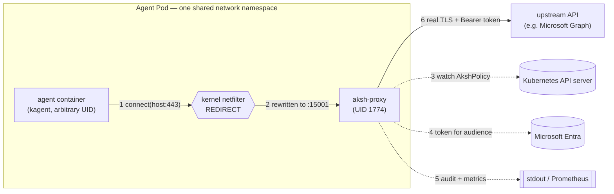
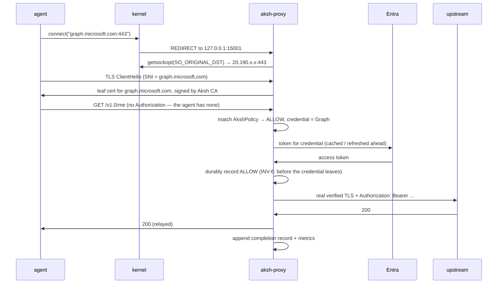

# S0 — Architecture & Trust Model

> **Status:** Reviewed · **Depends on:** nothing · **Depended on by:** S1–S7

This document establishes the vocabulary, the component inventory, the adversary, the
invariants that every later document must uphold, and the compatibility policy that makes
the v1 roadmap achievable without breaking changes. Read this before anything else.

---

## Scope

**This document decides:**

- what the MVP is and is not;
- the components, where they run, and who talks to whom;
- the adversary and the trust boundaries;
- the non-negotiable invariants (including a precise definition of "fail closed");
- the Go module and package layout;
- the inventory of named interfaces, and which document owns each;
- the configuration model;
- the API compatibility policy that underpins every *v1 forward-compatibility* claim.

**This document does not decide:** any component's internal algorithms. Each later document
owns its own.

## Requirements covered

Directly: **FR1** (run as a sidecar for kagent workloads), **FR2** (be injected into the
network path). Structurally: every other MVP requirement, by allocating it to a component
and a document.

| Requirement | Owned by |
| ----------- | -------- |
| FR1 sidecar for kagent workloads | S0, S5 |
| FR2 injected into the network path | S1, S5 |
| FR3 tokens outside the agent runtime | S0 (invariant), S3 |
| FR4 acquire/refresh/rotate/cache/expire tokens | S3 |
| FR5 inject `Authorization` only after policy allows | S4 |
| FR6 policy-as-code via CRDs | S2 |
| FR7 destination allow/deny by FQDN, path, method, MCP server/tool, API category | S2 — **narrowed for MVP to MCP *server* identity; see ADR-S0-11** |
| FR8 fail closed | S0 (definition), S4 (matrix) |
| FR9 structured audit logs | S6 |

### Non-functional requirements

The NFRs in [`../README.md`](../README.md) are as binding as the FRs and are easier to drop,
so they are allocated explicitly.

| NFR | Owned by | Closure criterion |
| --- | -------- | ----------------- |
| **Security** — agent never receives raw long-lived credentials | S0 (INV-1), S3, S5 | Bypass catalogue in S7 has a test per entry. |
| **Availability** — graceful refresh, fail closed for protected actions | S2, S3, S4, S5, S6 | INV-4's bounded-degradation rows are implemented and measured; S7 verifies. |
| **Performance** — explicit P95/P99 budgets | S1 (per-hop budget), S4 (per-stage budget), S7 (harness) | A published budget per pipeline stage plus a repeatable benchmark. |
| **Operability** — Prometheus metrics, structured logs | S6 | Named metrics with a cardinality budget. |
| **Compatibility** — Kubernetes-native, kagent CRD/GitOps workflows | S2, S5 | Policy is plain YAML; injection survives GitOps reconciliation. |
| **Extensibility** — future OPA/CEL/Rego policy backends | S2 | `Matcher` is a seam, not a hardcoded evaluator. |
| **Compliance** — audit evidence, retention, SIEM export | S6 | Stable, versioned audit schema. |
| **Resource safety** (implied by the threat model, not listed in the MRD) | S1 (connections, streams, buffers), S2 (policy cache size), S3 (token cache, IdP call rate), S4 (concurrency), S5 (admission queue), S6 (audit buffer); **S7 verifies** | The adversary can open unbounded sockets, so every queue, cache, and connection pool is bounded, and overload behaviour is defined and tested. Assigned here because an unbounded sidecar is a denial-of-service vector against the node, Entra, and the audit sink — not just against itself. |

### Requirement deviations

Places where this design does **not** deliver a requirement as literally written. All are
deliberate, all are recorded here rather than buried in an ADR, and all need product sign-off —
a design document cannot unilaterally amend the MRD.

| # | Requirement | As written | What the MVP delivers | Why | Decision needed from |
| - | ----------- | ---------- | --------------------- | --- | -------------------- |
| **DEV-01** | **FR2** — "**all** ... passes through it" | all egress | all **TCP application** egress; DNS to the cluster resolver (UDP **and TCP**/53) is carved out (§2) | An agent that cannot resolve names cannot reach any brokered destination. Intercepting DNS is a materially larger scope. The residual risk — DNS tunnelling as an exfiltration channel — is real and unmitigated in MVP. | Product. If unacceptable, DNS interception must enter MVP scope, and S1 grows substantially. |
| **DEV-02** | **FR7** — allow/deny by "MCP server/**tool**" | tool granularity | MCP **server** granularity only (ADR-S0-11) | Under MCP's Streamable HTTP transport the tool name exists only in the JSON-RPC body, and body inspection is FR12/v1. | Product. If tool granularity is required at MVP, the bounded body-parsing option in ADR-S0-11 must be funded and FR12's boundary moves. |
| **DEV-04** | **FR2** — "so that **all ingress/egress** passes through it", listed as MVP | ingress and egress | **egress only** | The MRD marks FR2 (both directions) as MVP, while the roadmap in the root README puts ingress in v1. The LLD followed the roadmap. That is a genuine conflict between two source documents, and the LLD cannot resolve it — recorded here so it is decided rather than inherited. | Product. Either FR2's MVP scope is amended to egress-only, or ingress enters MVP and S1/S2/S4 grow a second direction. |
| **DEV-03** | **FR7** — allow/deny by "**API category**" | a category match dimension | no category concept; an operator groups rules in a policy by convention (ADR-S2-04) | A category is a named set of destinations, and fixing that taxonomy before its members are known would produce a match dimension that is both wrong and expensive to change. | Product. If a first-class, referenceable category is required at MVP, it must be designed as a `constraints` type or a separate grouping resource. |

No deviation is a licence to under-deliver quietly: S7 must state each in the FR-traceability
matrix as *not met as written*, so the gap is visible in the evidence rather than only here.
Note that DEV-02 and DEV-03 are two independent narrowings of the *same* requirement, FR7 —
what remains of FR7 in the MVP is FQDN, path, and method.

---

## Design

### 1. What the MVP is

Aksh MVP is **one CRD plus three cooperating pieces** — an admission-time injector, a
short-lived initContainer that programs the kernel, and the sidecar that enforces — which
together guarantee that an AI agent can use a credential it is never allowed to see.

Concretely, for **egress only**:

1. All outbound TCP from the agent's pod is forced through the Aksh sidecar by the kernel,
   with no cooperation from — and no possibility of opt-out by — the agent.
2. Aksh terminates the agent's TLS using a certificate authority Aksh owns, so it can read
   and modify the HTTP request.
3. Aksh matches the request against `AkshPolicy` resources. No match means denied.
4. On a match, Aksh obtains a token from Microsoft Entra for the credential the policy names,
   **records the allow decision durably**, then injects the token as an `Authorization`
   header and forwards the request upstream over a real, verified TLS connection.
5. Every decision — allow and deny alike — produces an audit record and a metric. The
   allow record precedes the credential leaving the process (INV-6).

### 2. Non-goals for the MVP

Stating these plainly is load-bearing: several are things a reader will otherwise assume.

| Non-goal | Why, and where it goes |
| -------- | ---------------------- |
| **Ingress** interception | v1. The MVP intercepts only traffic *leaving* the pod. |
| **Non-Entra identity providers** | v1 (FR10). The provider abstraction exists in MVP (S3); only the Entra implementation ships. |
| **Request body inspection / data-flow control** | v1 (FR11, FR12). The MVP reads request *headers* and the request line only. |
| **Approval hooks** | v1 (FR13). |
| **Deep MCP semantics** (tool allowlists, parameter constraints, response redaction) | v1 (FR14). MVP matches on MCP **server** identity only — see ADR-S0-11, which records this as a deliberate, visible narrowing of FR7's literal text. |
| **Removing kagent's existing env-var model credentials** | Out of scope entirely. kagent injects `OPENAI_API_KEY` / `ANTHROPIC_API_KEY` directly into the agent container today. Aksh MVP brokers *Entra* tokens; it does not remove those pre-existing secrets, and must not be described as if it does. Closing that gap is a separate effort. |
| **Protecting against a compromised node or cluster admin** | Out of the threat model — see §6. |
| **Non-TCP protocols** (QUIC/HTTP-3, arbitrary UDP) | Not intercepted, therefore **blocked** — see INV-3. Unintercepted egress is a bypass, not a gap. |

**The DNS exception.** DNS is UDP, so a literal reading of the row above blocks it — and an
agent that cannot resolve a hostname cannot reach *any* of the destinations Aksh exists to
broker. DNS is therefore an **explicit, named, single exception** to the UDP block, recorded
as deviation **DEV-01** because it means FR2 is not met as literally written:

- UDP/53 and TCP/53 **to the cluster resolver only** are permitted, and are not intercepted.
- The residual risk is real and accepted for the MVP: DNS is a viable exfiltration channel
  (a tunnelled query carries data out even if no response ever returns), and this exception
  means Aksh must **not** claim to control all egress. It controls all *TCP application*
  egress.
- Egress to any other resolver is blocked, so the exception is bounded to a destination the
  platform controls rather than one the agent chooses.
- Closing it belongs to FR15 (NetworkPolicy/CNI egress lock-down) in v1. S7 must carry it in
  the bypass catalogue rather than treating it as solved.

This mirrors Istio, which carves DNS out of interception for the same reason.

### 3. Glossary

Written for a reader with a backend background and no networking background. Every later
document uses these terms exactly as defined here.

| Term | Meaning |
| ---- | ------- |
| **Pod** | The unit of scheduling in Kubernetes: one or more containers that share a network namespace. Because they share it, they share one IP, one loopback interface, and **one set of firewall rules**. This is what makes sidecar interception possible. |
| **Sidecar** | A helper container in the same pod as the main workload. Aksh is a sidecar. |
| **Network namespace (netns)** | The kernel's per-pod isolated networking stack: its own interfaces, routing table, and firewall rules. Changes Aksh makes here affect every container in the pod and nothing outside it. |
| **iptables** | The kernel's firewall/NAT rule engine. Aksh uses it to rewrite the destination of outbound connections. |
| **REDIRECT** | An iptables action that rewrites a connection's destination to a local port, transparently. The application believes it connected to the original address. |
| **`SO_ORIGINAL_DST`** | A socket option that returns the destination address a connection had *before* `REDIRECT` rewrote it. Without it, Aksh would only know that the agent connected "to itself". |
| **TLS** | The encryption under HTTPS. |
| **SNI** (Server Name Indication) | The hostname the client announces **in cleartext** at the start of a TLS handshake, so a server hosting many domains on one IP knows which certificate to present. It is the TLS-layer analogue of HTTP's `Host` header, and it is how Aksh learns the intended hostname. |
| **ALPN** | A TLS handshake field where client and server agree on the application protocol — `h2` (HTTP/2) or `http/1.1`. |
| **MITM** (man-in-the-middle) | Terminating one TLS connection and originating another, so the middle party can read the plaintext. Normally an attack; here a deliberate, in-pod control. |
| **CA** (Certificate Authority) | The entity whose signature makes a certificate trustworthy. Aksh runs its own; the agent is configured to trust it, which is what makes Aksh's MITM succeed instead of raising a certificate error. |
| **Leaf certificate** | The per-hostname certificate Aksh mints and signs with its CA, presented to the agent. |
| **CRD** (Custom Resource Definition) | A user-defined Kubernetes API type. `AkshPolicy` is one: policy is written as Kubernetes YAML and read through the Kubernetes API. |
| **Admission webhook** | An HTTP callback the Kubernetes API server invokes while creating an object. A *mutating* webhook may modify the object — this is how a sidecar gets added to a pod the user never declared it on. |
| **Audience** | The identifier of the API a token is *for*. A token minted for Microsoft Graph is not valid at any other API. Policy names an audience; S3 obtains a token for it. |
| **Workload Identity Federation (WIF)** | Exchanging a Kubernetes-issued ServiceAccount token for a cloud token, with no long-lived secret stored anywhere. |
| **Fail closed** | On error, deny. Defined precisely in §7. |

### 4. Component inventory

Four artifacts, built from **one Go module and shipped as one container image** with
subcommands (see ADR-S0-08).

| Component | Runs as | Privileges | Responsibility |
| --------- | ------- | ---------- | -------------- |
| **`aksh-init`** | initContainer in the agent pod | `NET_ADMIN`, `NET_RAW`, then exits | Programs the pod's iptables rules. Owns nothing at runtime. |
| **`aksh-proxy`** | sidecar container in the agent pod | none; dedicated UID; no added capabilities | The enforcement point. Terminates agent TLS, evaluates policy, brokers and injects tokens, emits audit and metrics, forwards upstream. |
| **`aksh-injector`** | cluster-scoped Deployment | Kubernetes RBAC only | Serves **two** admission webhooks: a *mutating* one that adds `aksh-init` + `aksh-proxy` and distributes CA trust, and a *validating* one that inspects the final admitted pod and **rejects** anything shaped to defeat enforcement (INV-10, ADR-S0-12). Required — see ADR-S0-05. |
| **`AkshPolicy`** | CRD | — | The user-facing API. Owned by S2. |

Deliberately **not** components in the MVP:

- **A central policy control plane (xDS-style).** Each sidecar reads policy from the
  Kubernetes API server directly (ADR-S0-07).
- **A central token broker service.** Each sidecar brokers its own tokens, which is safe
  *because* WIF means no long-lived secret is distributed (ADR-S0-06).

### 5. Topology and request flow



Per request, inside `aksh-proxy`:



The agent's view is a plain HTTPS request that succeeded. It never saw a credential, and it
could not have chosen not to participate.

### 6. Threat model

**The adversary is the agent runtime itself.** An LLM-driven workload is assumed to be
attacker-influenced: prompt injection, a poisoned tool description, or a malicious MCP
server can cause it to execute attacker-chosen actions. We therefore treat code running in
the agent container as **hostile**, not merely buggy.

**Assets, in priority order**

| # | Asset | Consequence if lost |
| - | ----- | ------------------- |
| A1 | Entra access tokens | Attacker acts as the agent's identity against real APIs. |
| A2 | The Aksh CA private key | Attacker can forge any certificate the agent trusts — total loss of the interception guarantee. |
| A3 | Policy integrity | Attacker grants themselves destinations and audiences. |
| A4 | Audit integrity | Attacker acts without evidence. |
| A5 | Interception itself | Attacker egresses uncontrolled; every other control is moot. |

**In-scope adversary capabilities.** Arbitrary code execution in the agent container as
whatever UID(s) it can obtain; reading its own environment, filesystem, and memory; opening
arbitrary sockets to arbitrary addresses, ports, and protocols; reading any volume mounted
into it; issuing arbitrary HTTP through Aksh, including forged headers; observing timing and
error responses.

**Out-of-scope.** Compromise of the node or kubelet; a malicious or compromised cluster
administrator; a malicious kagent controller; kernel or container-runtime escape;
compromise of Entra; physical access. These are excluded because Aksh runs *inside* the
blast radius of all of them — it cannot defend against its own platform.

**Explicit trust assumptions.** Two are load-bearing and must be stated rather than implied:

- **ASM-1 — Allowing a destination is an act of trust in that destination.** Aksh hands a
  real bearer token to the upstream; that is what a bearer token *is*. A permitted upstream
  can therefore reflect the token back in its response body, and the MVP relays responses
  without inspection, so the agent would receive it. This is not a flaw Aksh can fix by
  filtering — an upstream can encode the token in any form it likes — it is inherent to
  bearer credentials. The mitigation is the policy allowlist itself: an `AkshPolicy` that
  permits a destination *is* an assertion that the destination is trusted with the named
  audience's token. S2 must make that consequence explicit in the CRD's documentation so
  operators understand what they are asserting, and S6 must record the destination in the
  audit trail so misplaced trust is at least attributable. Response redaction (FR14) reduces
  accidental leakage in v1, but never the deliberate case. *(The PoC's `echoserver`
  deliberately reflects the header — it is a test oracle, and it models exactly this risk.)*
- **ASM-2 — The Kubernetes admission chain is trusted and reachable.** Enforcement begins at
  admission (ADR-S0-05, ADR-S0-12). If the webhook is bypassed or disabled, Aksh is not in
  the path at all and no in-pod control matters.

**Trust boundaries.** In decreasing trust: Kubernetes control plane and Entra (trusted) →
`aksh-injector` (trusted) → `aksh-proxy` (trusted, and the enforcement point) → **boundary**
→ agent container (untrusted) → upstream APIs (untrusted, authenticated).

The critical boundary is *inside the pod*, between two containers that share a network
namespace. Everything Aksh does rests on that boundary holding, which is why §7 makes it an
invariant rather than an implementation detail.

### 7. Invariants

These bind every later document. A design that violates one is wrong, not merely different.

**INV-1 — The agent never possesses credential material.**
This covers two distinct things, and both matter:

- *Brokered tokens.* Aksh must never itself place a token where the agent can read it: not a
  shared volume, not an environment variable, not an error message, not a log or endpoint the
  agent can reach. Tokens exist only in `aksh-proxy` memory and on the wire to the upstream.
  The obligation is on **Aksh's own conduct**; it is bounded by ASM-1, which acknowledges that
  a permitted upstream may itself reflect a token back in its response, and that the MVP
  relays responses unmodified. Aksh cannot prevent that and does not claim to — which is why
  ASM-1 makes "permitting a destination" an explicit act of trust. The invariant is therefore
  testable as: *no Aksh-originated path discloses a token to the agent.*
- *Aksh's own broker credential.* Whatever Aksh uses to **obtain** tokens — under ADR-S0-06
  this is a federated ServiceAccount token, and nothing else — is subject to the same rule and
  more strictly. Leaking a scoped access token costs one resource until it expires; leaking the
  broker credential lets an attacker mint tokens for *every* resource, indefinitely. The
  credential's projected volume is mounted into `aksh-proxy` only (INV-10). *(A1)*

**INV-2 — The CA private key is never readable by the agent container.**
Only the CA *certificate* (public) is distributed into the agent's trust store. Any design that
materialises the private key on a volume the agent can read is invalid. *(A2)*

*Refined by S5 §6.1.1.* The original wording was "never leaves the process". That turned out to
be unachievable without a worse cost: native sidecars restart independently of app containers,
so an in-memory-only CA would be regenerated on any proxy restart while the agent kept trusting
the old one — breaking every subsequent request permanently. The key is therefore persisted to a
volume mounted into **`aksh-proxy` alone**. The invariant's purpose — the agent cannot obtain
it — is preserved exactly; what is given up is protection against a node-level attacker, who is
already outside the threat model (§6).

**INV-3 — Interception cannot be disabled by the workload.**
The agent must not be able to opt out, whether by unsetting an environment variable,
choosing a different port or protocol, changing UID, or connecting to a raw IP. Where a
class of traffic cannot be intercepted, it must be **blocked**, not passed through.
*(FR2, A5)*

The guarantee is explicitly indexed over four axes, because a gap in any one of them is a
total bypass rather than a partial one:

| Axis | Requirement |
| ---- | ----------- |
| **Port** | All destination TCP ports are intercepted, not just 443. The `:443` in this document's examples is illustrative. |
| **Address family** | IPv4 **and** IPv6 are intercepted equivalently, or IPv6 egress is blocked outright. A dual-stack pod with IPv4-only rules is a direct bypass. |
| **UID** | Interception does not depend on knowing the workload's UID (ADR-S0-04). |
| **Protocol** | Non-TCP egress is blocked, subject to the single named DNS exception in §2. |

The one deliberate exception is DNS, which is named, bounded, and its residual risk
explicitly accepted in §2. There are no others; a future exception requires an ADR.

**INV-4 — Fail closed.** Defined precisely:

> A request is allowed **only if** Aksh can establish, from current-enough information, that
> it is permitted **and** can durably record that it allowed it. If **either** of those
> fails, the request is denied.

(The two conditions are conjunctive for *allow*, so failing **either one** denies. Stating
it the other way round — "cannot establish permission *and* cannot record" — would wrongly
permit a request that is authorised but unauditable, contradicting INV-6.)

The nuances matter, and later documents must honour them rather than re-interpret:

| Situation | Behaviour | Rationale |
| --------- | --------- | --------- |
| No policy matches | **Deny** | Default-deny is the posture (FR7). |
| Policy cache is populated but the API server is unreachable | **Allow** to continue matching against the cached snapshot, *until* a bounded staleness limit is exceeded; then **deny** | A healthy cache *is* a successful lookup. Denying all traffic on every API-server blip would make Aksh a cluster-wide outage amplifier. Staleness must be bounded, surfaced as a metric, and configurable. S2 owns the limit. |
| Policy cache has never been populated | **Deny** | No basis for any decision. |
| Token acquisition fails | **Deny** | FR8, explicitly. |
| Audit record cannot be durably recorded | **Deny**, subject to a bounded local-buffer allowance | FR8, explicitly. The same "do not become a cluster-wide outage amplifier" reasoning as the policy-cache row applies, and *more* strongly: this check runs on every single request, not on a resync interval. So "durably recorded" must be allowed to mean "committed to a bounded, local, crash-visible buffer" rather than "acknowledged by a remote sink" — otherwise a SIEM hiccup denies every credentialed request in the cluster instantly. The buffer's bound, and the behaviour when it is full (deny), are S6's to fix. What is **not** negotiable is INV-6: no credential leaves without a record. |
| Aksh is not yet ready, or has crashed | **Traffic fails** (connections refused) | Because iptables rules are installed independently of Aksh's readiness, an unready Aksh means redirected traffic reaches nothing. This is *correct* fail-closed behaviour, but it makes startup and shutdown ordering a safety property, not a nicety. S5 owns it. |

**INV-5 — No secret material in any output.**
Token values, CA private keys, and client secrets must never appear in logs, audit records,
metric labels, error messages, or traces. Audit records name the *audience* and the
*provider*, never the token. *(S6)*

**INV-6 — Every decision is recorded, and the record precedes the credential.**
Two distinct obligations:

1. *Coverage.* Both allow **and** deny decisions produce an audit record (FR9 requires the
   decision, not just the successful ones).
2. *Ordering.* For an allowed request, the record is durably committed **before** the
   credential is transmitted upstream. Auditing after forwarding would mean a crash between
   the two leaves a credential-bearing request with no evidence — which is exactly the
   scenario audit exists for. This makes the audit write a blocking step in the request
   path, and it is the reason INV-4's audit row is stated as a *deny* condition.

A completion record (status, latency, bytes) may be appended afterwards; it is the
*allow-attempt* record that must precede the credential.

**The terminal case.** If the audit path itself has failed, INV-4 turns the request into a
deny — and that deny cannot be recorded through the same broken path. Requiring it would make
the invariant recursive and unimplementable. So it is bounded explicitly: **denials caused by
terminal audit failure are the one exception to obligation (1)**. They must instead raise a
best-effort *emergency signal* on an independent channel — process stderr, a dedicated
metric, and a readiness-failure — so the condition is loud even though the individual request
is unrecorded. What must never happen is the inverse: a credential leaving with no record.
S6 defines the emergency channel; ADR-S0-13's "reason lives only in audit" is likewise
suspended for this case. *(FR8, FR9; S4 orders it, S6 defines durability)*

**INV-7 — Decisions are deterministic.**
The same request against the same policy snapshot always produces the same decision.
Policy ordering must not depend on map iteration, object creation time, or informer arrival
order. *(S2)*

**INV-8 — One validated identity per request.**
A request carries several notions of "who the destination is". They serve different roles and
must be reconciled explicitly rather than assumed equal:

| Source | Trustworthiness | Role |
| ------ | --------------- | ---- |
| `SO_ORIGINAL_DST` (IP:port) | **Kernel-authenticated** — the agent cannot forge it | Where to connect. Not a name, so it cannot by itself authorise anything. |
| TLS **SNI** | Agent-chosen | Candidate identity; selects the leaf certificate. |
| HTTP `Host` / `:authority` | Agent-chosen | Candidate identity. |
| Policy match key | Derived | Must equal the validated identity. |
| Upstream certificate verification name | Derived | Must equal the validated identity. |

The rules, stated so they are testable:

1. **SNI is required for TLS.** A TLS connection with no SNI has no candidate identity and is
   **denied**. *Plaintext HTTP takes a different path* (S1 §6.1, ADR-S1-05): it is restricted to
   in-cluster destinations, and its identity is derived from the kernel-attested destination
   resolved through the Service registry rather than from anything the agent said. That path
   carries **no upstream authentication**, so rule 4 below cannot apply to it — the assurance is
   genuinely lower, it is marked as such in audit, and injecting a credential over it requires
   an explicit policy opt-in (`allowPlaintext`, S2 §3.2). Note that plaintext is **not** a second
   INV-3 exception: it is intercepted like any other TCP, so DNS remains the single carve-out. (An explicit IP-literal policy form may be introduced later; it does not
   exist in MVP, so bare-IP connections are denied by construction — closing OQ-S0-10.)
2. **Authority must match SNI.** The HTTP `Host` (HTTP/1.1) or `:authority` (HTTP/2) is split
   into hostname and optional port before comparison, because **SNI carries no port** — a
   naive string equality would reject ordinary HTTPS on a non-default port such as
   `example.com:8443`. The rules are: the *hostname* must equal the SNI after canonical IDNA
   normalisation (lowercase, trailing dot removed); the *port*, if present, must equal the
   port of the recovered destination. A mismatch on either is **rejected**, never reconciled
   by preferring one source. A request with neither `Host` nor `:authority` is denied.
3. **The validated identity is the SNI**, once (1) and (2) hold. Policy matching, audience
   selection, and upstream certificate verification all use this one value.
4. **The recovered destination constrains, it does not name.** Aksh connects to
   `SO_ORIGINAL_DST` and verifies the upstream's certificate against the validated identity.
   An agent that points a permitted name at an arbitrary IP therefore gets a TLS verification
   failure, not a token delivered to an attacker-chosen endpoint. This is what closes the
   confused-deputy hole; it is an architectural requirement, not an S1 preference.
5. **Aksh's own listener is not a destination.** A connection whose recovered destination is
   Aksh's own listener, or any pod-local address, is dropped — the agent must not be able to
   address the enforcement point directly (see also OQ-S0-09).
6. **Unsupported protocols are denied, not tunnelled.** Anything on an intercepted port that is
   neither TLS with a supported ALPN **nor in-cluster plaintext HTTP/1.x meeting S1 §6.1's
   Service-resolution rules**, and any `CONNECT`, is denied. Plaintext is not a tunnel: it is
   fully parsed, matched and audited. h2c remains denied. Aksh must never
   degrade into an opaque TCP tunnel, which would forward bytes with no identity at all.
7. **Identity is re-established per request, not per connection.** Connections are reused and
   long-lived; HTTP/2 multiplexes many requests over one. Policy match, token selection, and
   audit are therefore performed **per HTTP request / per HTTP/2 stream**, against the policy
   snapshot current at that moment. Upstream connection-pool keys must include the validated
   identity, the recovered destination, and the credential identity, so a pooled connection
   can never be reused across identities. TLS session resumption must not carry an
   authorisation decision forward.

*(A1, A5; S1 and S2 implement, S4 orders, S7 tests)*

**INV-9 — Agent-supplied credential headers never survive.**
`Authorization`, `Proxy-Authorization`, and any header Aksh treats as credential-bearing are
stripped from every request before forwarding, **unconditionally** — including on allowed
requests where Aksh injects nothing (for example a destination that needs no auth). Without
this, a compromised agent can smuggle an attacker-chosen credential to an allowed
destination through Aksh, and the audit record will describe a request that did not happen.
Stripping is demonstrated to work in the S1 spike; the invariant makes it non-optional.
*(FR5)*

**INV-10 — A protected pod must be *admissible*, or it must not run.**
Every in-pod control assumes the pod itself is not shaped to defeat it. Because containers in
a pod share a network namespace — and can share more — a protected pod is admitted only if
**all** of the following hold; otherwise admission is **rejected** (not silently
un-injected):

| Condition | Defeats, if violated |
| --------- | -------------------- |
| Every non-Aksh container declares an **explicit, numeric, non-reserved** `runAsUser`, with `runAsNonRoot: true` | An unset `runAsUser` resolves from the image at runtime and cannot be proven safe at admission; root can simply `setuid()` to Aksh's reserved UID and be `RETURN`ed by the exclusion rule — a **total** bypass |
| Every non-Aksh container sets `allowPrivilegeEscalation: false` and `capabilities.drop: ["ALL"]`; `SETUID`, `SETGID`, `NET_RAW`, `NET_ADMIN`, `SYS_PTRACE`, `SYS_ADMIN` are not added back | `SETUID`/`SETGID` re-enable UID switching; `NET_RAW` allows raw packet sockets that bypass the NAT path entirely; `NET_ADMIN` deletes the rules; `SYS_PTRACE`/`SYS_ADMIN` read `aksh-proxy` memory, extracting tokens and the CA key |
| `aksh-init` adds only the exact capability it needs, and no other container adds any | As above |
| `shareProcessNamespace` is false and `hostPID` is false | Agent inspects or attacks the proxy process directly |
| `hostNetwork` is false | Pod-level iptables rules do not apply at all |
| The projected credential and CA key volumes are mounted **only** into `aksh-proxy` | Agent reads the broker credential directly (INV-1) |
| The same checks apply to init containers, native sidecars, and **`pods/ephemeralcontainers` updates** | A debug container attached later bypasses every check above |

Two structural prerequisites follow, and both are requirements on S5, not optional hardening:

- **A restricted-equivalent baseline** must apply to protected namespaces. Note that stock Pod
  Security Admission at `restricted` **cannot** be used: `aksh-init` runs as UID 0 and adds
  `NET_ADMIN`/`NET_RAW`, both forbidden by that profile, and PSA has no per-container exception
  mechanism. S5 therefore ships the equivalent checks inside Aksh's own validating webhook, with
  exactly one narrowly-scoped exception for `aksh-init`. PSA at `baseline` may still be applied
  underneath.
- **A validating webhook is required in addition to the mutating one.** A mutating webhook
  cannot guarantee the shape of the *admitted* pod: another mutating webhook — a service mesh
  injector, a policy engine, a future Aksh-unaware controller — may run afterwards and remove
  Aksh's containers, add a container claiming the reserved UID, or restore a capability.
  `failurePolicy: Fail` on the mutator does not detect any of this, because the mutator has
  already returned. `aksh-injector` must therefore also serve a **fail-closed validating
  webhook that inspects the final pod**, after all mutation, and rejects it if the injected
  shape or this table's conditions do not hold. This closes admission ordering as an attack
  surface. *(ADR-S0-12)*

This is an **admission-time** property, so it is only enforceable on the webhook path — which
is the second reason ADR-S0-05 concludes the webhook is not optional. *(A2, A5; S5
specifies, S7 tests)*

### 8. Module and package layout

Single Go module, already declared: `github.com/girishmotwani/aksh` (Go 1.23+).

```
cmd/aksh/                 single binary; subcommands: proxy | init | injector
api/v1alpha1/             AkshPolicy Go types + deepcopy. PUBLIC — users import this.
internal/dataplane/       listener, original-destination recovery, TLS MITM, leaf cache,
                          upstream transport                                      [S1]
internal/iptables/        rule generation and idempotent application               [S1]
internal/policy/          informer, compiled snapshot, matcher                     [S2]
internal/token/           provider abstraction, Entra providers, cache             [S3]
internal/pipeline/        the ordered enforcement stages and hook slots            [S4]
internal/injector/        mutating webhook, sidecar template, CA distribution      [S5]
internal/pki/             CA lifecycle, leaf minting                               [S1, S5]
internal/audit/           audit record schema and sinks                            [S6]
internal/metrics/         Prometheus registry and instrument definitions           [S6]
internal/config/          configuration loading and precedence                     [S0]
test/e2e/                 kind-based end-to-end suite                              [S7]
```

`api/v1alpha1` is deliberately the only non-`internal` package: it is the compatibility
surface, and ADR-S0-09 governs how it may change.

### 9. Configuration model

Three sources, in increasing precedence: **built-in defaults → ConfigMap file → environment
variables**. Command-line flags are not a configuration source for `aksh-proxy`; a sidecar's
arguments are set by the injector and are inconvenient to change.

Rules: every setting has a working default except identity settings, which have none and
must fail startup if absent (fail closed applies to configuration too). No setting may
weaken an invariant — in particular there is no configuration that disables TLS
verification upstream, disables audit, or turns default-deny into default-allow. The PoC's
`AKSH_INSECURE_UPSTREAM` and `AKSH_UPSTREAM_OVERRIDE` knobs are **PoC-only and must not
exist in the product** (S1 closes both).

Settings are namespaced `AKSH_*`. Each later document defines its own settings; S0 fixes
only the mechanism and the prohibition above.

### 10. API compatibility policy

This section is what makes every later *v1 forward-compatibility* section meaningful.

The MVP ships **`aksh.dev/v1alpha1`**. Between MVP and v1 the following changes are
permitted without a version bump:

- adding a new **optional** field with a safe default equal to current behaviour;
- adding a new enum *value*, provided unknown values are rejected by validation rather than
  silently ignored;
- adding a new status condition;
- adding a new optional hook slot to the enforcement pipeline (internal, not API).

The following require a new API version and a conversion path, and are therefore what the
design must avoid needing:

- removing or renaming a field, narrowing a type, or changing a default;
- changing matching semantics or precedence such that an existing policy's decision changes;
- making an optional field required.

**Two consequences the design must honour now, not later.**

*First, semantics are as much of the contract as the schema.* If v1 adds a field that changes
how existing rules are ordered or combined, that is a breaking change even though the schema
only grew. S2's precedence rules must be defined so that new match dimensions can only ever
make a rule *more* specific.

*Second — and this corrects a tempting but wrong assumption — Kubernetes does **not** reject
unknown CRD fields; it **prunes** them.* Structural schemas silently drop fields the schema
does not know about. `fieldValidation=Strict` does not rescue this: it is chosen by the
*client* making the request, not mandated by the server, so it cannot be relied on as a
guarantee.

This matters because the failure is silent and security-relevant in exactly one direction: an
operator applies a v1 policy carrying a new *narrowing* constraint to a cluster still running
the MVP schema, the constraint is pruned, and the policy is enforced **more permissively than
written** with no error anywhere. "Add an optional field later" is therefore *not* a safe
pattern for any field that restricts access.

Two mechanisms are acceptable, and S2 must use one of them:

1. **A new API version** for any security-relevant addition, with conversion — the honest,
   Kubernetes-idiomatic answer.
2. **A discriminated representation designed in at MVP**: constraints are carried inside a
   structure with a *required, enumerated discriminator*, so that an unknown constraint kind
   fails the MVP schema's enum validation instead of being pruned. This must be designed now;
   it cannot be retrofitted.

Additive evolution remains safe for fields that only *widen* or that are purely informational
(status conditions, labels, telemetry hints). The distinction — narrowing versus widening — is
the one S2 must apply, not "optional versus required".

---

## Interfaces

S0 defines no interfaces itself. It fixes the **inventory**: each is defined in exactly one
document and referenced by name everywhere else. A later document introducing a
cross-component contract not listed here must add it here in the same change.

| Interface | Defined in | Purpose |
| --------- | ---------- | ------- |
| `DestinationResolver` | S1 | Recover the pre-NAT destination of an intercepted connection. |
| `LeafSource` | S1 | Supply a TLS certificate for a requested SNI, backed by a cache. |
| `UpstreamDialer` | S1 | Establish a verified TLS connection to the true destination. |
| `PolicyStore` | S2 | Provide the current policy snapshot, with staleness metadata. |
| `PolicySnapshot` | S2 | An immutable, versioned, deterministically-ordered rule set. |
| `Matcher` | S2 | Evaluate a request against a snapshot, yielding a `MatchResult`. |
| `MatchResult` | S2 | What policy *says*: matched rule, its identity and version, and the `CredentialSelector` it names (possibly none). Deliberately **not** the final disposition — S2 must not depend on S4. |
| `CredentialSelector` | **S2** | The **public, CRD-facing** description of which credential a rule wants. Provider-neutral by construction — `https://graph.microsoft.com/.default` is an Entra *scope*, not a portable audience, so a field named `audience` holding it would bake one provider's semantics into the public API. MVP ships `provider`, `resource`, `scopes`; `issuer` and `subject` are deferred, and are **not** safe as bare optional fields — they would be pruned on an MVP cluster and silently select a different principal, so they need a new API version or a discriminated form (ADR-S2-06, S2 §4.1). Owned by S2 because it is part of `AkshPolicy` and S2 freezes the CRD before S3 exists. **Optional**: a rule may allow a destination without naming a credential, in which case Aksh forwards with no `Authorization` (INV-9 still strips any the agent supplied). |
| `RequestFacts` | S2 | The canonical, already-validated view of a request that S1 produces and S4 assembles: identity, method, path, port — every field in the canonical form INV-8 defines, so policy can never authorise one representation while the upstream receives another. |
| `TokenProvider` | S3 | Resolve a `CredentialSelector` into its provider-specific wire form, and acquire a token for it. The seam that makes FR10 additive. |
| `ResolvedCredential` | S3 | The canonical resolved form — identity, provider, resource, composed wire scopes — shared by S1's pool key, S3's cache and S6's audit, so none of them re-derives it. |
| `TokenResult` | S3 | A token plus the resolution metadata and cache-hit flag S6 must record. |
| `AcquireError` | S3 | Classified acquisition failure — transient, permanent, or local — since the three have genuinely different handling and an untyped error would force the cache to guess. |
| `TokenCache` | S3 | Cache and refresh tokens ahead of expiry, keyed by `credentialIdentity`. |
| `Token` | S3 | A brokered credential and its expiry. Redacts at its own type level — an unexported secret field provably does not (S3 §6). Consumed by S4 at injection. |
| `credentialIdentity` | S3 | The single derived key that S1's upstream pool, S3's token cache, and S6's audit record all agree on. Hex SHA-256 over the composed wire scopes, or the literal `"none"` when a rule allows without a credential. |
| `Stage` | S4 | One ordered step of the request-phase pipeline. The v1 extension seam. |
| `ResponseStage` | S4 | One ordered step of the **response**-phase pipeline. Reserved at MVP with a pass-through default; FR14's response redaction and FR11's provenance capture attach here. Naming it now prevents a request-only relay contract that would have to be redesigned. |
| `RequestContext` | S4 | Per-request state threaded through the pipeline. Carries `IdentityInput` (untrusted, agent-chosen) separately from validated `Facts`, so nothing can trust what no stage checked. |
| `IdentityInput` | S4 | S1's untrusted handoff: candidate SNI, authority host and port, and the kernel-attested destination port. |
| `ResponseContext` | S4 | The minimal immutable view given to response and completion hooks — identity and provenance, never the request or the token (S3 §6.1). |
| `AuditEvent` | S4 | The immutable snapshot stage ⑥ hands `AuditSink`. Built from the context rather than being the context, so a sink can never reach the injected credential. |
| `FaultClass` | S4 | Closed classification recorded instead of error text, which can quote request data or wrapped secrets. |
| `Decision` | S4 | The final disposition — **invalid / allow / deny / pending** — plus the reason, fault flag and underlying cause. `Invalid` is the **zero value** and denies, so a dropped assignment cannot fail open. Three-valued-plus-zero from the MVP even though `pending` is never returned until FR13. |
| `DenyReason` | S4 | The closed enumeration of denial causes, recorded in audit and metrics, never surfaced to the agent (ADR-S0-13). |
| `CAProvider` | S5 | Supply the CA used to sign leaves and report a generation that invalidates S1's leaf cache. Rotation is a pod restart (ADR-S5-01), so there is no in-place rotate operation. |
| `Injector` | S5 | Render the sidecar patch, and judge whether a *final* admitted pod satisfies INV-10. Two operations because the pod the validator judges is not the pod the mutator produced — other webhooks run in between. |
| `AuditSink` | S6 | `Record(ctx, AuditEvent) error`. Receives S4's **immutable `AuditEvent`**, never the mutable `RequestContext` — after injection the context holds the plaintext credential, so passing it to a sink would create a leak path (S4 §2). Its error is the fail-closed trigger. |
| `MetricsRecorder` | S6 | Record counters, histograms, and gauges. |

---

## Failure modes

Component-level only; per-request failures are S4's fail-closed matrix.

| Failure | Observable behaviour | Consequence |
| ------- | -------------------- | ----------- |
| `aksh-init` fails to program iptables | Pod does not start | **Safe.** No interception means no enforcement; the pod must not run. S5 must ensure this actually blocks startup rather than being ignored. |
| `aksh-proxy` is not yet listening but rules are installed | Agent connections are refused | **Safe but disruptive.** Ordering is a safety property — S5. |
| `aksh-proxy` crashes mid-life | Agent egress fails entirely | **Safe.** Restart policy and readiness are S5's. |
| API server unreachable | Cached snapshot continues to serve until the staleness bound; then deny | Bounded, observable. S2. |
| Entra unreachable | Cached tokens serve until expiry; then deny for affected audiences | Blast radius is per-audience, not global. S3. |
| Audit sink unavailable | Requests denied per INV-4 | Highest-cost invariant; S6 must define it precisely. |
| `aksh-injector` unavailable | Creation of protected pods is rejected (`failurePolicy: Fail`, ADR-S0-12) | Running pods are unaffected. Chosen deliberately over `Ignore`, which would make the enforcement component's failure mode "enforcement silently switches off" — a direct INV-3 violation. |
| Pod is shaped to defeat enforcement (reserved UID, `NET_ADMIN`, shared PID namespace, host network, …) | Admission **rejected** with the offending field named | INV-10. Only enforceable on the webhook path — the second reason ADR-S0-05 makes it mandatory. |

---

## Decisions (ADRs)

### ADR-S0-01 — Custom Go data plane, not Envoy

*Context.* The data plane must MITM TLS, evaluate policy, and broker tokens.
*Options.* Envoy (+WASM/ext_authz); HAProxy; Linkerd; Traefik + ForwardAuth; custom Go.
*Decision.* Custom Go, carried forward from `FEASIBILITY.md` §1.1 and validated by the PoC.
*Consequences.* Full control and a single static binary; in exchange we own correctness for
things Envoy solves for free — HTTP parsing, protocol translation, timeouts, pooling,
smuggling defences. S1 must therefore lean on Go's standard library
(`httputil.ReverseProxy`) rather than hand-rolling the relay, as the PoC does.

### ADR-S0-02 — Aksh is the OAuth client, not a token scraper

*Context.* Aksh must supply credentials the agent cannot see.
*Options.* (A) MITM the agent's traffic to Entra and lift tokens off the wire. (B) Aksh
performs the OAuth flow itself.
*Decision.* (B), carried from `FEASIBILITY.md` §1.2.
*Consequences.* The agent never runs an auth flow and never holds a credential, which is
what makes INV-1 achievable at all. Aksh takes on token lifecycle (FR4).

### ADR-S0-03 — Transparent interception is the product; explicit proxy is a development aid

*Context.* The PoC validated both `HTTPS_PROXY` and iptables interception.
*Decision.* Only transparent interception satisfies FR2 and INV-3, because
`HTTPS_PROXY` is advisory — a hostile agent simply unsets it. The explicit-proxy path may
remain as a developer convenience but is not a supported enforcement mode and must never be
documented as one.
*Consequences.* Linux-only data plane; `NET_ADMIN` needed at pod setup; local development
needs a story (OQ-S0-12).

### ADR-S0-04 — Redirect all outbound TCP and exclude only Aksh's UID

*Context.* The PoC redirects only traffic owned by UID 1500, the agent's UID.
*Evidence.* kagent's generated pod sets **no** `securityContext` at all by default — the
agent's UID comes from the image (`USER 65532:65532`) and is freely overridable by the user
through `Agent.spec.declarative.deployment.securityContext`. There is no stable agent UID to
enumerate.
*Options.* (A) Allowlist the agent's UID. (B) Redirect everything, `RETURN` only for Aksh's
own UID.
*Decision.* (B) — the Istio pattern. Concretely, the OUTPUT rule matches **all destination
TCP ports** (not only 443) across **both address families**, with a `RETURN` for Aksh's own
UID and the DNS carve-out of §2. The `--dport 443` in the PoC and the `:443` in this
document's diagrams are illustrative of the common case, not the rule.
*Consequences.* Interception no longer depends on knowing the workload's UID, which closes
a bypass (anything running as another UID would have escaped (A) entirely) and removes a
coupling to kagent's internals. Aksh must own a dedicated UID that the workload cannot
assume; S5 must guarantee this, and S7 must test it. Any process in the pod other than Aksh
is now intercepted, so S1 must handle localhost and health-check traffic explicitly.

### ADR-S0-05 — The mutating webhook is the only enforcement path; `extraContainers` is a non-enforcing convenience

*Context.* `FEASIBILITY.md` assumed an Istio-style mutating webhook. kagent independently
offers `Agent.spec.declarative.deployment` extension fields, and its `ExtraContainers` field
is documented as *"Useful for sidecars such as token proxies, log shippers, or security
agents"* — apparently our exact use case.

*Investigation.* `SharedDeploymentSpec` in `kagent-dev/kagent@main:go/api/v1alpha2/agent_types.go`
exposes exactly: `ImagePullSecrets`, `Volumes`, `VolumeMounts`, `Env`, `EnvFrom`,
`SecurityContext`, `PodSecurityContext`, `ServiceAccountName`, `ServiceAccountConfig`, and
`ExtraContainers []corev1.Container`.

Two things it does **not** expose are decisive:

| Missing | Consequence |
| ------- | ----------- |
| **`InitContainers`** | There is no way to run the `NET_ADMIN` step that programs iptables *before* the agent starts. A container that programs its own rules at startup needs `NET_ADMIN` at runtime and races the agent — and the race fails **open**: during the window before rules exist, the agent egresses completely uncontrolled. |
| **Native sidecar semantics** | `ExtraContainers` is `[]corev1.Container`, an ordinary container. Native sidecars are `initContainers` with `restartPolicy: Always` (ADR-S0-10). So even ordering the *proxy's* readiness ahead of the agent is impossible on this path. |

*Decision.* **The mutating webhook is the only path that delivers enforcement.**
`extraContainers` can mount the CA and set trust environment variables and run the proxy
container — that is, it can deliver *explicit-proxy* token custody — but it **cannot deliver
transparent, unbypassable interception**, which is precisely the mode ADR-S0-03 already
rejected as non-enforcing. It is therefore documented as a **development and evaluation
convenience only**, and must never be presented as a supported enforcement mode.

*Consequences.* The webhook is not optional, which makes its `failurePolicy` a security
decision rather than a tuning knob (see ADR-S0-12), and makes `aksh-injector` a required MVP
component rather than a convenience — the component inventory says so. The earlier claim that
both paths produce an identical pod shape is withdrawn: they cannot. If webhook-free
enforcement is ever required, the correct route is to ask kagent upstream for a pod-template
extension covering init containers, not to work around its absence. Recorded as OQ-S0-08.

### ADR-S0-06 — Each sidecar brokers its own tokens; no central broker service

*Context.* A per-sidecar broker holding a long-lived client secret would replicate a
high-value credential across every agent pod.
*Decision.* **Workload Identity Federation is required for the MVP.** The sidecar exchanges
its projected ServiceAccount token for an Entra token, so no long-lived secret is distributed
and no central broker is required.
*Consequences.* No extra component and no shared secret. Three details must not be glossed:

- **Kubernetes identity is per ServiceAccount, not per pod.** kagent creates one
  ServiceAccount per `Agent`, so in practice identity is per agent — which is the useful
  granularity — but S3 and S6 must attribute audit records to the *pod* separately, since
  replicas share the ServiceAccount.
- **The projected token must be audience-scoped and mounted only into `aksh-proxy`**
  (INV-10). A default, unscoped ServiceAccount token mounted pod-wide would hand the agent
  the very credential this ADR exists to protect.
- **The agent's ServiceAccount must not hold `TokenRequest` permission** for the Entra
  audience, or it can mint the federation token itself and bypass Aksh entirely. Aksh's RBAC
  for policy is read-only. S5 specifies both grants.

The obvious fallback — a client-credentials secret mounted into every agent pod — is
**rejected**, not offered as an equivalent option, because it reintroduces exactly the risk
this ADR exists to avoid: a long-lived, high-value credential replicated across every agent
pod, in the same pod as the hostile workload. Accepting it would make the ADR's own rationale
incoherent. Environments without WIF are therefore **unsupported at MVP**; if support becomes
necessary, the decision to reopen is between a central broker service (one credential, held
away from agents) and uniquely-scoped per-pod credentials — and that is a real ADR for S3 to
write, not a footnote here.

### ADR-S0-07 — Sidecars watch the Kubernetes API directly; no policy control plane in MVP

*Context.* Policy could be distributed by a central control plane (Istio's istiod/xDS model)
or read directly by each sidecar.
*Decision.* Direct watch for MVP, scoped by namespace and label.
*Consequences.* One fewer component and one fewer failure domain, at the cost of one watch
per sidecar against the API server and a small RBAC grant per agent. This does not scale
indefinitely, but the transport between policy source and sidecar is **internal**: replacing
it with a control plane in v1 changes no CRD and no user-visible behaviour, so it is
additive under §10. S2 must not leak the transport choice into the `PolicyStore` contract.

### ADR-S0-08 — One module, one image, subcommands

*Decision.* `aksh proxy`, `aksh init`, `aksh injector` from one binary and one image.
*Consequences.* One thing to build, sign, scan, and version; guarantees the initContainer
and sidecar are the same version. The image must carry `iptables` for the `init` role, which
slightly enlarges the sidecar's attack surface — S7 should consider a distroless variant for
the proxy role.

### ADR-S0-09 — API version `v1alpha1`, additive-only evolution

*Decision.* Ship `aksh.dev/v1alpha1` and hold to the compatibility rules in §10 through v1.
*Consequences.* The `v1alpha1` name signals instability while the rules give real
guarantees. Every later document must show its v1 features fit these rules; where one does
not, that is a design defect to fix in the MVP, not a cost to defer.

### ADR-S0-10 — Kubernetes 1.29 floor, 1.33 recommended

*Context.* Native sidecars (`initContainers` with `restartPolicy: Always`) guarantee the
sidecar starts before, and stops after, app containers — which is exactly the ordering
INV-4's last row requires. They were alpha in 1.28, **beta and on by default in 1.29**, and
**GA in 1.33**.
*Decision.* Floor at **1.29**; recommend 1.33.
*Consequences.* Note carefully what native sidecars do and do not buy. They are **not** what
makes interception safe — if rules are installed and Aksh is not listening, connections are
refused, which INV-4 already classifies as correct fail-closed behaviour. What they buy is
**availability and deterministic lifecycle**: the sidecar is started before app containers and
terminated after them, so a pod does not spend its first seconds refusing every request, and
in-flight requests are not cut off during shutdown. Ordering alone is also insufficient —
Kubernetes orders on the *startup probe*, not on process creation, so S5 must define a
startup probe that actually asserts the listener is accepting. Below 1.29 clusters are
**unsupported**, not degraded.

### ADR-S0-11 — MVP matches MCP *servers*, not MCP *tools*

*Context.* FR7 is an MVP requirement and its literal text includes "MCP server/tool" as a
match dimension. Separately, the MVP data plane reads only the request line and headers
(body inspection is FR12, v1).
*Problem.* These two cannot both hold. Under MCP's Streamable HTTP transport every tool call
is a `POST` to one fixed endpoint; the tool name appears **only inside the JSON-RPC body**
(`params.name`), never in the URL, method, or headers. Tool-level matching is therefore
unachievable without reading the body.
*Options.* (A) Narrow MVP FR7 to MCP-server identity (FQDN + path). (B) Carve out a bounded
exception that parses just the JSON-RPC `method`/`params.name` on MCP endpoints.
*Decision.* **(A)** for the MVP. Tool-level matching moves to v1 alongside FR12 and FR14.
*Consequences.* This is a **visible narrowing of FR7's literal text** and is recorded here so
that no one — reviewer, implementer, or evaluator — assumes tool granularity ships in the
MVP. The failure mode of leaving it ambiguous is silent under-enforcement: an operator writes
a policy believing they blocked a dangerous tool, and every tool call to an allowed MCP server
passes. S2 must make the CRD say plainly what it matches, and must shape the match block so
that (B) later lands as an *additional, narrowing* constraint on an existing rule — never as a
change to what existing rules mean (§10). Option (B) additionally requires body-size bounds
and a fail-closed rule for unparseable bodies, which is why it belongs with FR12 rather than
being smuggled into the MVP.

### ADR-S0-12 — `failurePolicy: Fail`, and reject inadmissible pods

*Context.* Once the webhook is the only enforcement path (ADR-S0-05), its behaviour when
unavailable, and its treatment of pods shaped to defeat enforcement, become security
decisions.
*Options.* `failurePolicy: Ignore` (pods are created uninjected when the webhook is down —
available, but silently unprotected) versus `Fail` (protected workloads cannot be created
while the webhook is down).
*Decision.* **`failurePolicy: Fail`** on both webhooks, scoped by namespace/object selectors so
the blast radius is limited to namespaces that opted into protection. `aksh-injector` serves
**two** webhooks: a *mutating* one that injects, and a *validating* one that inspects the
**final** pod after all other mutation and **rejects** anything violating INV-10. The
validating webhook is what makes the guarantee hold — a mutating webhook alone cannot, because
a later admission plugin can undo its work (INV-10).
*Consequences.* An `aksh-injector` outage stops new protected pods from being created; it
does not affect running ones. That is the correct trade for a security control — `Ignore`
would mean the failure mode of the enforcement component is "enforcement silently switches
off", which contradicts INV-3 outright. The cost is that `aksh-injector` becomes a
availability-critical component for deployments in protected namespaces, so S5 must specify
it as highly available and must scope the selectors narrowly. Rejection also means a user can
be blocked by a policy they did not write, so S5 must ensure the rejection message names the
offending field.

### ADR-S0-13 — External denial responses are coarse; detail lives only in audit

*Context.* The threat model grants the adversary the ability to observe responses and timing.
Distinct error responses for "no policy matched", "policy cache stale", "token acquisition
failed", and "audit unavailable" let a hostile agent enumerate policy and probe
infrastructure state.
*Decision.* All **HTTP-level** denials return a single, uniform response to the agent — the
same status, headers, body, and connection handling regardless of cause. The specific reason
is recorded **only** in the audit record and metrics, which the agent cannot read (OQ-S0-09).

*Scope.* Uniformity applies to requests that were parsed far enough for an HTTP response to
exist. Failures below that point — no SNI (INV-8 rule 1), unsupported ALPN, plaintext or
non-TLS bytes on an intercepted port, a malformed handshake, or Aksh not listening — cannot
produce an HTTP response at all and are necessarily distinguishable. These are a separate,
enumerated class of **transport-level rejections**; S1 must enumerate them and define the
connection behaviour for each, and S7 tests the two classes separately. Pretending they are
uniform would make the ADR untestable.

*Consequences.* Debuggability moves from the agent's error output to the audit stream, which
is where an operator should be looking anyway. Timing differences remain a residual side
channel — token acquisition is slower than a policy miss — and are accepted rather than
padded, because constant-time responses would impose a latency floor on every request. The
transport-level class is itself a coarse oracle (an agent learns "that wasn't valid TLS"),
which is accepted as unavoidable. S7 records both residues in the bypass catalogue.

---

## v1 forward-compatibility

How each v1 requirement attaches without a breaking change. Each row names the seam; the
owning document must prove it.

| v1 requirement | Seam | Why it is additive |
| -------------- | ---- | ------------------ |
| **Ingress** (v1 scope) | A second listener and a second iptables chain | Egress rules are untouched — **provided** MVP rules live under a `spec.egress` envelope from day one. If MVP puts rules at the top level, ingress forces them to move, which is breaking. **Normative requirement on S2.** |
| **FR10** multi-IdP | `TokenProvider` + `CredentialSelector` | Entra is one implementation. `CredentialSelector` (owned by S2, since it is part of the CRD) is provider-neutral from day one: `https://graph.microsoft.com/.default` is an Entra *scope*, not a portable audience, and a CRD field literally named `audience` holding that string would bake Entra semantics into the public API. `provider`, `resource`, and `scopes` are distinct fields, with Entra as the default provider when unspecified; `issuer` and `subject` are deferred and are *widening* additions when needed (ADR-S2-06). |
| **FR11** data-flow policy | `Stage` + `ResponseStage` + **cross-request state** | Provenance must be *captured* on responses and *enforced* on requests, so both phases are needed — plus state that outlives a request. See the caveat below. |
| **FR12** body inspection | `Stage` hook slot + the fact that Aksh already terminates TLS | The plaintext is already available; MVP **streams** request bodies but does not *inspect* them. S4 must preserve safe body-access semantics — bounded buffering, and a fail-closed rule for bodies too large to inspect — so that enabling inspection later does not change how bodies are handled. |
| **FR13** approval hooks | `Stage` returning `pending` **plus cross-request state** | `Decision` is three-valued from the MVP. See the caveat below. |
| **FR14** MCP-aware controls | `AkshPolicy` match block + `ResponseStage` | MVP matches MCP *server* identity (ADR-S0-11); v1 adds narrowing constraints — which per §10 must arrive via a new API version or a discriminated representation designed in now, **not** as a bare optional field. Response redaction attaches to `ResponseStage`. |
| **FR15** anti-bypass via mesh/CNI | A capture-backend / deployment-mode seam | **Not** merely additional manifests, as previously claimed. Standard `NetworkPolicy` selects on pod IP and cannot distinguish two containers sharing one pod IP, so it cannot express "only Aksh's UID may egress". Mesh or CNI coexistence may also change the capture mechanism, the UID convention, and the chain layout — all of which are S1 contracts. S5/S7 must spike coexistence rather than assume it. |

Two places where this discipline bites the MVP, both recorded so they cannot be forgotten:

**FR13 forces a three-valued `Decision`.** `Decision` must model allow / deny / *pending*
from day one even though the MVP never returns the third value. A two-valued type would make
approval hooks a breaking change.

**FR11 and FR13 both need state that outlives a single request, and nothing in this
architecture provides it.** "SharePoint-derived content cannot be sent to GitHub" is
inherently a correlation across *separate* requests and connections; an approval hook must
suspend a request and resume it when an approval arrives later, out of band, on a different
connection. `RequestContext` is explicitly per-request, and §8 has no package for flow
provenance or suspended-request state. A `Stage` hook slot is therefore **necessary but not
sufficient** for either requirement — the seam exists, the substrate does not. Per ADR-S0-09
("where a v1 feature does not fit the additive rules, that is a design defect to fix in the
MVP"), this is surfaced now as OQ-S0-07 rather than deferred.

---

## Open questions

| ID | Question | Must be closed by |
| -- | -------- | ----------------- |
| **OQ-S0-01** | ~~Does kagent's controller reconcile away pod-level mutations?~~ — **closed by S5 §8: no.** The controller owns the *Deployment* and reconciles its pod template; the webhook mutates *Pods*, which the controller does not manage. Verified against kagent source. Every rollout produces fresh pods that pass through the webhook again. The corollary is that injection is invisible in the Deployment, which is why the marker annotation exists on the pod. | *closed in S5* |
| **OQ-S0-02** | ~~Does the kagent runtime honour `SSL_CERT_FILE` / `REQUESTS_CA_BUNDLE`?~~ — **closed by source analysis: yes.** kagent's lock resolves `httpx` to **0.28.1**, whose `create_ssl_context` consults `SSL_CERT_FILE` before falling back to `certifi`; verified for the OpenAI, Anthropic, Ollama, google-genai, MCP and A2A clients. Two caveats, both actionable: the *specifier* is `>=0.25.0`, not a pin, and httpx **before 0.28 ignored** `SSL_CERT_FILE` — so `httpx >= 0.28` is a supported-version requirement on kagent to be asserted at runtime, not assumed; and AWS Bedrock goes through botocore, needing `AWS_CA_BUNDLE` too. The distroless image's `/etc/ssl/certs` is not writable by UID 65532, so the env-var path is the only one — which is fine, since it works. | *closed by evidence* |
| **OQ-S0-03** | ~~What protocols do the agent's egress legs use?~~ — **closed by source analysis.** LLM providers: HTTPS, SSE-over-POST for streaming. MCP: `SSE` or `STREAMABLE_HTTP` only, no WebSocket. A2A: JSON-RPC over HTTP. **The consequential finding is that four in-cluster legs are plaintext `http://`** — the controller, A2A subagents and MCP servers — which forced ADR-S1-05. OTLP additionally defaults to gRPC with `insecure: true` (h2c on 4317), a further plaintext shape S7 must carry. | *closed by evidence* |
| **OQ-S0-04** | ~~CRD CEL validation availability relative to the 1.29 floor~~ — **closed by S2 (ADR-S2-01)**: `x-kubernetes-validations` is GA in 1.29, exactly at the floor, so policy validates in-schema and needs no validating webhook. (`ValidatingAdmissionPolicy` is GA only in 1.30, so S5's pod-admissibility check remains a webhook.) | *closed in S2* |
| **OQ-S0-05** | ~~Bounded staleness limit for the policy cache~~ — **closed by S2 (§7, ADR-S2-05)**: 5 minutes, operator-configurable but **not** policy-configurable, and it also covers the case where a healthy watch delivers state that fails to compile. | *closed in S2* |
| **OQ-S0-06** | ~~Which UID, and how is the workload prevented from assuming it?~~ — **closed by S5 (ADR-S5-02): UID 1774**, deliberately not Istio's 1337, enforced by the validating webhook rejecting any other container that claims it or that lacks an explicit UID after mutation. *Original text:* Which UID does Aksh claim, and how is the workload prevented from assuming it? Kubernetes lets any container in a pod declare an arbitrary `runAsUser`, and kagent does not validate it — so a container that declares Aksh's UID is `RETURN`ed by the exclusion rule and egresses **completely uncontrolled**. This is a total bypass of every other control in the design, not a partial one. A candidate direction is admission-time rejection of any pod in which a non-Aksh container requests the reserved UID, which implies the webhook path is required for this guarantee and the `extraContainers` path cannot provide it. 1337 mirrors Istio but collides with Istio if both are present. | S5, S7 |
| **OQ-S0-07** | **Still open** — S4 attempted to close it and the closure did not survive review. A closure-held store supplies *storage*; FR13 needs a *protocol*: continuation identity, request-body preservation across suspension, expiry and cancellation of a pending decision, replay protection, binding to the suspending policy version, and an answer for the original connection being gone when approval arrives — which for human approval is the normal case, not an edge case. S4 §1.0's one-way lifecycle has no re-entry point at all. `Disposition.Pending` exists, which was necessary; it is not sufficient. Does not block the MVP, which never returns `Pending`. | v1 design, before FR13 is specified; S7 records it as a prerequisite |
| **OQ-S0-08** | Half-closed by S5 §8: the webhook path **does** survive kagent's controller (OQ-S0-01), so kagent workloads *can* be protected transparently and no kagent change is required for the MVP. What remains open is whether to propose an `InitContainers` extension upstream anyway, which would make the webhook-free path viable and reduce the privileged surface. Not blocking. | post-MVP (no MVP owner) |
| **OQ-S0-09** | ~~Can the agent reach `aksh-proxy`'s own metrics and probe endpoints?~~ — **closed by S6 §5 / ADR-S6-04.** Yes it could, and binding to loopback would have made it *worse*, since containers share the namespace and S1 deliberately excludes loopback from interception. Closed with an iptables owner-match on port 15020 scoped to pod-local destinations, plus the endpoints carrying no secrets. | *closed in S6* |
| **OQ-S0-10** | ~~Bare-IP / no-SNI connections~~ — **closed** by INV-8 rule 1: no SNI means no candidate identity, so the connection is denied. | *closed in S0* |
| **OQ-S0-11** | ~~IPv6: intercept or block?~~ — **closed by ADR-S1-03: intercept equivalently.** `aksh-init` programs `ip6tables` with the translated rule set and **fails the pod** if the pod has IPv6 addresses and `ip6tables` is unavailable. Note the one translation that is not literal: a blanket non-TCP reject would break ICMPv6 neighbour discovery, so required control types are carved out. | *closed in S1* |
| **OQ-S0-12** | How does a developer run and test Aksh locally, given ADR-S0-03 makes transparent interception Linux-and-pod-only and ADR-S0-05 demotes the `extraContainers` path to non-enforcing? The `extraContainers` path remains available precisely as that development convenience, but it exercises a different ingestion path than production, so it cannot be the only answer. | S7 |
| **OQ-S0-13** | ~~Bound response size or duration?~~ — **closed by S1 §5.4 and §7: both.** Size by a byte-counting wrapper around the streamed body (not buffering); duration by a per-stream **progress deadline**, because idle timeouts bound neither a trickling body nor a stalled response — which was the actual exhaustion vector. | *closed in S1* |
