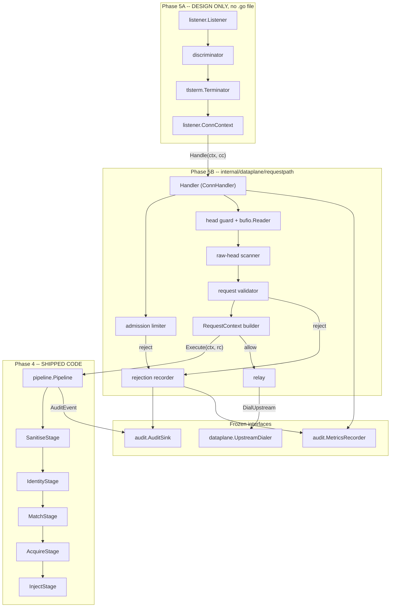
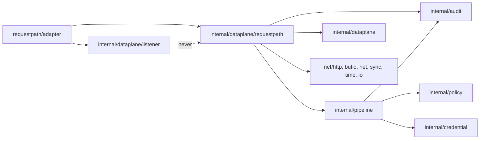

# S1b: Request Path and Pipeline Integration (HTTP/1.1)

> Status: Draft for review - Phase 5B design
> Phase: 5B
> Supersedes: ADR-S1-02 (`httputil.ReverseProxy`), and S1 section 6's relay mechanism only
> Superseded by: none
> Amends (as errata, not applied in this branch): S1a-dataplane-capture.md, named sections only
> Related: S0-architecture.md, S1-data-plane.md, S1a-dataplane-capture.md,
> S4-enforcement-pipeline.md, S6-observability.md, S7-security-testing.md,
> interface-guide.md

## 1. Metadata

| Field | Value |
| ----- | ----- |
| Document id | S1b |
| Title | Request Path and Pipeline Integration (HTTP/1.1) |
| Status | **Implemented and reconciled to code on this branch.** Phase 5B's request-path, adapter, audit sink, and pipeline addenda are checked in. The living sections below describe the implementation as it exists now; remaining gaps are called out explicitly as limitations or `[Planned -- not yet implemented]` items. The suite now exercises the real `listener.ConnContext` adapter, but most request-path coverage still runs over `net.Pipe` rather than a full listener+TLS end-to-end stack (section 20.3, L-15). |
| Phase | 5B (request path and pipeline integration) |
| Branch | `impl/phase-5b-request-path`, off the commit carrying the 5A design |
| Supersedes | `ADR-S1-02` in full, and the *mechanism* half of S1 section 6. See section 2 |
| Superseded by | none |
| Consumes | `internal/pipeline` (runner, five stages, `RequestContext`, `IdentityInput`, `Decision`, `AuditEvent`), `internal/dataplane.UpstreamDialer`, `internal/audit.AuditSink`, `internal/audit.MetricsRecorder`, `internal/policy.Transport`, 5A's `listener.ConnContext` and `tlsterm.CanonicaliseServerName` |
| Implements | `listener.ConnHandler` (through the adapter of section 6.5), `audit.AuditSink` (the first implementation in the tree), `pipeline.AuditSink` (same type, same method set) |
| Hands off to | 5C (upstream pooling and transport reuse; the Service ClusterIP index), 5D (HTTP/2; see ADR-S1b-01), S6 (metrics interface widening, OQ-S1a-02) |
| Empirical basis | None. Every number in section 14 is derived or inherited; none is measured. This is stated once here and again per row |
| Protocol scope | **HTTP/1.1 only** `[user]` (G0.2 Q2). No HTTP/2, no h2c, no HTTP/3, no WebSocket, no `CONNECT` tunnel |
| Output-path note | This document lives at `docs/design/S1b-request-path.md` rather than beside the brief. That is a deliberate deviation from the `design workflow` skill default, following the 5A precedent, and it is recorded in the phase's Agent Decisions document rather than here |

### 1.1 Glossary

| Term | Meaning |
| ---- | ------- |
| Handover | The moment 5A gives 5B a connection: one call to `ConnHandler.Handle` with a fully populated `*ConnContext` |
| Head | The request line plus the header block plus the terminating empty line. Everything the 64 KiB bound applies to |
| Head guard | The byte-counting `io.Reader` that sits *beneath* the `bufio.Reader` and makes `max_header_bytes` enforceable before an `*http.Request` exists (section 10.2) |
| Raw-head scanner | A validator, never a producer, that re-reads the captured head bytes looking for structural faults the stdlib parser does not have to reject (section 10.4) |
| Validated identity | The hostname `IdentityStage` writes into `RequestFacts.Identity` after the INV-8 comparison. The only value permitted to reach policy, `DialUpstream` and audit |
| Attested port | `ConnContext.OriginalDst.Port()`, recovered from a BPF map. The agent cannot forge it |
| Authority port | The optional port of the `Host` header. A claim, never an input to enforcement |
| In-flight request | A request that has acquired an admission slot and has not yet released it. Released after the response has been fully relayed or the connection has failed |
| Rejection path | Every 5B refusal that does not go through `Pipeline.Execute`: capacity, framing, protocol, pod-local. It has its own audit emitter (section 8.7) |
| Progress deadline | 60 s without a byte moving in either direction on an active request. Distinct from the 90 s idle timeout, which measures the gap *between* requests |
| T1..T9 | The transport rejection taxonomy defined in S1 section 8, restated for eBPF in S1a section 14 and for the request path in section 15 here |
| 5D | The label this document assigns to the phase that will implement HTTP/2. It is created here (ADR-S1b-01); no prior document names an h2 phase |

---

## 2. Supersession, amendment and authority map

Three different relationships are in play and conflating them would be a mistake, so each is
named separately: what 5B **supersedes** (S1's relay mechanism), what 5B **amends** (S1a, as an
errata list only), and what remains **authoritative** over 5B.

### 2.1 What S1b supersedes

| Source | Status after S1b | What replaces it |
| ------ | ---------------- | ---------------- |
| `ADR-S1-02` ("Build on `httputil.ReverseProxy`") | **Superseded in full** | `ADR-S1b-02`. Every behaviour ADR-S1-02 listed as inherited is re-provided or re-scoped explicitly; the row-by-row replacement table is in ADR-S1b-02, and the security half of it - S7 B21 - is re-answered in section 16.2 |
| S1 section 6, first paragraph ("The relay is built on `net/http/httputil.ReverseProxy`, not the PoC's `http.ReadRequest` + `io.Copy`") | **Superseded in mechanism only** | Sections 10 and 13 of this document. The *policy* S1 section 6 states - the header sequence, "bodies stream; they are not buffered", the reject-rather-than-tunnel list - is unchanged and is honoured here |
| S1 section 6's `Rewrite`-based injection point ("in `Rewrite`, immediately before `RoundTrip` (S4 stage 7)") | **Superseded in mechanism only** | `InjectStage` is already the injection point in shipped code, and 5B keeps it last (section 12.3). The empty gap ADR-S4-02 requires is between `InjectStage` and `http.Request.Write` |
| S1 section 7's "byte-counting wrapper around the streamed body" for the response body cap | **Deviated from, not superseded** | `DEV-S1b-01`. There is no byte cap in either direction `[user]`. The deviation is recorded in section 22 rather than presented as a supersession, because S1 section 7 remains authoritative for every other bound in its list |

Nothing else in S1 is superseded by this document. In particular S1 section 6.1 (plaintext),
S1 sections 5.1 to 5.4 (upstream transport, verification, pool key, timeouts) and S1 section 8
(the taxonomy and the wire-behaviour table) all remain authoritative, and section 15 of this
document reconciles itself against S1 section 8 explicitly rather than quietly diverging.

### 2.2 What remains authoritative over S1b

| Source | Authority it retains over the request path |
| ------ | ------------------------------------------ |
| `S0-architecture.md` INV-1 to INV-10 | All ten. Section 16.5 classifies each as upheld, not applicable, or deviated-from with an identifier |
| `S0-architecture.md` ADR-S0-13 | Denial-response uniformity, and the *scope* sentence that splits HTTP-level denials from transport-level rejections. Section 15.3 places every 5B rejection on one side of that line |
| `S1-data-plane.md` sections 5.1-5.4 | Where to connect, how to verify, the pool key, the timeout budget. 5B implements four of the eight timeouts (section 14.4) |
| `S1-data-plane.md` section 6, minus the mechanism | The header sequence, the streaming rule, the not-supported list |
| `S1-data-plane.md` section 6.1 | Plaintext. Out of scope for 5B (section 3.2); nothing here weakens it |
| `S1-data-plane.md` sections 7 and 8 | Resource bounds (except the response body cap, DEV-S1b-01) and the T1-T9 taxonomy |
| `ADR-S1-04` ("Reject rather than tunnel") | Unchanged and strengthened: `CONNECT` and `Upgrade` are refused at request level (sections 10.7, 10.8) |
| `S1a-dataplane-capture.md` sections 7.2, 7.3, 8, 9, 10, 11, 13.1, 13.2, 14, 23.2 | The frozen 5A contract 5B is written against, subject to the errata in section 26 |
| `S4-enforcement-pipeline.md` sections 1, 1.0, 1.1, 1.2, 3, 4, 4.1, 5, 6, 7 | The pipeline 5B wires. 5B adds no stage and changes no stage |
| `S6-observability.md` sections 2, 2.1, 2.2, 3, 4, 4.1 | The audit record shape, the metric families, and the label discipline. Section 18 states exactly how far the checked-in interfaces let 5B go |
| `S7-security-testing.md` section 1 and ADR-S7-01 | The bypass catalogue is the acceptance criterion. Section 16 re-answers every case 5B touches |
| `internal/dataplane/interfaces.go` | Frozen. 5B consumes `UpstreamDialer` and changes no signature |
| `internal/pipeline` | Frozen except for two named, additive changes: two `DenyReason` values (ADR-S1b-10) and one doc comment (O10) |

### 2.3 What S1b amends in S1a, and how

The HTTP/1.1-only decision, the reassignment of `max_h2_streams`, the `max_inflight_requests`
derivation and the resolution of `OQ-S1b-01` all require edits to `S1a-dataplane-capture.md`.
Per the G2 disposition for Q-F, **those edits are recorded here as an errata list (section 26)
and are not applied to S1a in this branch.** Section 26 is normative for a future editor: it
names the S1a section, quotes the current text, and gives the replacement. One of the fourteen
items - `UpstreamOptions.NextProtos` - is a correctness bug rather than a documentation edit,
and is marked as such.

---

## 3. Scope and requirements covered

### 3.1 In scope

1. A `ConnHandler` implementation that owns one downstream connection for its lifetime, and
   exactly one `bufio.Reader` over it (sections 6.4, 8.1).
2. HTTP/1.1 request-head parsing with Go's `http.ReadRequest`, over a `bufio.Reader`, over a
   byte-counting head guard that enforces `max_header_bytes` = 64 KiB on the wire `[user]`
   (sections 10.1 to 10.3).
3. A raw-head structural scanner and a semantic validator that together reject an enumerated
   list of request-smuggling and framing vectors, fail-closed per INV-4 `[user]`
   (sections 10.4, 10.5, 16.2).
4. Explicit rejection of HTTP/1.1 pipelining `[user]` (section 10.6).
5. Explicit handling of `Expect` (section 10.9), `CONNECT` (section 10.7) and `Upgrade`
   (section 10.8).
6. Construction of `pipeline.IdentityInput` and `pipeline.RequestContext` from `ConnContext`
   plus the parsed request, per the mapping frozen in S1a section 7.3 (section 11).
7. Closure of the INV-8 rule 2 port gap: `AuthorityPort` is compared against the attested port
   inside `IdentityStage`, absent means the scheme default and is allowed, a mismatch denies
   with `ReasonIdentityMismatch` `[user]` (section 11.3, ADR-S1b-07).
8. The pipeline wiring site: the exact stage slice, its order, and the constraint that keeps the
   runner's audit boundary correct (section 12).
9. Per-request evaluation on keep-alive connections, never per connection `[user]`
   (section 12.6).
10. The in-flight admission cap of 2048, enforced before any policy work, with an audit event on
    the rejection path `[user]` (sections 8.4, 8.7, 14.2).
11. The upstream relay: dial through `dataplane.UpstreamDialer` with the validated identity,
    re-serialise with `http.Request.Write`, stream the request body up and the response back
    with a fixed-size pooled buffer and no byte cap `[user]` (section 13).
12. The 60 s per-request progress deadline and the 90 s idle timeout, neither of which exists
    anywhere in the tree today (section 13.6).
13. A minimal `AuditSink` implementation - the first in the repository - plus a shared rejection
    recorder usable by both 5A's accept loop and 5B's handler (sections 8.7, 8.8).
14. The rejection taxonomy in request-path terms, with a per-rejection wire-behaviour table
    (section 15).
15. The interim metric encoding through the unchanged `audit.MetricsRecorder` (section 18.1).
16. Two additive `DenyReason` values and one doc-comment correction in `internal/pipeline`
    (sections 12.7, 26).
17. The S1a amendment errata list (section 26).

### 3.2 Out of scope

**HTTP/2** `[user]` - no parsing, no multiplexing, no `SETTINGS`, no `RST_STREAM`.
`max_h2_streams` is reassigned to 5D and no 5B component references it (ADR-S1b-01).
**Plaintext HTTP and the Service ClusterIP informer index** `[user]` - plaintext stays rejected
as `T9` at 5A's discriminator; 5C owns the index (section 15.4).
**Upstream connection pooling and transport reuse** - 5C. 5B dials through the frozen
`UpstreamDialer` interface, which already carries `credID`, so 5C changes no call site.
**Response body inspection or redaction** - the `ResponseStage` list is empty, exactly as S4
section 8 specifies for the MVP (ADR-S1b-06).
**Any byte cap on bodies** `[user]` - `DEV-S1b-01`.
**Widening `audit.MetricsRecorder`** - `OQ-S1a-02` is carried to S6 (section 18.1).
**A completion record** - S4's `CompletionEvent` and `CompletionOutcome` exist in S4 prose only,
not in code; 5B does not create them (`DEV-S1b-02`).
**Real CA lifecycle, the listener, the discriminator, the TLS terminator, the resolver** -
unchanged by 5B, per S1a section 23.2.
**A process entrypoint.** `cmd/aksh-proxy/main.go` is assigned to 5A by S1a section 24.1. 5B
adds the adapter and the sink; the three wiring lines are added to 5A's `main` when both exist
(section 6.5). 5B does not create `cmd/`.
**IPv6** - denied at the capture layer by 5A.

### 3.3 Acceptance criteria coverage

The 23 criteria are from the approved brief. Each row names the section that discharges it.

| # | Acceptance criterion (abbreviated) | Satisfied by |
| - | ---------------------------------- | ------------ |
| AC-1 | Document exists, ASCII/Mermaid only, states what it supersedes and amends | 1, 2, 26 |
| AC-2 | Reconciles the 5A/5B seam against the code that now exists, including the real `listener.ConnHandler` / `listener.ConnContext` contracts and the remaining adapter-shape debt | 6.1-6.5, 1 (Status), 20.3 |
| AC-3 | Full request/response relay, and what 5C replaces | 9, 13, 25.1 |
| AC-4 | HTTP/1.1 only; the S1a 11.1 ALPN amendment including the post-handshake assertion and the T5 rule | ADR-S1b-01, 26 (items A2, A3, A7) |
| AC-5 | `max_h2_streams` reassigned to a named phase, in S1b and as an S1a amendment; no 5B code references it | ADR-S1b-01, 14.1, 26 (item A5) |
| AC-6 | Pipelining rejected: detection, class, connection closed rather than drained | 10.6, 15.3 |
| AC-7 | 64 KiB enforced before `http.ReadRequest` consumes the head, with the reason the ordering is mandatory | 10.2, ADR-S1b-03 |
| AC-8 | Every anti-smuggling vector enumerated by name with outcome and test | 16.2 (the vector table), 20.1 |
| AC-9 | Bodies stream both directions, and the document states the current streaming mechanism plus the remaining `[Planned -- not yet implemented]` explicit copy-buffer path | 13.4, ADR-S1b-12 |
| AC-10 | `OQ-S1a-04` closed with "no byte cap, concurrency is the bound", reasoning given, S1a section 26's assignment to 5C noted | 14.3, DEV-S1b-01, 29 |
| AC-11 | 2048 enforced before policy; rejection path emits an audit event; `DenyReason` named; populated and zero fields listed; sink call bounded; saturation behaviour specified | 8.4, 8.7, 14.2, ADR-S1b-04, ADR-S1b-05 |
| AC-12 | 2048 restated as derived and unmeasured, with derivation and tuning signal carried forward | 14.2 |
| AC-13 | Policy re-evaluated per request, stated as an invariant with a named test and its silent failure mode | 12.6, 20.1 |
| AC-14 | `DEV-S1a-01` closed: every 5B rejection including pod-local reaches `audit.AuditSink`; which 5A outcomes stay out of reach | 8.7, 15.2, 16.5 (INV-6) |
| AC-15 | `T6` raised through `IdentityStage` as an audited denial; every `DenyReason` mapped to a `RejectClass` and a metric label | 11.3, 15.1, 15.3, 18.1 |
| AC-16 | `CONNECT` parsed then denied with an audited decision; deny reason named and reuse justified | 10.7, ADR-S1b-10 |
| AC-17 | Plaintext out of scope: `T9` restated, 5C named as the index owner, consequences stated | 15.4 |
| AC-18 | INV-4, INV-6, INV-8 each have a subsection including the port half of rule 2; INV-1, INV-2, INV-5, INV-7, INV-9 each classified | 16.5 |
| AC-19 | `OQ-S1a-02` carried to S6; the exact interim `RecordDecision` encoding stated so S6 can reverse it | 18.1, 29 |
| AC-20 | Parsing lives outside the pipeline; the Phase-4 stage list is unchanged; the stage order named; why `"inject"` must stay last | 12.1, 12.2, 12.3 |
| AC-21 | The response direction, including how `Execute`'s post-audit `DenyFault` return is interpreted against S4 section 1.0 | 12.5, 13.7 |
| AC-22 | Every ADR carries an `ADR-S1b-NN` id, including the five named minima | 21 |
| AC-23 | Test strategy: unit tests for every bound, vector, rejection class and the keep-alive invariant, all on Windows; named integration tests blocked on 5A, stated as a schedule risk | 20 |

---

## 4. Overview and design principles

### 4.1 Executive summary

Phase 4 built an enforcement pipeline that nothing calls. Phase 5A designed a capture layer
that terminates TLS and hands over an attributable connection. 5B is the piece between them,
and it is the first phase in which a real request is decided.

The shape is a `ConnHandler` implementation in a new package, `internal/dataplane/requestpath`.
It owns one downstream connection. For each request on that connection it acquires an admission
slot, reads exactly one request head under a byte bound the standard library does not offer,
scans the raw head bytes for structural faults, validates the parsed request against an
enumerated list of smuggling and framing vectors, builds a `pipeline.RequestContext`, calls
`Pipeline.Execute` once, and - only on an allow - dials the attested destination through the
frozen `UpstreamDialer`, re-serialises the mutated request with `http.Request.Write`, streams
the request body up and the response back through the standard library's streaming request/response paths, and then loops
for the next request with a completely fresh evaluation.

Four things about that sentence are load-bearing and each is a decision rather than an
implementation detail:

- **Parsing happens outside the pipeline** `[user]`, because `IdentityStage.Execute`
  dereferences `rc.Request.URL`, so an `*http.Request` must already exist when `Execute` is
  called. That is also what keeps the Phase-4 stage list untouched.
- **The byte bound sits below the parser**, not around it, because `http.ReadRequest` takes no
  size limit and `http.Server.MaxHeaderBytes` is a field of a server 5B does not use. A bound
  enforced anywhere above the parser is a bound that exists only on paper (ADR-S1b-03).
- **The admission slot is acquired before parsing and before policy** `[user]`, because that is
  the only place where shedding is cheap, and the shed request is audited on its own path so
  that `DEV-S1a-01` closes without a credential ever being materialised (ADR-S1b-04,
  ADR-S1b-05).
- **`http.Request.Write` re-serialises**, so the parse and the write share one set of framing
  rules. This is the structural half of the answer to S7 B21 now that `ReverseProxy` is gone
  (ADR-S1b-02, section 16.2).

5B alone yields a working proxy `[user]`. 5C then replaces the dialer with a pool and adds the
Service ClusterIP index; 5D adds HTTP/2.

### 4.2 Design principles

1. **One parser, one serialiser, one set of framing rules.** `http.ReadRequest` is the only
   thing in 5B that turns bytes into a request, and `http.Request.Write` is the only thing that
   turns a request back into bytes. Every additional check 5B performs is a *validator*: it may
   reject, and it may never produce a value the request is built from. A second producer is a
   parser differential, which is the mechanism of nearly every smuggling vector in section 16.2.
2. **Fail closed on ambiguity, not merely on error** (INV-4). Two `Content-Length` headers with
   the same value are not an error in any parser; they are ambiguity, and ambiguity denies.
   The zero value of `Disposition` is `DispositionInvalid`, and `normalizeDecision` in
   `runner.go` converts it into `DenyFault(ReasonInternal, ...)`; 5B relies on that mechanism
   rather than restating the invariant.
3. **Enforcement reads only kernel-attested values.** `RequestFacts.Port` comes from
   `ConnContext.OriginalDst.Port()`. The `Host` header's port is a claim to be validated and
   never an input to enforcement `[user]`. The same asymmetry S1a section 4.2 principle 2
   depends on is what makes INV-8 rule 2 meaningful here.
4. **Nothing 5B adds may weaken a decision the pipeline already makes.** 5B writes no
   enforcement logic. It builds inputs, calls `Execute`, and obeys the result. Where a check
   belongs inside a stage - the `AuthorityPort` comparison is the case in point - it goes in the
   stage, so that it is audited rather than dropped at transport (ADR-S1b-07).
5. **Every refusal is a record.** A refusal that is only counted is not evidence. 5B routes
   every rejection it can raise, including the ones that happen before a policy has run, through
   an audit emitter (section 8.7). That is `DEV-S1a-01` closed rather than deferred.
6. **Bound the memory, not the message.** There is no byte cap on bodies `[user]`. Concurrency
   is the bound, and the derivation in section 14.2 is stated so the next reader can check the
   arithmetic rather than trust the number.
7. **Say which side of the parse line a rejection falls on.** ADR-S0-13 scopes uniformity to
   requests parsed far enough for an HTTP response to exist. 5B straddles that line by
   construction, so every rejection in section 15.3 says which side it is on and why its wire
   behaviour is safe.
8. **Platform independence.** Unlike 5A there is no Linux-only path in 5B. Every file compiles
   and every test runs on Windows with no kernel and no build tag.

### 4.3 What changes relative to S1, S1a and the shipped code

| Aspect | Before 5B | After 5B |
| ------ | --------- | -------- |
| Relay mechanism | `httputil.ReverseProxy` (ADR-S1-02, design only) | `http.ReadRequest` + validators + `http.Request.Write` + a pooled-buffer relay (ADR-S1b-02) |
| Protocol set | ALPN offers `{h2, http/1.1}` (S1a 11.1) | ALPN offers `{http/1.1}` only; h2 deferred to 5D (ADR-S1b-01) |
| Header bound | Declared at 64 KiB, unenforced (S1a 13.1) | Enforced on the wire, beneath the parser (section 10.2) |
| In-flight bound | Declared at 2048, unenforced, derived from h2 stream math | Enforced in the handler; the derivation is rewritten without the h2 premise and still lands on 2048 (section 14.2) |
| `max_h2_streams` | Declared at 100, "5A-declared, 5B-enforced" | Reassigned to 5D; unreachable in 5B; no 5B code references it |
| Body size | `OQ-S1a-04`, open, owner listed as 5C | Closed: no cap, in either direction (`DEV-S1b-01`) |
| Transport denials | Counted and logged; not audited (`DEV-S1a-01`) | Audited through a real sink, including the pod-local case once 5A's accept loop calls the shared recorder (section 8.7, 15.2) |
| `AuditSink` implementations | None anywhere in the tree | One: `audit.StreamSink` (section 8.8) |
| `T6 identity_mismatch` | Never raised by anything | Raised by `IdentityStage` on a hostname or port mismatch, audited (section 11.3) |
| INV-8 rule 2 port half | Unchecked; `IdentityStage` never reads `AuthorityPort` | Checked inside `IdentityStage`; absent means allowed (ADR-S1b-07) |
| Callers of `Pipeline.Execute` | Test code only | One production caller, per request (section 12) |
| Progress deadline, idle timeout | Named in S1 5.4 and S1a 13.2; implemented nowhere | Implemented in the relay (section 13.6) |
| `Expect: 100-continue` | "Handled by the standard library" (S1 section 6) | Handled explicitly; anything else is refused (section 10.9) |
| Trailers | `sanitise.go` strips declared names once at stage 0 | A request that *declares* a credential-bearing or hop-by-hop trailer name is refused outright (ADR-S1b-09, section 16.3) |

---

## 5. Architecture

### 5.1 Component diagram



Three things the diagram is meant to make unmissable. The 5A box is design only: nothing in it
exists as Go source (section 6.1). The pipeline box is shipped code that 5B does not modify
beyond two additive enum values. And the rejection recorder has an edge to the sink that does
*not* pass through the pipeline - that edge is `DEV-S1a-01`'s closure and it is the reason a
capacity rejection can be audited without a credential ever being acquired.

### 5.2 Dependency graph



The dashed non-edge is a design constraint, not an observation. `listener` must never import
`requestpath`: 5A depends only on the `ConnHandler` interface it declares itself, and the
adapter that binds the two is a separate file in `requestpath` that imports `listener`. If that
direction were reversed the packages would be mutually recursive the moment 5A wanted a typed
handler, and Go would refuse to build. The adapter still isolates the import direction, but it is now an ordinary compiled file because `internal/dataplane/listener` ships real Go types on this branch (section 6.5).

`requestpath` does not import `internal/policy` or `internal/credential`. It never needs to: the
pipeline owns both, and 5B's contact surface with policy is `RequestFacts`, whose
`policy.Transport` field is a plain string type (`policy.TransportTLS = "tls"`).

### 5.3 Request lifecycle sequence

```mermaid
sequenceDiagram
    participant A as Agent
    participant H as requestpath.Handler
    participant G as head guard + bufio
    participant V as validator
    participant P as pipeline
    participant U as upstream
    participant S as AuditSink

    A->>H: TLS conn handed over (ConnContext)
    loop per request, keep-alive
        H->>H: acquire admission slot (cap 2048)
        alt slot unavailable
            H->>S: rejection audit (resource_limit)
            H-->>A: close, no status
        end
        H->>G: arm head guard at 64 KiB, set 10 s read deadline
        G->>G: http.ReadRequest over bufio.Reader
        alt head > 64 KiB
            H->>S: rejection audit (resource_limit)
            H-->>A: 431 then close
        end
        G->>V: parsed request + captured raw head
        V->>V: raw-head scan, framing, version, method, target, Expect, trailers
        alt structural fault
            H->>S: rejection audit (unsupported_protocol / malformed_target)
            H-->>A: 400 then close
        end
        V->>H: validated request, handler builds RequestContext
        H->>P: Execute(ctx, rc)
        P->>S: AuditEvent (allow or deny)
        alt deny, Reason == ReasonIdentityMismatch
            H-->>A: bare close, no status, no body (15.3 rows 24-25, DEV-S1b-07)
        else deny, any other reason
            H-->>A: 403, generic body, close (ADR-S0-13)
        else allow
            P->>H: mutated *http.Request (credential injected)
            H->>U: DialUpstream(ctx, addr, serverName, credID)
            H->>U: req.Write(conn) -- head then streamed body
            U->>H: http.ReadResponse
            H-->>A: resp.Write(conn) -- head then streamed body
            H->>H: release slot; check pipelining; loop
        end
    end
```

Two call shapes in that diagram are load-bearing. `Execute` originates from the handler, not
from the validator: `Validate` returns to the handler, which builds the `RequestContext` and
then calls the pipeline (section 9). And `DialUpstream(ctx, addr, serverName, credID)` splits
its two identity-bearing arguments by source of truth: `addr` is the kernel-attested
`ConnContext.OriginalDst`, never a value derived from a header, while `serverName` is the
validated identity (section 11). Policy is matched against the kernel-attested value; a header
can never redirect the dial. The deny branch is split because the wire behaviour is not uniform:
a `ReasonIdentityMismatch` denial closes bare, and section 15.3 is authoritative for every row.

### 5.4 Where 5B sits in the phase sequence

| Phase | State | Relationship to 5B |
| ----- | ----- | ------------------ |
| 0-4 | **Implemented** | 5B calls the Phase-4 pipeline; the five stages and the runner are shipped Go |
| 5A | **Design only** | 5B's input contract. Nothing in it is code except `internal/dataplane/interfaces.go` |
| 5B | This document | Request path, relay, first `AuditSink` |
| 5C | Not started | Upstream pooling, transport reuse, the Service ClusterIP index and therefore plaintext |
| 5D | Named here for the first time | HTTP/2, and the owner of `max_h2_streams` |

---

## 6. The 5A/5B seam

### 6.1 What actually exists, precisely

This section now describes shipped Go code, not a speculative seam.

**Exists as Go source, today, on this branch:**

- `internal/dataplane/listener`, including the real `ConnHandler` interface and `ConnContext` owned by 5A.
- `internal/dataplane/requestpath`, including `adapter.go`, `handler.go`, the raw-head scanner, validator, limiter, relay, fuzz targets, and the request-path tests.
- `internal/audit`, including the first real `AuditSink` implementation (`StreamSink`) and the detached `RejectionRecorder`.
- `internal/pipeline`, `internal/policy`, `internal/credential`, and the rest of Phases 0-4.

**What the real 5A seam looks like today:**

- `listener.ConnHandler` is real and has the expected signature: `Handle(ctx context.Context, cc *listener.ConnContext) error`.
- `listener.ConnContext` is also real, but its field set differs from the earlier design-time mirror: it has `Downstream`, `PeerAddr`, `OriginalDst`, `OriginUID`, `Protocol`, `Transport`, `CandidateSNI`, `NegotiatedALPN`, `AcceptedAt`, and `ConnID`; it does **not** expose a separate `TLSConn` field.
- The live adapter therefore maps `cc.Downstream` into both `Handover.TLSConn` and `Handover.Downstream`, derives `Handover.SourceIP` from `cc.PeerAddr.Addr()`, copies the full `PeerAddr`, translates `CandidateSNI` into `SNI`, and reduces `Protocol` to `IsTLS` with the check `cc.Protocol == listener.ProtocolTLS`.

Consequences that this document now states explicitly:

1. 5B is no longer blocked on 5A for compilation or adapter tests. `adapter.go` is a real file, compiled and tested against the real `listener.ConnContext` type.
2. The earlier `TLSConn` vs. `Downstream` separation remains the **design target**, but the live 5A/5B seam currently collapses that distinction in the adapter. This is implemented reality and remains tracked as technical debt rather than as a blocker.
3. A green 5B suite is now stronger evidence than it was at design time because it exercises the real adapter. It is still not full listener+TLS end-to-end proof, because most request-path coverage uses `net.Pipe` rather than a full accept-loop plus TLS-terminator stack (L-15).

### 6.2 The handover contract

5A now hands 5B a real `*listener.ConnContext`, and `adapter.go` copies it into a `Handover`.
The fields that matter at the seam are therefore best stated as a mapping rather than as a purely forward-looking contract:

| Real 5A field | Adapter / 5B use |
| ----- | -------- |
| `Downstream net.Conn` | Copied into both `Handover.TLSConn` and `Handover.Downstream`. Request-path code reads only `Handover.TLSConn`; the semantic overlap is current implementation debt, not a second code path |
| `PeerAddr netip.AddrPort` | Preserved as `Handover.PeerAddr`; `Handover.SourceIP` is derived from `PeerAddr.Addr()` for legacy consumers |
| `OriginalDst netip.AddrPort` | The kernel-attested destination. `Port()` is the attested port for INV-8 rule 2 |
| `CandidateSNI string` | Copied into `Handover.SNI`, then fed to `IdentityInput.SNI` |
| `Protocol listener.Protocol` | Reduced to `Handover.IsTLS` via `cc.Protocol == listener.ProtocolTLS` |
| `AcceptedAt time.Time` | Carried through unchanged for connection-lifetime bookkeeping |
| `ConnID string` | Used to derive per-request `RequestID`s (`connID-ordinal`). It is **not** serialised into `pipeline.AuditEvent`, because that schema has no `ConnID` field |
| `OriginUID uint32`, `Transport policy.Transport`, `NegotiatedALPN string` | Passed through into `Handover` so the seam stays visible and future consumers do not need a second mirror change |

5B mutates none of the 5A-owned values. The adapter performs a one-time structural translation and `Handler.Serve` then treats the resulting `Handover` as read-only for the connection's lifetime.

### 6.3 OQ-S1b-01: the TLS connection field (option B) `[user]`

The design decision remained: **5B should read cleartext from an explicit `TLSConn`-like slot and must never fall back to a pre-TLS byte stream implicitly.**

What shipped is slightly different at the 5A seam:

- `requestpath.Handover` still carries both `TLSConn` and `Downstream`, and the handler still asserts `Handover.TLSConn != nil` and reads requests only from that field.
- The real `listener.ConnContext`, however, currently exposes only `Downstream`.
- `adapter.go` therefore sets both `Handover.TLSConn` and `Handover.Downstream` from `cc.Downstream`.

So the **internal 5B contract** matches the original decision, but the **external 5A/5B seam** does not yet have a distinct field. This keeps the handler logic simple and localises the seam mismatch inside one adapter function. If 5A later grows an explicit TLS-stream field, the adapter is the only place that changes.

`[Planned -- not yet implemented]` A distinct 5A-owned field separating the cleartext stream from any pre-TLS transport vocabulary still has architectural value. The current overlap is acceptable for the shipped code because requestpath never reads `Handover.Downstream`; it remains technical debt because the names imply a distinction the live adapter cannot currently preserve.

### 6.4 Exactly one `bufio.Reader` per connection

The handler creates one `bufio.Reader` when the connection is handed over and uses it for every
request on that connection. This is not an optimisation; it is a correctness requirement with
two independent reasons.

First, `bufio.Reader` may read ahead. If request *n*'s reader has buffered the first bytes of
request *n+1* and is then discarded, those bytes are lost, and the next request is parsed from
the middle of itself. Any smuggling defence built on top of that is theatre.

Second, pipelining detection (section 10.6) is defined as "the reader has buffered bytes at a
moment when it must not". That predicate is only meaningful if the reader is the same object
across the whole connection.

The head guard beneath it is re-armed per request (section 10.2); the `bufio.Reader` above it is
not recreated.

### 6.5 The adapter, and why `cmd/` is not a 5B deliverable

S1a section 24.1 still assigns `cmd/aksh-proxy/main.go` to 5A, so 5B still does not create it.
What changed since the design draft is that the adapter is no longer hypothetical:

- `internal/dataplane/requestpath/adapter.go` is checked in, compiles on this branch, and makes `*Handler` satisfy `listener.ConnHandler` directly.
- The adapter is intentionally small. `Handle(ctx, cc)` calls `handoverFromConnContext(cc)` and delegates to `Serve(ctx, ho)`.
- The structural translation performed there is the authoritative description of the current seam: `PeerAddr` is preserved, `SourceIP` is derived from it, `CandidateSNI` becomes `SNI`, `ProtocolTLS` becomes `IsTLS`, and `cc.Downstream` currently backs both `TLSConn` and `Downstream` in the mirror.

The `Handover` mirror therefore remains real code, but it is no longer a build-conditional or an "absent until 5A exists" device. It is a convenience seam that keeps request-path tests and local reasoning simple while quarantining the current 5A/5B field-shape differences in one place.

`cmd/` remains out of scope for 5B even though the adapter now exists: 5A still owns the process entrypoint and listener construction.

### 6.6 Handover preconditions the handler asserts

The handler asserts these on entry, before touching a byte of the stream. Each failure is an
internal inconsistency (`Fault = true`), audited on the rejection path, connection closed with
no status:

| Precondition | Why it is asserted rather than assumed |
| ------------ | -------------------------------------- |
| `TLSConn != nil` | Section 6.3 |
| `IsTLS` is true | 5B has no plaintext path; a plaintext connection reaching 5B means the discriminator regressed. `IsTLS == false` marks a `T9` plaintext connection, which has no TLS layer at all and therefore also fails the `TLSConn != nil` row |
| `OriginalDst` is non-zero and IPv4 | The attested destination is the only enforcement input; a zero value would silently produce port 0 and make INV-8 rule 2 vacuous |
| `SNI != ""` | Not asserted. An empty SNI is a client behaviour, and `IdentityStage` already owns the response to it. See section 11.4 on `ReasonNoSNI` |

The third row is the one worth pausing on. If `OriginalDst` were ever the zero value, the
attested port would be 0, and 5B's `AuthorityPort` rule treats an absent authority port as
"matches the scheme default" - so a zero attestation combined with an absent `Host` port would
compare 0 against 0 and *pass*. Asserting a non-zero attestation is what stops a capture-layer
bug from turning into a silent identity-check bypass.

---

## 7. Core data types

Every signature below is either quoted from checked-in code (marked SHIPPED), quoted from S1a
(marked 5A DESIGN), or new in 5B (marked NEW). Nothing is paraphrased into a plausible-looking
signature: where a 5A signature is not declared anywhere, that is stated rather than invented.

### 7.1 Types consumed unchanged

```go
// SHIPPED -- internal/dataplane/interfaces.go
type UpstreamDialer interface {
    DialUpstream(ctx context.Context, addr netip.AddrPort, serverName string, credID string) (net.Conn, error)
}

// SHIPPED -- internal/audit/interfaces.go
type AuditSink interface {
    Record(ctx context.Context, event pipeline.AuditEvent) error
}

type MetricsRecorder interface {
    RecordDecision(disposition, reason, identity string)
    RecordLatency(stage string, duration time.Duration)
    RecordTokenCacheHit(credID string, hit bool)
}

// SHIPPED -- internal/pipeline/runner.go
type AuditSink interface {
    Record(ctx context.Context, ev AuditEvent) error
}

func NewPipeline(stages []Stage, sink AuditSink) *Pipeline
func (p *Pipeline) Execute(ctx context.Context, rc *RequestContext) (decision Decision)

// SHIPPED -- internal/pipeline/types.go
type IdentityInput struct {
    SNI             string // TLS ServerName (agent-chosen)
    AuthorityHost   string // HTTP Host / :authority hostname
    AuthorityPort   uint16 // HTTP Host / :authority port (0 if absent)
    DestinationPort uint16 // kernel-attested port
}

type RequestContext struct {
    Request     *http.Request
    Identity    IdentityInput
    Transport   policy.Transport
    Facts       policy.RequestFacts
    MatchResult policy.MatchResult
    TokenResult token.TokenResult
    Decision    Decision
    StartTime   time.Time
    RequestID   string
    Timings     map[string]time.Duration
}
```

Note on the `DestinationPort` doc comment. The checked-in comment reads "kernel-attested port
from SO_ORIGINAL_DST". S1a section 6.3 and the doc comment on `DestinationResolver` both state
that the destination is read from a BPF map written by the capture programs, *not* from a socket
option. The comment is therefore stale. Correcting it is obligation O10 and is listed as a
deliverable in section 27; it is a comment-only change with no behavioural effect.

Two observations about `pipeline.AuditSink` and `audit.AuditSink`. They are distinct interface
declarations in distinct packages with identical method sets modulo the parameter name (`event`
versus `ev`). Go structural typing means one concrete type satisfies both, so 5B's `StreamSink`
implements both without an adapter and without either package importing the other's interface.
This is the answer to risk R-07 and it is verified by a compile-time assertion in the sink's
test file rather than assumed.

### 7.2 New types: the handler and its options

```go
// NEW -- internal/dataplane/requestpath/handler.go
//
// Handler serves HTTP/1.1 requests from one terminated downstream
// connection. One Handler instance is shared by every connection; all
// per-connection state lives on the stack of Serve.
type Handler struct {
    pipeline *pipeline.Pipeline
    dialer   dataplane.UpstreamDialer
    sink     audit.AuditSink
    metrics  audit.MetricsRecorder
    limiter  *Limiter
    reject   *audit.RejectionRecorder
    opts     Options
    bufPool  *sync.Pool // reserved for a future explicit copy-buffer path; currently not used by relay
    now      func() time.Time
}

func NewHandler(
    p *pipeline.Pipeline,
    dialer dataplane.UpstreamDialer,
    sink audit.AuditSink,
    metrics audit.MetricsRecorder,
    opts Options,
) (*Handler, error)
```

```go
// NEW -- internal/dataplane/requestpath/options.go
type Options struct {
    MaxHeaderBytes          int           // default 65536
    MaxInflightRequests     int           // default 2048
    CopyBufferBytes         int           // default 32768
    HeaderReadTimeout       time.Duration // default 10s
    IdleTimeout             time.Duration // default 90s
    ProgressDeadline        time.Duration // default 60s
    UpstreamDialTimeout     time.Duration // default 15s; see section 14.4
    UpstreamResponseTimeout time.Duration // default 30s
    MaxRejectionAudits      int           // default 64
    RejectionAuditTimeout   time.Duration // default 250ms
}

func DefaultOptions() Options
func (o Options) Validate() error
```

`Validate` rejects a zero or negative value in every field rather than silently substituting a
default, because a config surface that repairs itself is a config surface where a typo becomes a
disabled bound. `NewHandler` returns the validation error; it does not log and continue.
`DefaultOptions` is the only source of default values, so the numbers in section 19 and the
numbers in the code cannot drift apart.

### 7.3 New types: the handover mirror

```go
// NEW -- internal/dataplane/requestpath/handover.go
//
// Handover mirrors the 5A connection fields consumed by the request path.
type Handover struct {
    TLSConn        net.Conn
    Downstream     net.Conn
    SourceIP       netip.Addr
    PeerAddr       netip.AddrPort
    OriginalDst    netip.AddrPort
    SNI            string
    ConnID         string
    AcceptedAt     time.Time
    IsTLS          bool
    OriginUID      uint32
    Transport      policy.Transport
    NegotiatedALPN string
}

func (h *Handler) Serve(ctx context.Context, ho Handover) error
```

`Handover` is now a **real mirror over a real `listener.ConnContext`**, not a speculative pre-5A placeholder. The current adapter fills it as follows:

- `TLSConn` and `Downstream` are both sourced from `cc.Downstream`.
- `SourceIP` is derived from `cc.PeerAddr.Addr()` while `PeerAddr` is preserved separately.
- `SNI` comes from `cc.CandidateSNI`.
- `IsTLS` is derived from `cc.Protocol == listener.ProtocolTLS`.
- `OriginUID`, `Transport`, and `NegotiatedALPN` are preserved even though requestpath's current core flow does not yet read them.

The name collision with `listener.RejectClass` is worth calling out here as well: `requestpath` and `listener` each define their own `RejectClass`, with different concrete types and different roles. The shared T1-T9 taxonomy is conceptual, not a shared Go type.

### 7.4 New types: per-connection and per-request state

```go
// NEW -- internal/dataplane/requestpath/relay.go and handler.go

type connState struct {
    ho       Handover
    source   *prependConn
    br       *bufio.Reader
    guard    *HeadGuard
    upstream *upstreamConn
    served   int
}

type prependConn struct {
    net.Conn
    prefix []byte
}
```

`connState` is owned exclusively by the goroutine running `Serve`; it is never shared and needs no lock. `prependConn` is the small utility that makes the idle-wait path safe: `waitForRequest` reads one byte under the idle deadline, then pushes that byte back so the subsequent head read sees an untouched request stream.

Earlier design drafts described a separate `reqState` struct. **Current implementation reality:** request-scoped data now lives in local variables (`req`, `rawHead`, `expectContinue`) plus the `pipeline.RequestContext` built for the current request, so there is no concrete `reqState` type in shipped code.

### 7.5 New types: rejection

```go
// NEW -- internal/dataplane/requestpath/reject.go

type RejectClass string

const (
    ClassT1 RejectClass = "no_original_dst"
    ClassT2 RejectClass = "loop_guard"
    ClassT3 RejectClass = "no_sni"
    ClassT4 RejectClass = "handshake"
    ClassT5 RejectClass = "unsupported_protocol"
    ClassT6 RejectClass = "identity_mismatch"
    ClassT7 RejectClass = "resource_limit"
    ClassT8 RejectClass = "plaintext_unresolvable"
    ClassT9 RejectClass = "plaintext_registry_unavailable"
)

type WireBehaviour int

const (
    WireCloseBare WireBehaviour = iota
    WireWrite400Close
    WireWrite431Close
)

type Rejection struct {
    Class     RejectClass
    Reason    pipeline.DenyReason
    Bound     string
    Wire      WireBehaviour
    Status    int
    Fault     bool
    RequestID string
    ConnID    string
    Port      uint16
    Method    string
    Path      string
}
```

One subtle but important point: `Rejection.Wire` describes **only the pre-pipeline rejection path**. The pipeline's uniform 403 denial is not encoded as a `WireBehaviour` value because it is not a `Rejection`.

`requestpath.RejectClass` is also intentionally distinct from `listener.RejectClass`. They share the same transport-taxonomy vocabulary, but they are different Go types in different packages and must not be treated as interchangeable at compile time.

## 8. API reference

### 8.1 `Handler.Serve` -- the connection loop

```go
// Serve owns ho.TLSConn for its entire lifetime and closes it before
// returning. It returns nil when the connection ended normally (agent
// closed, idle timeout, or a designed rejection) and a non-nil error only
// for an internal fault the operator should see.
func (h *Handler) Serve(ctx context.Context, ho Handover) error
```

Loop structure, one iteration per request:

1. Wait for the first byte under `Options.IdleTimeout`. Idle timeout or EOF before the first byte ends the connection quietly with no audit record.
2. Acquire an admission slot. On failure: emit the rejection record and close bare.
3. Read one request head under `Options.HeaderReadTimeout` through the armed `HeadGuard`.
4. Validate. On failure: emit the rejection record and either write 400 / 431 or close bare per section 15.3.
5. Build `RequestContext` and call `pipeline.Execute(ctx, rc)` exactly once.
6. On allow: relay. On deny with `ReasonIdentityMismatch`: close bare after the pipeline has already audited the denial. On any other deny: write the uniform 403 response.
7. After a successful relay, reject pipelining if buffered bytes or an immediate next byte are present; otherwise loop for the next request.

The limiter slot is released by a `defer` scoped to `serveOne`, not to the full lifetime of `Serve`, so a keep-alive connection still holds at most one in-flight slot at a time.

### 8.2 `HeadGuard` -- the pre-parse byte bound

```go
// NEW -- internal/dataplane/requestpath/headreader.go

type HeadGuard struct {
    r         io.Reader
    limit     int
    remaining int
    armed     bool
    tee       []byte
}

func NewHeadGuard(r io.Reader, limit int) *HeadGuard
func (g *HeadGuard) Arm()
func (g *HeadGuard) Disarm()
func (g *HeadGuard) Read(p []byte) (int, error)
func (g *HeadGuard) Head() []byte
```

Current behaviour, as implemented:

- `NewHeadGuard` clamps a negative limit to 0 and preallocates the capture slice with capacity equal to that limit.
- While armed, `Read` truncates the caller's buffer to the remaining budget before reading from the underlying reader, so the guard never over-reads past the limit.
- Bytes successfully read while armed are appended to `tee` and reduce `remaining`.
- If the underlying reader returns a **short read that exactly exhausts the remaining budget** with no error, `HeadGuard` returns that short read and **does not** synthesize `ErrHeadTooLarge` on the same call; the bound error appears on the next read attempt once the budget is already 0. This is deliberate and tested, because the caller must receive the real final bytes before the guard turns the next read into a bound failure.
- `Disarm` stops both counting and capture; body bytes are therefore not appended to the head tee after the parser has returned.

### 8.3 The raw-head tee and structural scanner

```go
// NEW -- internal/dataplane/requestpath/rawhead.go
//
// ScanRawHead inspects the literal bytes of a request head for structural
// faults that are invisible after parsing. It is a validator only: it
// returns a fault or nil, and never produces a value used to construct the
// request. See ADR-S1b-02 and S1b section 16.2.
func ScanRawHead(head []byte) *Rejection
```

The scanner is necessary, not belt-and-braces, because parsing is lossy in ways that matter.
`http.ReadRequest` moves the `Host` header into `req.Host` and removes it from `req.Header`, so
a request carrying two `Host` headers is indistinguishable from one carrying a single `Host`
after the parse. Duplicate-`Host` is a classic request-smuggling primitive. If 5B wants to
reject it, it must look at the bytes.

The scanner is deliberately *stricter than the parser and never more permissive*. It can only
add rejections. That asymmetry is what makes it safe to run a second reader over the same bytes:
a parser differential is dangerous when two components disagree about what a request *means*,
and harmless when the second component's only output is "refuse".

### 8.4 `Limiter` -- the in-flight admission cap

```go
// NEW -- internal/dataplane/requestpath/limiter.go
//
// Limiter is a counting semaphore with a non-blocking acquire. A request
// that cannot get a slot is rejected immediately; it does not queue.
// Queueing would convert a load problem into a latency problem and would
// let an agent pin memory by opening connections it never drives.
type Limiter struct {
    ch chan struct{}
}

func NewLimiter(n int) *Limiter

// TryAcquire returns false immediately when the cap is reached.
func (l *Limiter) TryAcquire() bool

// Release returns a slot. Releasing more than was acquired is a
// programming error and panics in tests via a paired counter assertion.
func (l *Limiter) Release()

// InFlight reports the current count, for the gauge of section 18.1.
func (l *Limiter) InFlight() int
```

A buffered channel is used rather than `golang.org/x/sync/semaphore` because the latter is a
dependency the module does not have and its weighted semantics are not needed, and rather than
an atomic counter with compare-and-swap because a channel gives `TryAcquire` for free with a
`select` default and is impossible to get subtly wrong under contention.

### 8.5 The validator

```go
// NEW -- internal/dataplane/requestpath/validate.go
func Validate(req *http.Request, rawHead []byte, ho Handover, opts Options) *Rejection
```

`Validate` is still the request-level gate between parsing and pipeline execution, but two details from the design draft are worth reconciling to current code:

- The current implementation mutates `req` in **two** narrow cases: it rewrites `OPTIONS *` to `URL.Path = "/"` / `URL.RawPath = ""`, and it removes `Expect` only when exactly one `100-continue` expectation has been accepted.
- `ho` and `opts` are part of the function contract but are not currently read by the implementation. They remain in the signature so callers and tests do not need another seam change if request-level validation later needs handover- or option-derived context.

The implemented check order is:

1. `ScanRawHead`.
2. Nil request / nil URL guard.
3. Exact HTTP/1.1 only.
4. `CONNECT` refused.
5. `Upgrade` refused.
6. Target-form validation, including absolute-form vs. `Host` agreement.
7. `Host` / authority parsing via `splitAuthority`.
8. Framing validation.
9. `Expect` validation.
10. Trailer-declaration validation.

### 8.6 The relay

```go
// NEW -- internal/dataplane/requestpath/relay.go
//
// upstreamConn is one dialled upstream connection plus the reader used to
// parse responses from it. Reused across keep-alive requests only while
// the validated identity, the attested port and the credential identity
// are all unchanged (S1 section 5.3 pool key, INV-8 rule 7).
type upstreamConn struct {
    conn     net.Conn
    br       *bufio.Reader
    identity string
    port     uint16
    credID   string
}

// Relay writes the mutated request upstream, reads the response head, and
// streams the response body downstream. It returns the number of body
// bytes relayed in each direction for the latency and throughput metrics,
// and an error only when the exchange failed.
//
// Relay is the only place in 5B that writes to the upstream connection and
// the only place that writes a non-rejection response downstream.
func (h *Handler) relay(
    ctx context.Context,
    cs *connState,
    rs *reqState,
) (relayResult, error)

type relayResult struct {
    Status        int
    RequestBytes  int64
    ResponseBytes int64
    Outcome       string // closed set; see S1b section 18.1
}
```

```go
// progressConn wraps a net.Conn and stamps a monotonic timestamp on every
// successful Read or Write. The watchdog of section 13.6 reads the stamp;
// it is the mechanism for the 60 s progress deadline, which is what
// distinguishes a slow-but-live transfer from a stalled one.
type progressConn struct {
    net.Conn
    last *atomic.Int64 // unix nanos of the most recent byte moved
}
```

### 8.7 `RejectionRecorder` -- the audit path for refusals

```go
// NEW -- internal/audit/rejection.go
//
// RejectionRecorder emits an audit record for a refusal that never
// reached the enforcement pipeline: capacity, framing, protocol,
// identity-at-transport and pod-local rejections.
//
// It lives in internal/audit rather than in the request path so that
// Phase 5A's accept loop can close DEV-S1a-01 for the pod-local (T2) and
// connection-cap (T3) cases with a single call, without importing the
// request path. See S1b section 26, amendment A15.
type RejectionRecorder struct {
    sink    AuditSink
    metrics MetricsRecorder
    timeout time.Duration
    slots   chan struct{}
    dropped atomic.Uint64
    emerg   func(format string, args ...any) // INV-6 emergency channel
}

func NewRejectionRecorder(
    sink AuditSink,
    metrics MetricsRecorder,
    maxConcurrent int,
    timeout time.Duration,
    emerg func(format string, args ...any),
) *RejectionRecorder

// Record emits one rejection record. It never blocks the caller on the
// sink beyond timeout, and never propagates the caller's cancellation
// into the sink: a client that disconnects must not be able to suppress
// the record of its own rejection. This mirrors the detachment that
// Pipeline.audit already performs in runner.go.
func (r *RejectionRecorder) Record(rej Rejection)

// Dropped reports records shed because maxConcurrent was saturated. Used
// by readiness (INV-6) and by the drop counter of section 18.1.
func (r *RejectionRecorder) Dropped() uint64
```

Three properties of `Record` that are design decisions rather than implementation freedom:

**It detaches from the request context.** `runner.go`'s `audit` method already does this, with
the comment "Request cancellation is agent-controlled. Detaching prevents a client disconnect
from suppressing its decision record, while the private deadline still bounds sink stalls." The
rejection path needs exactly the same property for exactly the same reason, and this is the
mechanism that keeps S7 B45 closed (section 16.4).

**It is bounded twice.** By time (`RejectionAuditTimeout`, defaulting to 250 ms to match
`defaultAuditTimeout` in `runner.go`) and by concurrency (`MaxRejectionAudits`, default 64). The
concurrency bound exists because the rejection path is, by construction, the path a hostile
agent can drive fastest: it costs the agent one TCP connection and a malformed byte to force a
record. Without a bound, an unbounded goroutine-per-rejection design turns the audit sink into
the amplification target.

**On saturation it degrades to INV-6's emergency channel rather than blocking or silently
dropping.** A shed record increments `dropped`, writes one line to the emergency channel, and
flips readiness. INV-6 requires that audit failure be visible; it does not require that every
record survive an attack designed to exhaust the sink, and blocking the rejection path would
make the sink a denial-of-service lever against the proxy itself.

The asymmetry with the pipeline is deliberate and must be stated plainly: inside
`Pipeline.Execute`, a sink error is fail-closed - `runner.go` converts it to
`DenyFault(ReasonAuditUnavailable, err)` and the request is denied. On the rejection path the
request is *already* being refused, so there is no decision left to fail closed on. The
fail-closed obligation therefore attaches to readiness, not to the individual request.

### 8.8 `StreamSink` -- the first real `AuditSink`

```go
// NEW -- internal/audit/streamsink.go
//
// StreamSink writes one JSON object per audit record to an io.Writer,
// newline-delimited. It is the first AuditSink implementation in the
// repository; before Phase 5B only the interface and test fakes existed.
//
// It satisfies both audit.AuditSink and pipeline.AuditSink: the method
// sets are identical, so no adapter is needed. Compile-time assertions in
// the test file pin that.
type StreamSink struct {
    mu     sync.Mutex
    w      io.Writer
    enc    *json.Encoder
    clock  func() time.Time
    schema string
}

func NewStreamSink(w io.Writer) *StreamSink

func (s *StreamSink) Record(ctx context.Context, ev pipeline.AuditEvent) error
```

Design notes, each with its reason:

- **One mutex, held only across the encode-and-write.** Records from many connections interleave
  and a partially interleaved JSON line is an unparseable audit log, which is worse than a
  slower one. The mutex is the correctness mechanism, not a performance compromise.
- **`Record` honours `ctx` only by checking `ctx.Err()` on entry.** It cannot interrupt a
  blocking `Write` on an `io.Writer` that offers no deadline. That limitation is real and is
  recorded as `DEV-S1b-05` rather than glossed: a sink whose writer blocks forever will hold the
  mutex forever, and the deadline the caller set will not save it. The mitigation available
  today is operational (write to a file or to stdout, not to a socket); the structural fix is a
  buffered, dropping writer, which belongs to S6.
- **The encoded record carries an explicit `schema` field.** S6 section 2.1 fixes the field set;
  a version string is what lets S6's real sink recognise 5B-era records rather than guess.
- **The encoding is derived mechanically from `pipeline.AuditEvent`**, with enums rendered
  through their `String()` methods (`Disposition.String()`, `DenyReason.String()`,
  `FaultClass.String()` all exist in shipped code) so the JSON contains `"deny"` and
  `"identity_mismatch"` rather than integers whose meaning depends on declaration order.
- **`AuditEvent` has no `Token` field** and `StreamSink` adds none. S4 section 2 forbids it, the
  type comment says so explicitly, and the sink never receives a `RequestContext`, so the
  credential is structurally out of reach.

### 8.9 Errors

```go
// NEW -- internal/dataplane/requestpath/errors.go
var (
    ErrHeadTooLarge      = errors.New("requestpath: request head exceeds max_header_bytes")
    ErrPipelined         = errors.New("requestpath: pipelined request")
    ErrUnsupportedProto  = errors.New("requestpath: unsupported protocol version")
    ErrAmbiguousFraming  = errors.New("requestpath: ambiguous message framing")
    ErrBadTarget         = errors.New("requestpath: malformed request target")
    ErrUnhonourableExpect = errors.New("requestpath: unsupported Expect value")
    ErrDeniedTrailer     = errors.New("requestpath: denied trailer declaration")
    ErrNoHandoverTLS     = errors.New("requestpath: handover carried no TLS connection")
)
```

None of these strings reaches the agent. ADR-S0-13 forbids it, and the only bytes 5B ever writes
on a rejection are a status line and a fixed minimal head (section 15.3). The errors exist for
operator logs and for tests that must distinguish causes.

---

## 9. The request lifecycle

This section is the narrative spine. Each numbered step names the component that performs it,
the failure modes it can raise, and what the agent observes on each.

### 9.1 Step 0: handover

5A calls `Handle(ctx, cc)`; the adapter copies `*listener.ConnContext` into a `Handover` and then calls `Serve`. `Serve` asserts the preconditions of section 6.6, defers the close of `ho.TLSConn`, creates the head guard over a `prependConn` wrapper, creates a single `bufio.Reader` over that guard, and enters the loop.

The reader stack, bottom to top, as it exists now:

```
net.Conn (current cleartext source at the 5A/5B seam)
  -> prependConn      : pushes back the byte consumed by the idle wait
    -> HeadGuard      : counts and captures head bytes while armed
      -> bufio.Reader : one per connection, reused across requests
        -> http.ReadRequest
```

`progressConn` is **not** part of the head-read stack in the shipped code; it is introduced only inside the relay, where bytes are actually moving between downstream and upstream for the progress watchdog.

### 9.2 Step 1: idle wait and admission

The idle deadline is set before the first read of each iteration. Its expiry is not a rejection
and produces no audit record: the connection simply ends. This matters for metric hygiene -
counting normal keep-alive expiry as a rejection would swamp the rejection counters and make
them useless for detecting attack.

Once a byte is available, `Limiter.TryAcquire` runs. It runs *before* the head is read, and
therefore before any policy work, per the binding decision. Two consequences follow and both are
deliberate:

- A shed request has no method, no path and no identity, because none has been parsed. Its audit
  record carries `Port` (attested, always available) and the rejection metadata, and leaves the
  rest zero. Section 18.2 documents which fields are zero and why, so an analyst does not read
  an empty `Identity` as "identity was empty".
- No credential is ever materialised for a shed request, which is exactly what the binding
  decision asks for: `DEV-S1a-01` closes and INV-6 is satisfied without `AcquireStage` running.

### 9.3 Step 2: read one head

`waitForRequest` first applies the idle deadline and consumes one byte from the connection. If that read succeeds, the byte is prepended back into `prependConn` so the parser still sees the original stream. `readRequest` then:

1. Sets `HeaderReadTimeout` on `ho.TLSConn`.
2. Arms the `HeadGuard`.
3. Calls `http.ReadRequest(br)`.
4. Copies the captured tee bytes and trims them to the first `


` terminator when present.
5. Disarms the guard.

Outcomes in current code:

| Outcome | Class | Wire |
| ------- | ----- | ---- |
| Idle timeout before the first byte | not a rejection | close quietly, no audit |
| EOF before the first byte | not a rejection | close quietly, no audit |
| `ErrHeadTooLarge`, `bufio.ErrBufferFull`, or a captured head already at `MaxHeaderBytes` | T7 | 431 then close |
| Header read deadline exceeded mid-head | T7 | close bare |
| Any other parse error from `http.ReadRequest` | T5 | 400 then close |
| Success | - | proceed |

The partial-read edge the tests care about is in `HeadGuard`, not in a second `readRequest` state machine: when the budget is exhausted on a short underlying read, the final bytes are still returned first and the bound error appears on the next read.

### 9.4 Step 3: validate

`Validate` runs the nine ordered checks of section 8.5. Sections 10 and 16.2 give each check its
mechanism and its test. Any failure ends the connection: 5B never validates a request, refuses
it, and then continues reading the same stream. Once framing is in doubt, the stream's
self-delimiting property is in doubt, and continuing is precisely how smuggling succeeds.

### 9.5 Step 4: build the `RequestContext`

```go
rc := &pipeline.RequestContext{
    Request: req,
    Identity: pipeline.IdentityInput{
        SNI:             strings.ToLower(ho.SNI),
        AuthorityHost:   authorityHost,
        AuthorityPort:   authorityPort,
        DestinationPort: ho.OriginalDst.Port(),
    },
    Transport: policy.TransportTLS,
    StartTime: h.now(),
    RequestID: requestID(ho.ConnID, cs.served+1),
}
```

Current implementation notes:

1. `Request` is passed through directly; 5B does **not** currently replace it with a new request-scoped context before calling the pipeline.
2. `Identity.SNI` is lowercased at construction time, and `AuthorityHost` is the result of the same `splitAuthority` helper that validation used.
3. `AuthorityPort` remains `0` when the authority carried no explicit port.
4. `Transport` is set to `policy.TransportTLS` by the request path.
5. `Timings` is left nil here; `pipeline.Execute` allocates it when needed.
6. `RequestID` is deterministic, not random: with a non-empty `ConnID` it is `connID-ordinal`, and otherwise it falls back to `req-ordinal`.

### 9.6 Step 5: execute

One call, one request, every time:

```go
decision := h.pipeline.Execute(ctx, rc)
```

`Execute` runs the pre-audit stages, normalises the decision, audits exactly once, and then runs the post-audit stages. 5B does not interpret the stage list, does not re-run stages, and does not cache the result (section 12.6). Current implementation note: `pipeline.Execute` still receives `ctx`, but requestpath does not currently rebind `req.Context()` before the call.

### 9.7 Step 6: act on the decision

| `decision` | 5B's action |
| ---------- | ----------- |
| `IsAllow()` true | Relay (section 13). `rc.Request` now carries the injected credential |
| Deny, `Fault == false`, `Reason == ReasonIdentityMismatch` | **Bare close, no response body** `[user]`. Section 15.3 rows 24 and 25, and `DEV-S1b-07` |
| Deny, `Fault == false`, any other reason | Uniform denial response per ADR-S0-13, then close |
| Deny, `Fault == true`, `Reason == ReasonInternal`, after a committed allow | Section 12.5. The allow was audited; the request must not be relayed |
| Deny, `Fault == true`, other | Uniform denial response, then close; metric records the fault |

The `ReasonIdentityMismatch` row is the one exception to ADR-S0-13's uniform denial response, and
it is binding: a T6 identity rejection closes bare so that no oracle exists for the
kernel-attested destination the agent may not know. Section 15.3 is authoritative for wire
behaviour and wins over any looser reading of this table; the deviation is recorded as
`DEV-S1b-07`.

The pipeline has already emitted the audit record in every one of these cases. 5B emits no
second record for a decision the pipeline made; double-counting a denial would corrupt every
downstream rate calculation.

### 9.8 Step 7: relay and release

Section 13 covers the relay in detail. On return, the slot is released, the response has been
fully written downstream, and the upstream connection is either retained for reuse or closed.

### 9.9 Step 8: connection reuse

The connection is reused for another request only when **all** of these hold:

- The response permitted reuse: no `Connection: close` from either side, and the response body
  was fully and unambiguously delimited.
- The request was fully consumed. A request whose body was not drained leaves unread bytes that
  would be parsed as the next request line.
- No framing, protocol or identity rejection occurred on this request.
- `bufio.Reader.Buffered() == 0` at the checkpoint (section 10.6).
- The connection context is not cancelled and shutdown has not begun.

Otherwise the connection closes. Section 10.6 explains why the fourth condition is a security
check and not an optimisation.

### 9.10 Step 9: shutdown

On context cancellation (`SIGTERM` through 5A), `Serve` stops accepting new requests on the
connection at the top of the loop and lets the in-flight request finish, bounded by the progress
deadline. It does not abort a request mid-relay: a half-written response is indistinguishable to
the agent from a truncated one, and truncation on shutdown is how partial data gets treated as
complete. The overall drain window belongs to 5A's shutdown design; 5B's contribution is that
`Serve` returns promptly once its current request completes.

---

## 10. HTTP/1.1 parsing, framing and protocol handling

### 10.1 Parser choice `[user]`

The parser is Go's `net/http.ReadRequest` over a `bufio.Reader`, plus an explicit byte-counting
guard for the 64 KiB header bound, because `http.ReadRequest` does not enforce one. That is the
binding decision and this section only records its consequences.

What `http.ReadRequest` gives, and what it does not:

| Property | Provided by the stdlib? | 5B's response |
| -------- | ----------------------- | ------------- |
| Request-line and header grammar, token validation | Yes | Rely on it |
| Rejection of a bare LF in the request line, and of most malformed header lines | Yes | Rely on it, and test it (section 20.1) so a stdlib change cannot silently weaken 5B |
| `Content-Length` parsing and rejection of a non-numeric or negative value | Yes | Rely on it |
| Rejection of `Content-Length` together with `Transfer-Encoding: chunked` | Believed yes for the common case; 5B does not rely on it | Explicit check (section 10.5) |
| Rejection of a `Transfer-Encoding` other than `chunked` | Believed yes; 5B does not rely on it | Explicit check |
| Duplicate `Host` detection | **No, and the information is destroyed**: `Host` is moved to `req.Host` and deleted from `req.Header` | Raw-head scan (section 10.4) |
| A header-size bound | **No.** `MaxHeaderBytes` is a field of `http.Server`, which 5B does not use | `HeadGuard` (section 8.2) |
| Rejection of obs-fold continuation lines | Uncertain across versions | Raw-head scan |
| Pipelining detection | No - `bufio` simply buffers what arrives | Explicit check (section 10.6) |
| `Expect` handling | Only inside `http.Server`; `ReadRequest` alone does nothing | Explicit handling (section 10.9) |

The rows marked "believed" or "uncertain" are stated that way on purpose. This document has not
executed the Go standard library to confirm them, and section 20.1 turns each into an assertion
so the answer is measured rather than assumed. The design does not depend on any of them: every
uncertain row has an explicit 5B check behind it, and the tests exist to detect a *change* in
stdlib behaviour, not to establish it.

### 10.2 The 64 KiB head bound `[user]`

`max_header_bytes` = 65536, applied to the request line plus all header lines plus the CRLF that
terminates the block. Enforced by `HeadGuard` (section 8.2), beneath the `bufio.Reader`, armed
per request.

The ordering requirement is worth stating as a rule, because it is the single easiest thing to
get wrong here: **a bound on parsed output is not a bound on memory.** By the time
`http.ReadRequest` returns a request whose headers total 10 MB, the 10 MB has been read,
allocated and parsed. The only place a header bound is enforceable is on the byte stream, before
the parser sees it. That is ADR-S1b-03.

`bufio.Reader` is created with a 65536-byte buffer, equal to the bound. The consequence is that
a single header line exceeding the bound produces `bufio.ErrBufferFull` from the parser rather
than `ErrHeadTooLarge` from the guard, because `bufio` fails before it exhausts the guard's
budget. Both map to the same rejection: T7, `max_header_bytes`, 431. The tests assert both
paths, because a reviewer who sees only the guard test would reasonably conclude the long-line
case was unhandled.

### 10.3 What the bound does not cover

The bound covers the head only. It does not cover the body, which is unbounded by decision
(`DEV-S1b-01`), and it does not cover trailers, which arrive after the body. A chunked request
could in principle carry a very large trailer section. 5B's mitigation is section 16.3's rule:
trailers whose names are on the denylist cause rejection at *declaration* time, before the body
is read, and the relay does not accumulate trailer bytes in memory - `http.Request.Write`
streams them. An unbounded but streamed trailer section costs bandwidth and time, both of which
the progress deadline bounds, but not memory. This is stated as a known residual in section 23.

### 10.4 The raw-head structural scan

`ScanRawHead` walks the captured bytes and rejects on any of the following. Each row names current implemented behaviour, including the dev-review hardening that landed during the fix rounds.

| Fault | Rule | Why the parser is not enough |
| ----- | ---- | ---------------------------- |
| Duplicate `Host` | More than one line whose field-name is `host`, case-insensitive | `req.Header` no longer contains `Host` after parsing; the duplicate is invisible |
| Absent `Host` | Zero such lines | HTTP/1.1 requires it; `req.Host` may be populated from an absolute-form target instead, masking the absence |
| Bare CR or bare LF inside the head | Any CR not followed by LF, or LF not preceded by CR, other than the terminating sequence | Line-splitting is the core smuggling primitive |
| Obs-fold | A header line beginning with SP or HTAB | Folding lets a header value contain what a second parser reads as a new header |
| Whitespace before the colon | `name SP : value` or `name HTAB : value` | Parser disagreement on header-name termination is a smuggling primitive |
| Control bytes or non-token field names | Any invalid `tchar` in the name, or CTL / DEL in the value (HTAB still allowed) | A parsed request no longer preserves which raw bytes produced the header |
| Duplicate `Content-Length` lines | More than one, regardless of value equality | Two identical values are still ambiguity, and INV-4 denies on ambiguity |
| `Transfer-Encoding` lines | More than one line, or a single line whose trimmed value is not exactly `chunked` | Multiple lines and near-miss values are classic desync vectors |
| `Content-Length` numeric form | Empty, non-digit, `+`-prefixed, leading-zero, or OWS-padded beyond the one syntactic byte immediately after the colon | Parsers disagree about `0100`, `+5`, and padded forms |
| Request-line length / shape | More than 8192 bytes, or not exactly three space-delimited fields | The raw request line is the last place this can be enforced without trusting a second parser |

One subtlety from the shipped code: `trimContentLengthFieldValue` strips **at most one** leading SP/HTAB from the field value, matching the normal `Header: value` syntax. Any additional leading or trailing OWS in the numeric token is rejected.

### 10.5 Framing consistency

After the raw scan, the parsed request is checked as follows:

- If the raw head carried `Content-Length` or the parsed request carries any `Transfer-Encoding`, `GET` and `HEAD` are rejected immediately as bodyless-method framing faults.
- If `req.TransferEncoding` is non-empty, it must currently be **exactly one** element and that element must be `chunked`; otherwise the request is rejected as `unsupported_protocol:framing`.
- A parsed `Transfer-Encoding` and any raw `Content-Length` line together are rejected.
- `req.ContentLength < 0` is rejected.

Two neighbouring behaviours are easy to confuse and are therefore worth separating explicitly:

1. **Inbound validation** is intentionally strict and today requires the parsed transfer-coding list to collapse to exactly `[]string{"chunked"}`.
2. **Outbound request writing** uses a different helper, `usesChunkedTransferEncoding`, which treats a request as chunked when the **last** transfer-coding element is `chunked`. That helper exists to preserve correct framing when the standard library has already normalised an outgoing request structure; it does not weaken the inbound validator.

If neither framing signal is present, 5B does not proactively reject the request body in `Validate`; any unexpected trailing bytes are caught later by the pipelining check after the request has been processed.

### 10.6 Pipelining is rejected `[user]`

HTTP/1.1 pipelining is refused, failing closed.

**Detection point.** After the request head is parsed and the declared body has been fully
consumed, and before any response byte is written downstream, the handler evaluates
`cs.br.Buffered() > 0`. If bytes remain buffered, the agent sent a second request before
receiving the first response: that is pipelining.

**Why that point and not another.** Before the body is consumed, buffered bytes are the body,
not a second request. After the response is written, refusing is pointless. Between the two, any
buffered byte is unambiguously a subsequent request.

**Why refusing is a security decision and not a capability decision.** With pipelining permitted,
the correctness of every request boundary depends on the proxy and the upstream agreeing exactly
on where each message ends. That agreement is the thing request smuggling attacks. With
pipelining refused and the connection closed on detection, a desync cannot span requests, because
there is no second request on the connection to desync into.

**Wire behaviour.** T5, `ReasonUnsupportedProtocol`, 400 then close. The connection is closed
rather than drained: draining would mean parsing the very bytes the rejection exists to avoid
parsing. If the first request had already been allowed and relayed when the check fires, the
response is completed first and the connection is then closed without serving the pipelined
request; the agent may retry it on a fresh connection.

### 10.7 `CONNECT` is refused

`CONNECT` is parsed by `http.ReadRequest` and then refused by `Validate`. Refusing it at the
parser would be indistinguishable to the agent from a malformed request, and ADR-S1-04's "reject
rather than tunnel" is a policy statement that deserves its own audited outcome.

Class T5, `ReasonUnsupportedProtocol`, 400 then close. A `CONNECT` request is not relayed, not
tunnelled, and never reaches the pipeline, because tunnelling would produce exactly the opaque
byte pipe that INV-1 exists to forbid.

Per AC-16 the request is *parsed* before it is denied, so the audit record carries the method
and, where the target parses, the path.

### 10.8 `Upgrade` is refused

A request carrying an `Upgrade` header, or a `Connection` header nominating `upgrade`, is
refused: T5, `ReasonUnsupportedProtocol`, 400 then close. This covers WebSocket and h2c
prior-knowledge upgrades in one rule.

The check runs in `Validate`, before `SanitiseStage` would strip the headers. That ordering is
mandatory: `sanitise.go`'s `hopByHop` map contains `upgrade` and `connection`, so by the time
stage 0 has run, the evidence is gone. A design that relied on inspecting the request after
sanitisation would silently forward an upgrade attempt as an ordinary request.

### 10.9 `Expect` `[user]`

With `ReverseProxy` gone, `http.ReadRequest` alone still implements no `Expect` semantics.
Implemented rule:

- No `Expect` header: nothing to do.
- Exactly one `Expect` whose value is `100-continue`, case-insensitively after trimming: accepted. `Validate` deletes the header from `req`, while `serveOne` separately remembers that the request carried the expectation so the relay can emit `HTTP/1.1 100 Continue


` **only after** the pipeline has allowed the request and the request head has been written upstream successfully.
- Any other `Expect` value, or more than one `Expect` header: T5, 400 then close.

`417 Expectation Failed` is still deliberately unused. The shipped code preserves the narrower observable status set of 400, 431, uniform 403, and bare close.

### 10.10 Request targets

Origin-form (`/path?query`) is the normal case.

Absolute-form (`https://host/path`) is accepted and validated identically `[user]`, which
requires care because `http.ReadRequest` populates `req.Host` from the absolute-form authority
when no `Host` header is present, and 5B's identity check reads `req.Host`. The rule:

1. The raw-head scan has already established that exactly one `Host` header line exists. This
   applies to absolute-form requests too, so the masking case cannot arise.
2. For absolute-form, the target's authority is compared with the `Host` header value,
   case-insensitively, host and port separately. Any disagreement is a rejection: T5,
   `ReasonMalformedTarget`, 400 then close. Two authorities that disagree is precisely the
   ambiguity that lets a proxy and an origin route the same request differently.
3. The scheme, if present, must be `http` or `https`. Anything else is `ReasonMalformedTarget`.
4. The authority's port, when present, feeds `AuthorityPort` exactly as the `Host` header's would,
   and is therefore subject to the identical INV-8 rule 2 comparison of section 11.3. This is
   what "validated identically or rejected" means concretely.

Asterisk-form (`*`) is accepted only with method `OPTIONS`, and `IdentityStage`'s path
canonicalisation is fed `/` for it (`identity_stage.go` already substitutes `/` when the raw
path is empty; 5B does not need special handling but the test asserts the outcome).

Authority-form occurs only with `CONNECT`, which is already refused.

---

## 11. Identity validation and INV-8

### 11.1 The two identity claims and the one attested fact

Three values arrive with a request and exactly one of them is trustworthy:

| Value | Source | Trust |
| ----- | ------ | ----- |
| SNI | The agent's ClientHello | A claim. The agent chooses it |
| `Host` header (host and port) | The agent's request | A claim. The agent chooses it |
| `OriginalDst` | A BPF map written by the capture programs | Kernel-attested. The agent cannot forge it |

INV-8 rule 2 requires that the authority the request names agrees with the destination the
kernel observed. `IdentityStage` implements the hostname half of that agreement today, and does
not implement the port half at all.

### 11.2 The gap in shipped code

`identity_stage.go` reads `rc.Identity.SNI`, `rc.Identity.AuthorityHost` and
`rc.Identity.DestinationPort`. It never reads `rc.Identity.AuthorityPort`. The field is declared
in `types.go` with the comment "HTTP Host / :authority port (0 if absent)", it is populated by
whoever builds the `RequestContext` - which, before 5B, was only test code - and no production
logic consumes it.

The consequence: an agent that connects to port 443, attested, and sends `Host: api.example.com:8080`
passes identity validation today. `RequestFacts.Port` is set from `DestinationPort`, so *policy*
still matches on the attested port and the request is not authorised for port 8080. But the
mismatch itself is not detected, not denied and not audited, and the upstream `Host` header would
have carried a port the connection never went to. Closing this is 5B's obligation `[user]`.

### 11.3 The rule `[user]`

Implemented inside `IdentityStage.Execute`, immediately after the existing SNI/Host hostname comparison and before `RequestFacts` is built.

The current code performs two related checks:

1. It re-parses `rc.Request.Host` itself. If the request host carries malformed host:port syntax (for example an empty host with a numeric port, a negative port, zero-padded forms, or malformed bracketed syntax), the request is denied as `ReasonMalformedTarget` before facts are built.
2. It then compares the effective authority port against `DestinationPort` with the three-row rule:

| Authority-port state | DestinationPort | Outcome |
| --------------- | ----------------- | ------- |
| absent (`0`) | any | **Allow** |
| present and equal | any | **Allow** |
| present and different | any | **Deny**, `ReasonIdentityMismatch`, class T6 |

When both `IdentityInput.AuthorityPort` and the freshly parsed `rc.Request.Host` contain explicit ports, the stage requires them to agree first; the parsed request-host value then becomes the operative authority port for the destination-port comparison.

The first row is still the one that must not be got wrong. Most legitimate requests carry no explicit authority port, so treating `0` as a mismatch would deny nearly all traffic.

**Disclosure.** The current shipped behaviour is the narrower one: an `AuthorityPort` mismatch does not emit the pipeline's uniform 403. `Handler.Serve` special-cases `ReasonIdentityMismatch` and closes the connection bare after the pipeline has audited the denial.

### 11.4 `ReasonNoSNI` remains unreachable

`ReasonNoSNI` is declared in `deny_reason.go` and returns `"no_sni"` from `String()`. Nothing in
the tree returns it. `identity_stage.go` handles the both-empty case with
`Deny(ReasonIdentityMismatch, fmt.Errorf("no SNI or Host identity"))`, so an SNI-less request is
audited as an identity mismatch, not as `no_sni`.

5B does not change this, and says so rather than quietly leaving it. Two reasons. Making the
empty-SNI case return `ReasonNoSNI` would change the audit output of an existing, tested code
path, and 5B's mandate is to wire the pipeline up, not to re-shape its outputs. And 5B has no
empty-SNI case of its own: the handover of section 6.6 does not assert `SNI != ""`, so an
SNI-less TLS connection - which the terminator would have had to serve a certificate for
somehow - reaches `IdentityStage` and is denied there on the existing path. The divergence
between S4's prose and the code is real, is not 5B's to fix, and is carried in section 29 as an
open question with S4 named as the owner.

### 11.5 The `Host` rewrite and its port

`identity_stage.go` sets `rc.Request.Host = identity`, where `identity` is the hostname only,
with no port. This is correct per S4 section 3 item 4: the upstream must see the identity policy
matched, not the agent's claim.

It has a consequence 5B must state honestly. For a destination whose attested port is not the
scheme default - say 8443 - the upstream request will carry `Host: api.example.com` with no
port, even though the connection goes to port 8443. Some origins care. 5B does **not** mutate
`rc.Request.Host` after the pipeline has run: writing to the request between `InjectStage` and
`http.Request.Write` would put 5B code inside the gap ADR-S4-02 requires to stay empty, and
would mean 5B modifying a value a stage deliberately set. The limitation is recorded as L-02
(section 23) and the question of whether `IdentityStage` should re-attach a non-default port is
carried to section 29 with S4 named as the owner.

### 11.6 What 5B feeds `IdentityInput`

```
SNI             <- `listener.ConnContext.CandidateSNI`, copied into `Handover.SNI` by `adapter.go`
AuthorityHost   <- Host header, lowercased, port removed
AuthorityPort   <- Host header port, or 0 when absent
DestinationPort <- ConnContext.OriginalDst.Port(), kernel-attested
```

5B does not canonicalise the SNI itself. S1a specifies a canonicalisation function in the TLS
terminator, and applying a second, possibly different, canonicalisation in 5B would create
exactly the two-parsers-one-value hazard section 4.2 principle 1 forbids. This document does not
quote a signature for that function because S1a does not declare one; the assumption 5B makes is
stated explicitly: **the candidate SNI handed across the listener/requestpath seam is already lowercased, trailing-dot-stripped and IDNA-normalised when the handler receives it.** If 5A does not do that, `IdentityStage`'s `strings.ToLower` comparison would still catch case differences but not a trailing dot, and the mismatch would deny a legitimate request. Section 20.3 keeps this as a remaining integration assertion even though 5A now exists, because requestpath does not currently have a dedicated listener/TLS end-to-end test for it.

The `Host` header parse uses `net.SplitHostPort` semantics with the no-port case handled
explicitly, and a port that is not a decimal number in `[1, 65535]` is a rejection
(`ReasonMalformedTarget`, T5, 400). A port of `0` written literally in the header is refused
rather than treated as absent, because `Host: example.com:0` is a claim, and mapping a claim of
"port zero" onto "no claim" would let an agent opt out of the INV-8 rule 2 check by writing a
port that cannot exist.

---

## 12. Pipeline integration

### 12.1 Parsing lives outside the pipeline `[user]`

`IdentityStage.Execute` begins by rejecting `rc == nil || rc.Request == nil || rc.Request.URL == nil`.
The pipeline therefore requires a fully-formed `*http.Request` as an input. Parsing cannot be a
stage without inverting that dependency, and inverting it would mean editing shipped, tested
Phase-4 code to accommodate the transport, which is the wrong direction for a layering that S4
deliberately drew the other way.

So 5B parses, validates, and *then* calls `Execute`. The Phase-4 stage list is unchanged.

### 12.2 The stage slice 5B constructs

```go
stages := []pipeline.Stage{
    &pipeline.SanitiseStage{}, // S4 position 0
    &pipeline.IdentityStage{}, // S4 position 1
    &pipeline.MatchStage{...}, // S4 position 2
    &pipeline.AcquireStage{...}, // S4 position 5
    &pipeline.InjectStage{},   // S4 position 7
}
p := pipeline.NewPipeline(stages, sink)
```

Five stages, in that order. `NewPipeline` copies the slice at construction, so the ordering is
frozen against later mutation by the caller - a property `runner.go` documents in a comment and
which 5B relies on rather than re-implementing.

The construction arguments for `MatchStage` and `AcquireStage` are their existing dependencies
(the policy snapshot source and the token acquirer respectively); 5B does not change either
constructor and this document does not restate signatures it would then have to keep in sync.

### 12.3 The audit boundary and why `"inject"` must stay last

`NewPipeline` derives the audit boundary by scanning the stage slice for a stage whose `Name()`
returns the literal string `"inject"`, and setting the boundary to that index. If no such stage
is found the boundary is `len(stages)`, meaning *every* stage runs before the audit.

This is fragile in a specific and serious way: the security boundary of the entire system is
keyed on a string literal. A rename of `InjectStage.Name()` from `"inject"` to anything else -
a refactor that no compiler and no existing test would flag - silently moves the audit *after*
credential injection, breaking INV-6's ordering guarantee, and the system would keep working
perfectly in every functional test.

5B does not fix this, because changing `NewPipeline` is a Phase-4 change outside 5B's mandate
and would need its own design. 5B instead imposes a **design constraint plus a test**:

- **Constraint.** The stage slice 5B constructs must have exactly one stage named `"inject"`,
  and it must be the last element. Any future stage that materialises or writes a credential
  must be placed after it.
- **Tests** (section 20.1): `TestStageSliceInjectIsLast` asserts `stages[len(stages)-1].Name() == "inject"`;
  `TestStageSliceExactlyOneInject` asserts the count; `TestAuditPrecedesInjection` drives a real
  pipeline with a recording sink and a stub credential resolver and asserts the sink was called
  before the `Authorization` header appeared on the request.

The third test is the one that actually protects the invariant, because it tests the ordering
property rather than the string. Carried forward as an open question (section 29) with a
suggested Phase-4 fix: make the boundary a typed marker interface rather than a name.

### 12.4 S4's ten positions against the five stages that exist

S4 section 1 enumerates ten positions. Transcribing S4's circled digits as plain numbers:

| # | S4 name | Code | 5B's disposition |
| - | ------- | ---- | ---------------- |
| 0 | Sanitise | `SanitiseStage` (`sanitise.go`), `Name() == "sanitise"` | Wired first. See 12.4.1 for the trailer defect |
| 1 | Identity | `IdentityStage` (`identity_stage.go`), `Name() == "identity"` | Wired second. 5B closes its `AuthorityPort` gap (section 11.3) |
| 2 | Match | `MatchStage` (`match_stage.go`), `Name() == "match"` | Wired third, unchanged |
| 3 | BodyGate | **No code.** S4 marks it reserved, pass-through in MVP | Not created. 5B streams bodies and never inspects them, so a body gate would have nothing to gate |
| 4 | Hooks | **No code.** S4 marks it reserved, empty in MVP | Not created |
| 5 | Acquire | `AcquireStage` (`acquire_stage.go`), `Name() == "acquire"` | Wired fourth, unchanged |
| 6 | Audit | **Not a `Stage`.** It is runner machinery: `Pipeline.audit`, called from `Execute` between the pre- and post-audit slices | Nothing to wire. 5B supplies the sink that makes it real for the first time |
| 7 | Inject | `InjectStage` (`inject_stage.go`), `Name() == "inject"` | Wired last. Its name is the audit boundary (12.3) |
| 8 | Relay | **No code.** `ResponseStage` is declared in `types.go`; `Pipeline` has no `ResponseStage` field and no code path that runs one | 5B relays *outside* the pipeline (ADR-S1b-06). See 12.5 |
| 9 | Complete | **No code.** S4's `CompletionEvent` and `CompletionOutcome` exist in prose only | Not created (`DEV-S1b-02`). 5B records the upstream outcome as a metric instead (section 18.1) |

So: ten documented positions, five `Stage` implementations, one runner-internal position, and
four positions with no code. 5B creates none of the missing four. Building a `BodyGate` or a
`Hooks` stage that does nothing would add a security-relevant extension point with no test
coverage and no user, and building a `Complete` stage would mean designing `CompletionEvent`,
which is S4's to design.

#### 12.4.1 The `SanitiseStage` trailer defect, stated where it is wired

`sanitise.go` iterates `rc.Request.Trailer` once, at stage 0, deleting keys for which
`shouldStrip` is true. On a chunked request, `http.ReadRequest` populates `req.Trailer` at parse
time with the *declared* trailer names from the `Trailer` header, and the actual trailer
*values* are read from the wire only when the body has been fully consumed - which happens
during the relay, long after stage 0 ran.

Therefore a trailer that arrives with the body is not stripped by `SanitiseStage`. It is not a
theoretical gap: `Trailer: Authorization` followed by a chunked body followed by
`Authorization: Bearer ...` reaches the relay with the credential populated after sanitisation
ran. 5B closes this by rejecting at declaration time (section 16.3, ADR-S1b-09), which is the
only fix available without either buffering the body - forbidden - or re-running sanitisation
after the body, which the relay's streaming structure does not permit.

Note also that `SanitiseStage`'s trailer loop applies only `shouldStrip`, not `hopByHop` and not
`nominated`, whereas its header loop applies all three. So a trailer named `Transfer-Encoding`
or `Connection` is not removed even in the declared-name case. 5B's denylist covers both sets
(section 16.3) precisely because the stage's coverage is narrower than its header pass.

### 12.5 Position 8: the response path

`ResponseStage` is a declared interface with no runner support. `Pipeline` has no field holding
response stages and `Execute` has no code that would call one. S4 section 8 states the MVP list
is empty. The code and the design agree that nothing runs there.

5B therefore relays outside the pipeline (ADR-S1b-06). When response stages become real, the
relay gains a call site before the response head is written downstream, and `ResponseContext` is
built from `rc` at that point - it carries `RequestID`, `Identity`, `CredentialID`,
`PolicyVersion` and `Disposition`, all of which 5B has in hand. The relay is written with that
insertion point marked in a comment so the future change is a one-line addition rather than a
restructuring.

**Interpreting `Execute`'s post-audit return.** `runner.go` is explicit and 5B must handle it
exactly: if a post-audit stage fails, `Execute` returns `DenyFault(ReasonInternal, ...)` with
`Fault` set, and the comment reads "The committed allow remains authoritative; this return value
only reports that post-audit completion did not succeed." S4 section 1.0 says the same thing in
prose: after position 6, a failure is a *completion failure*, never a denial.

5B's handling:

- The audit record already written says `allow`. 5B does not write a second record contradicting
  it, and does not attempt to have the audit re-emitted as a denial.
- 5B does **not** relay, because the only post-audit stage is `InjectStage`, and its failure
  means the credential was not written. Relaying a request without its credential would send an
  unauthenticated request the audit trail claims was authorised.
- The agent receives the uniform denial response of ADR-S0-13 - not because the request was
  denied, but because that is the only response shape 5B is permitted to produce, and a fault
  must not be distinguishable from a denial on the wire.
- No dedicated 5B metric call distinguishes this path today; the difference remains visible in the returned decision shape and in requestpath's refusal to relay after a post-audit failure.

This is a genuine asymmetry between the audit trail and the agent's experience, and it is
recorded as such: the audit says allow, the agent saw a denial-shaped response, and the metric
is what reconciles them. AC-21 asks for exactly this to be stated rather than smoothed over.

### 12.6 Policy is re-evaluated on every request `[user]`

On a keep-alive connection carrying *n* requests, `Execute` is called *n* times and every stage
runs *n* times. Nothing about a previous request's decision is retained: not the `MatchResult`,
not the `TokenResult`, not the `Decision`, not the identity. `reqState` is per-iteration and
`connState` holds none of them.

Why it matters, concretely: policy is a live snapshot. Between request 1 and request 2 on the
same connection, an operator may have revoked the rule that allowed request 1. Caching the
decision per connection would mean an agent could hold a connection open across a policy change
and keep the old answer. Since 5B imposes no lifetime bound on a connection beyond the idle
timeout, "hold it open" is not a difficult attack.

**The silent failure mode.** If a future change cached the decision, every functional test would
still pass. The proxy would still allow what should be allowed and deny what should be denied,
for as long as policy does not change mid-connection - which it does not during a test. The
failure is invisible to functional testing, which is why it needs a dedicated test rather than
a comment: `TestPolicyReEvaluatedPerRequest` (section 20.1) drives two requests on one
connection, swaps the policy snapshot between them to one that denies, and asserts the second
request is denied and that the match stage was entered twice.

### 12.7 The two additive `DenyReason` values

`DenyReason` is a closed enum by design ("closed so audit and metric values stay bounded and
cannot expose operator- or agent-controlled text"). 5B needs two values that do not exist:

| New value | `String()` | Used for | Why an existing value does not fit |
| --------- | ---------- | -------- | ---------------------------------- |
| `ReasonResourceLimit` | `"resource_limit"` | The in-flight cap, the header bound, the header-read timeout | No existing value denotes a capacity refusal. `ReasonInternal` would be a lie (nothing failed) and would pollute the fault metrics that page an operator |
| `ReasonPodLocalDestination` | `"destination_pod_local"` | A destination inside the pod, refused at transport | S4 section 3.1's prose names this outcome; no enum value exists. Mapping it to `ReasonNoMatch` would be false, since no policy was consulted |

Both are appended after `ReasonMalformedTarget` so that no existing constant's integer value
changes - the block is an `iota` run, and inserting in the middle would renumber every value
after the insertion point, silently changing the meaning of any persisted integer. `String()`
gains two cases. Nothing else in `deny_reason.go` changes, and the compatibility aliases at the
bottom of the file are untouched.

Everything else 5B rejects reuses an existing value:

| 5B rejection | Reason used |
| ------------ | ----------- |
| `CONNECT`, `Upgrade`, bad version, framing fault, pipelining, unhonourable `Expect`, denied trailer, TLS-less handover | `ReasonUnsupportedProtocol` |
| Malformed target, absolute-form authority conflict, bad `Host` port | `ReasonMalformedTarget` |
| `AuthorityPort` or hostname mismatch | `ReasonIdentityMismatch` |
| Internal inconsistency | `ReasonInternal` |

---

## 13. The relay and the response path

### 13.1 Scope of the relay

The relay begins after `Execute` returns an allow and `rc.Request` carries the injected
credential. It ends when the response has been fully written downstream or the exchange has
failed. It is the only 5B component that writes to the upstream connection, and the only one
that writes a non-rejection response downstream.

Everything in this section supersedes ADR-S1-02's mechanism. It does not supersede S1 section 6's
rules, which it implements.

### 13.2 Dialling upstream

```go
conn, err := h.dialer.DialUpstream(dialCtx, ho.OriginalDst, rc.Facts.Identity, credID)
```

Current implementation details:

- `dialCtx` is `context.WithTimeout(ctx, h.opts.UpstreamDialTimeout)`, so the parent request/serve context still bounds the dial and is no longer ignored.
- `addr` remains `ho.OriginalDst`, the kernel-attested destination.
- `serverName` remains `rc.Facts.Identity`, the validated identity.
- `credID` remains the resolved credential identity (or `"none"`).

Before dialling, 5B checks whether `connState.upstream` is already reusable for the current request. Reuse requires the same validated identity, the same attested destination port, the same credential identity, a still-open upstream connection, and a previously reusable response path.

Failure to dial is still a post-allow completion failure rather than a denial. The relay records `RecordDecision("upstream", "dial_failed", "")`, writes the uniform 403-shaped downstream response, and closes the exchange.

### 13.3 Writing the request upstream

The shipped relay has two write paths:

1. **Normal path (`expectContinue == false`)**: clone the request, clear `RequestURI`, and call `req.Write(upstream)`.
2. **`Expect: 100-continue` path**: write the head manually with `writeRequestHead`, emit `100 Continue` downstream only after the head write succeeds, and then stream the body.

Details that matter:

- `Request.Write` / `writeRequestHead` serialise from the same validated `*http.Request` that the validator and `IdentityStage` just normalised.
- `RequestURI` is cleared on the cloned outbound request before normal `Request.Write` is used.
- `writeRequestHead` strips `Expect` and, when the request is chunked, forces the outbound headers to carry `Transfer-Encoding: chunked` and omit `Content-Length`.
- In the `Expect` path, chunked-body preservation is keyed off `usesChunkedTransferEncoding(req)`, which returns true when the **last** transfer-coding element is `chunked`.
- When that helper selects the chunked path, the relay intentionally keeps the extra terminating `

` after `httputil.NewChunkedWriter(...).Close()`. The tests assert the full suffix `


4

test

0


`, so the current implementation treats that final blank line as part of the correct preserved framing rather than trimming it away.

### 13.4 Streaming the bodies `[user]`

The high-level decision is unchanged: **no request-body or response-body byte cap is enforced by 5B**.

What the current implementation does:

- Normal request streaming and normal response streaming rely on the standard library's own `Request.Write` / `Response.Write` paths.
- The `Expect: 100-continue` chunked path streams through `httputil.NewChunkedWriter` and `io.Copy`.
- Progress is monitored by wrapping both downstream and upstream connections in `progressConn` during the relay.

`[Planned -- not yet implemented]` `Options.CopyBufferBytes` and the handler's `bufPool` field are present, validated, and tested as configuration surface, but the current relay does **not** yet use an explicit `io.CopyBuffer` + rented-slice path. The implemented guarantees are therefore streaming, framing preservation, progress-deadline enforcement, and no cross-request residue -- not a specific copy-buffer implementation strategy.

### 13.5 Reading and writing the response

```go
resp, err := http.ReadResponse(cs.upstream.br, rc.Request)
...
err = resp.Write(downstreamProgressConn)
```

- `http.ReadResponse` is given the request so it can apply request-dependent framing rules -
  notably that a response to `HEAD` has no body regardless of `Content-Length`. Passing nil here
  is a classic response-splitting bug: the proxy would try to read a body that does not exist and
  interpret the *next* response's head as it.
- The upstream `bufio.Reader` is created once per upstream connection and reused, for the same
  read-ahead reason as section 6.4.
- `resp.Write` re-serialises the response with the standard library, symmetrically with
  `Request.Write` upstream. 5B does not copy the upstream's raw response bytes through, because
  raw pass-through would forward whatever framing the upstream emitted, including framing that
  disagrees with what 5B parsed - which is response smuggling with the upstream as the attacker.
- **Hop-by-hop headers on the response** are removed before writing downstream: the set in
  `sanitise.go`'s `hopByHop` map plus any name nominated by the response's own `Connection`
  header. 5B re-implements this for the response direction because `SanitiseStage` operates on
  `rc.Request` only; the *rule* is S4's and 5B does not invent a different one. The rule and the
  request-side map must not drift, so the relay reads its set from a single exported list once
  `internal/pipeline` exposes one; until then the duplication is recorded as limitation L-03.
- **No response byte cap** (`DEV-S1b-01`), and no response body inspection (ADR-S1b-06).
- **The response status is never rewritten.** An upstream 401 is relayed as a 401. Aksh's own
  denial responses and upstream responses are distinguishable to the agent, and that is correct:
  they are different events.

### 13.6 The progress deadline and the idle timeout

Neither exists anywhere in the tree today. Both are named in S1 section 5.4 and restated in S1a
section 13.2. 5B implements both, because without the first, S7 B43 regresses (section 16.4).

**Progress deadline: 60 s without a byte moving in either direction, on an active request.**

Mechanism:

1. Both connections are wrapped in `progressConn`, which stores `time.Now().UnixNano()` into a
   shared `atomic.Int64` after every successful `Read` or `Write` of at least one byte. The
   stamp is shared between the two directions of one request, so a response streaming steadily
   keeps a request whose upload has finished alive, which is the correct semantics: the exchange
   is progressing.
2. A watchdog goroutine per in-flight request wakes every `ProgressDeadline / 4` (15 s), compares
   the stamp against now, and on expiry closes both connections. Closing is the only reliable way
   to interrupt a blocked `Read` on a `net.Conn`, and it is why the deadline cannot be
   implemented with `context` alone.
3. The watchdog exits when the request completes. Its lifetime is strictly inside one loop
   iteration.

A polling interval of a quarter of the deadline means the effective deadline is between 60 s and
75 s. That imprecision is acceptable for a resource backstop and avoids a timer per byte; it is
stated so nobody reads "60 s" as exact.

Wire behaviour on expiry: the request was allowed and audited, so this is a **completion
failure**, matching S1 section 8's last wire-behaviour row ("truncate + close ... completion
failure, not a denial"). The response is truncated and both connections close. The metric is
`RecordDecision("upstream", "progress_deadline", "")`. No second audit record is written,
because the allow record stands and 5B has no `CompletionEvent` to write (`DEV-S1b-02`).

**Idle timeout: 90 s between requests.** Applied as a read deadline before the first byte of each
request on a keep-alive connection. Expiry closes the connection with no status, no audit record
and no rejection metric. An idle connection ending is not a refusal.

The two are deliberately distinct. Merging them would mean either killing a legitimate 5-minute
download (if the idle value governed active transfers) or letting a connection sit open for
minutes doing nothing (if the progress value governed idleness).

### 13.7 Upstream connection reuse within one downstream connection

5B is not a pool - that is 5C - but it does hold the upstream connection across keep-alive
requests on the same downstream connection, because re-dialling and re-handshaking per request
on a connection that is already keeping alive would triple the latency of every request after
the first for no security benefit.

Reuse requires **all** of:

- the validated identity is unchanged from the previous request on this connection;
- the attested port is unchanged (it cannot change within a connection, but it is compared
  anyway, because an assertion that can never fire is free and a future refactor may make it
  fireable);
- the credential identity (`credID`) is unchanged - INV-8 rule 7, and the reason `credID` is in
  the pool key;
- the previous response was fully read and permitted reuse;
- the upstream did not send `Connection: close`.

Otherwise the upstream connection is closed and a new one is dialled. The comparison is against
the fields stored on `upstreamConn` (section 8.6), which is why they are stored there rather than
recomputed.

Note the interaction with section 12.6: policy is re-evaluated per request even when the upstream
connection is reused. Reuse is a transport optimisation gated on the *outcome* of a fresh
evaluation, never a substitute for one. A request that reuses an upstream connection has still
been through all five stages and been audited.

### 13.8 What the relay never does

- Never buffers a body.
- Never retries. A retry after an allow would send the credential twice for one audited decision,
  and 5B cannot know whether the first attempt reached the upstream.
- Never follows a redirect. A 3xx is relayed to the agent, which may then make a new request that
  gets its own decision. Following it inside the proxy would authorise a destination policy never
  saw.
- Never upgrades a connection (section 10.8).
- Never writes a response header 5B invented, other than on the rejection and denial paths.
- Never logs a header value or a body byte.

---

## 14. Resource bounds and the timeout budget

Every number here is **derived or inherited, not measured.** That sentence is the honest state of
the phase and it is repeated per row rather than stated once and forgotten.

### 14.1 Bounds 5B owns

| Bound | Value | Derived or measured | Derivation | Class on breach |
| ----- | ----- | ------------------- | ---------- | --------------- |
| `max_header_bytes` | 65536 | **Derived**, inherited from S1a 13.1 unchanged | Go's default is 1 MiB, which at 512 connections would be 512 MiB of attacker-controlled memory; 64 KiB is far above any legitimate agent request (typically under 4 KiB) and 16 times cheaper. 5A declared it; 5B is the first phase that can enforce it | T7, `bound="max_header_bytes"`, 431 then close |
| `max_inflight_requests` | 2048 | **Derived**, and re-derived here without the h2 premise | Section 14.2 | T7, `bound="max_inflight_requests"`, close bare |
| `copy_buffer_bytes` | 32768 | **Derived** | Section 13.4 | Not a rejection; a fixed allocation |
| `max_rejection_audits` | 64 | **Derived** | Section 14.5 | Record shed to the emergency channel |
| Request-line length | 8192 | **Derived** | A defensive sub-bound: without it the 64 KiB head bound alone permits a 64 KiB request target, which no legitimate agent produces and which is a convenient carrier for parser-differential payloads. 8 KiB matches the conventional limit of common origins, so a target 5B accepts is one the upstream will accept | T5, 400 then close |
| Response body size | **none** | Decision, not derivation | `DEV-S1b-01`. Concurrency is the bound | n/a |
| Request body size | **none** | Decision, not derivation | `DEV-S1b-01` | n/a |
| `max_h2_streams` | **reassigned** | n/a | Reassigned to Phase 5D. No 5B component reads it, and no 5B code path can raise `bound="max_h2_streams"` because 5B never negotiates h2 (ADR-S1b-01) | n/a in 5B |

### 14.2 The in-flight cap: 2048, re-derived `[user]`

**The value stays at 2048.** It is derived, not measured. What changes is the derivation, because
S1a's rests on a premise that HTTP/1.1-only makes false.

S1a 13.1 derives it as follows: 512 connections times 100 h2 streams is 51,200 concurrent
requests, so a per-connection cap does not bound the product and a global cap is required; the
floor is `max_downstream_conns` = 512, because a cap below that would reject ordinary HTTP/1.1
traffic where each connection has one request in flight; four times the floor absorbs fan-out
plus retries, giving 2048; the ceiling comes from memory, since each in-flight request can hold
up to 64 KiB of attacker-chosen header bytes, so 2048 admits 128 MiB worst case, and the next
step, 4096, would admit 256 MiB and make headers the dominant memory consumer.

With HTTP/1.1 only, the 51,200 figure does not exist. One connection carries at most one request
in flight, so the *reachable* concurrency in 5B is exactly `max_downstream_conns` = 512. The
first two sentences of S1a's derivation are therefore void, and the honest question becomes:
should the cap simply be 512?

**No, and 2048 remains right, for three reasons that survive the removal of the h2 premise.**

1. **A bound equal to the reachable maximum is a bound that fires in the ordinary case.** With
   the cap at exactly 512 and the connection cap at 512, every connection admitted at capacity
   would be racing for the last slot, and ordinary bursty traffic would produce rejections that
   are not attacks. A resource bound whose alarms are routinely false is a bound operators learn
   to ignore.
2. **The two caps are enforced at different layers and can drift.** `max_downstream_conns` is
   5A's, `max_inflight_requests` is 5B's, and they are separately configurable. A 4x margin means
   an operator who raises the connection cap to 1024 or 2048 to accommodate a fan-out agent does
   not simultaneously and silently disable request admission. Coupling them at 1:1 would make one
   config change require the other, which is a trap.
3. **The memory ceiling argument is unaffected and still binds.** Each in-flight request can hold
   up to `max_header_bytes` = 64 KiB of attacker-chosen bytes, so 2048 admits 128 MiB worst case.
   Adding 5B's copy buffers at 32 KiB per direction gives another 128 MiB worst case, for 256 MiB
   total. 4096 would double both to 512 MiB and make the request path the dominant consumer in
   the sidecar by a wide margin. 2048 remains the largest step whose worst case stays in the same
   order as the rest of the budget.

So the number is unchanged and its justification is now independent of HTTP/2. Under 5B the cap
is a **backstop**, not the primary control: with the connection cap at 512, the in-flight cap
cannot fire at all unless 5A's connection cap is raised above 2048 or a future phase reintroduces
multiplexing. That is a strictly stronger position than S1a described, and it is stated plainly
so a reader does not expect the counter to move.

**Tuning signal, carried forward unchanged from S1a.** A sustained non-zero
`resource_limit:max_inflight_requests` rate while `max_downstream_conns` rejections stay at zero
means this cap, and not the connection cap, is the binding constraint; raise it with a matching
reduction in `max_header_bytes` or an increase in the sidecar memory request. 5B owns the
measurement because 5B enforces the bound. Under 5B's HTTP/1.1-only shape, that signal firing at
all is itself notable: it means the two caps have been configured inconsistently.

### 14.3 Closing `OQ-S1a-04` `[user]`

`OQ-S1a-04` asked for the response body cap, and S1a section 26 assigned it to 5C. It is closed
here, in 5B, with the answer **no cap in either direction**.

Reasoning, stated so a future reader can disagree with the argument rather than with the number:

- The purpose of a body cap in S1 section 7 is memory safety against a hostile upstream combined
  with a hostile agent. 5B never holds a body in memory: it streams through a fixed 32 KiB
  buffer. The memory a body consumes is therefore constant per in-flight request and independent
  of body size, so the memory argument for a cap does not apply to a streaming relay.
- What is left is bandwidth and time, and both are bounded by the progress deadline (section 13.6)
  and by the in-flight cap. An infinite but *stalled* stream is killed at 60 s. An infinite and
  *fast* stream consumes bandwidth, which no byte cap meaningfully protects either, since the
  agent could simply make many capped requests instead.
- A cap has a real cost: it breaks legitimate large transfers - container images, model weights,
  dataset downloads - which are exactly the traffic an agent proxy sees. S1 section 5.4 protects
  legitimate streaming explicitly, and S1 section 7 itself says the cap should be set generously
  rather than as a content policy. A generous cap that still breaks the 99th-percentile
  legitimate transfer is the worst of both.
- It is nonetheless a deviation from a shipped requirement, so it is `DEV-S1b-01` rather than a
  silent choice, and the reintroduction path is named: if 5C's pooling makes per-connection memory
  non-constant, the cap question reopens with different facts.

### 14.4 Timeouts

Inherited from S1 section 5.4 and S1a 13.2 without revision. 5B implements four of the eight; the
other four are 5A's or 5C's.

| Timeout | Value | Owner | Implemented by 5B? |
| ------- | ----- | ----- | ------------------ |
| Downstream TLS handshake | 10 s | 5A | No |
| Request header read | 10 s | 5B | **Yes** (section 9.3) |
| Upstream connect | **15 s enforced** (S1's 5 s connect + 10 s handshake, not separable) | 5B, through the dialer's context | **Yes**, as `Options.UpstreamDialTimeout` on the context passed to `DialUpstream`; see the note below and L-10 |
| Upstream TLS handshake | 10 s | The dialer (5A/5C) | No. 5B's dial context bounds the whole dial-plus-handshake at the 15 s sum, and cannot bound the halves separately; see the note below |
| Upstream response header | 30 s | 5B | **Yes**, as a read deadline around `http.ReadResponse` |
| Idle, both sides | 90 s | 5B | **Yes** (section 13.6) |
| Per-stream progress deadline | 60 s without progress | 5B | **Yes** (section 13.6) |
| Total request | none by default | - | Nothing to implement |

**The upstream handshake note is a real discrepancy and is not glossed.** S1 section 5.4 budgets
5 s for connect and 10 s for the upstream TLS handshake, implying 15 s in total. `UpstreamDialer`
takes a single `context.Context` and returns a connected, verified `net.Conn`, so 5B has exactly
one deadline to set for both. Setting it to 5 s would break the budget for a slow-handshaking
upstream; setting it to 15 s would relax the connect budget. 5B sets
`Options.UpstreamDialTimeout` to **15 s**, matching the documented sum, and does *not* claim to
enforce the 5 s and 10 s halves separately, because the interface does not let it. Section 7.2's
struct and section 19's configuration table both carry 15 s. Splitting the two halves
requires a dialer-side change and is carried to section 29 as an open question owned by 5C.

### 14.5 The rejection-audit concurrency bound

`MaxRejectionAudits` = 64, derived. The rejection path is the cheapest path for a hostile agent
to drive: one connection and one malformed byte forces a record. An unbounded
goroutine-per-rejection design makes the audit sink the amplification target and turns a cheap
attack into an expensive one for the defender - the wrong direction.

64 is chosen as roughly an eighth of the connection cap: high enough that ordinary rejection
traffic (which should be near zero) never queues, low enough that a flood cannot accumulate
thousands of goroutines each holding a `Rejection` and a sink deadline. On saturation the record
is shed, counted and surfaced through INV-6's emergency channel (section 8.7). Like every other
number here, it is derived and unmeasured; the tuning signal is a non-zero shed counter.

---

## 15. The rejection taxonomy in request-path terms

### 15.1 The taxonomy is inherited, not extended

S1 section 8 defines T1 to T9 and S1a section 14 restates them in eBPF terms. 5B adds no class,
removes none and renumbers none. The metric family remains
`aksh_transport_reject_total{class="..."}` with the class labels of S1 section 8. What follows is
which classes 5B can raise and by what mechanism.

| Class | Label | Raised by 5B? | Mechanism in 5B |
| ----- | ----- | ------------- | --------------- |
| T1 | `no_original_dst` | Only as a handover assertion | `OriginalDst` invalid or port 0 at handover (section 6.6). The pod-local case (`reason="pod_local"`) is 5A's to raise; 5B supplies the recorder that makes it auditable (section 15.2) |
| T2 | `loop_guard` | No | 5A's, at accept time |
| T3 | `no_sni` | No | 5A's, at ClientHello. Note that an empty SNI reaching 5B is denied by `IdentityStage` as an identity mismatch, not as T3 (section 11.4) |
| T4 | `handshake` | No | 5A's |
| T5 | `unsupported_protocol` | **Yes, extensively** | Every framing, version, method, target and protocol fault (sections 10.4-10.10) |
| T6 | `identity_mismatch` | **Yes** | Raised by `IdentityStage` for a hostname or `AuthorityPort` mismatch. This is the class S1 section 8 describes as "the one member of the T-series that is an authorisation outcome rather than a transport rejection", and S1a section 14 records as "Never raised by 5A ... 5B raises it". 5B is where that becomes true |
| T7 | `resource_limit` | **Yes** | `max_inflight_requests`, `max_header_bytes`, `request_header_read_timeout` |
| T8 | `plaintext_unresolvable` | No | Unreachable: 5B has no plaintext path (section 15.4) |
| T9 | `plaintext_registry_unavailable` | No | Unreachable in 5B, and *every* plaintext connection in 5A (section 15.4) |

### 15.2 Closing DEV-S1a-01 `[user]`

`DEV-S1a-01` records that 5A's transport rejections are counted and logged but not audited,
because no `AuditSink` implementation exists and because a transport rejection has no `Decision`
to record.

5B closes it in three moves:

1. **A real sink exists** for the first time (`audit.StreamSink`, section 8.8), so "there is
   nothing to write to" ceases to be true.
2. **A rejection recorder exists** (`audit.RejectionRecorder`, section 8.7) that converts a
   `Rejection` into a `pipeline.AuditEvent` without a `Decision` and without a credential. That
   is the mechanism the deviation said was missing.
3. **The in-flight cap rejects before policy evaluation but emits an audit event on the rejection
   path** `[user]`. This is the specific case the binding decision names, and it is the one that
   proves the pattern: a request refused before any stage ran, with no credential ever
   materialised, still produces a durable record.

**What 5B closes and what it does not.** The recorder lives in `internal/audit`, not in the
request path, specifically so that 5A's accept loop can call it. But 5A's accept loop does not
exist, so:

| 5A outcome | Auditable after 5B? |
| ---------- | ------------------- |
| Pod-local destination (T1, `reason="pod_local"`) | **Yes, mechanically**, once 5A's accept loop calls `RejectionRecorder.Record`. That call is amendment A15 (section 26). Until 5A is implemented there is no call site, so the case remains unaudited *in fact* while being fully solved *in design*. Stated plainly rather than claimed as closed |
| Loop guard (T2) | Same: mechanism available, call site pending |
| No SNI (T3), handshake failure (T4) | **No.** These occur before or during the TLS handshake, where there is no request, no port necessarily attested, and arguably no counterparty worth attributing. 5B does not extend the audit surface to them and does not claim to |
| Connection cap (T7, `max_downstream_conns`) | Mechanism available, call site pending |
| Plaintext (T9) | Mechanism available, but see section 15.4: the record would say only "a plaintext connection was refused", which the metric already says |

So the honest statement is: **5B closes DEV-S1a-01 for every rejection 5B itself raises, and
supplies the mechanism that lets 5A close it for the rest.** AC-14 asks for exactly that
distinction.

### 15.3 The wire-behaviour table `[user]`

This is the G2 blocking resolution: transport-reject wire behaviour is split. Framing faults the
client caused emit a status then close. Capacity and identity rejections close bare with no
status.

There are exactly three wire behaviours and no fourth:

- **`400 Bad Request` then close** - a framing or protocol fault the client caused.
- **`431 Request Header Fields Too Large` then close** - the header bound.
- **bare close** - capacity, identity, handover faults, and everything before a request exists.

plus the pipeline's own **uniform denial response** for decisions, which is ADR-S0-13's and not
5B's to shape.

Every 5B rejection, with class, bound, reason, wire behaviour, whether it is audited, and why a
status is or is not safe:

| # | Rejection | Class | Bound | `DenyReason` | Wire | Audited | Why a status is / is not safe |
| - | --------- | ----- | ----- | ------------ | ---- | ------- | ----------------------------- |
| 1 | Head exceeds `max_header_bytes` | T7 | `max_header_bytes` | `ReasonResourceLimit` | **431** then close | Yes, rejection path | Safe, and required. S1 section 8's wire-behaviour table specifies `431` for oversized request headers in HTTP/1.1. The agent caused it, it is deterministic, and it is a function of the agent's own request size - it discloses nothing the agent did not already know. Without a status the agent cannot distinguish "too big" from "network died" and will retry the same oversized request forever |
| 2 | Single header line exceeds the `bufio` buffer (`ErrBufferFull`) | T7 | `max_header_bytes` | `ReasonResourceLimit` | **431** then close | Yes | Same as row 1; the two are the same condition reached by different mechanisms and must not be distinguishable |
| 3 | Request-line longer than 8192 bytes | T5 | - | `ReasonMalformedTarget` | **400** then close | Yes | Safe. A property of the agent's own request line |
| 4 | Header-read deadline exceeded | T7 | `request_header_read_timeout` | `ReasonResourceLimit` | **bare close** | Yes | **Not safe, and not useful.** The request head is incomplete by definition, so there is no request to answer; and a status here tells a scanner exactly how long Aksh will wait before giving up, which is a free timing calibration. Closing is also what an ordinary server does |
| 5 | In-flight cap reached | T7 | `max_inflight_requests` | `ReasonResourceLimit` | **bare close** | **Yes** `[user]` | **Not safe.** A distinguishable capacity signal tells an agent exactly when Aksh is saturated, which is the feedback channel a resource-exhaustion attacker needs to calibrate. `503` would be worse than `429`, and both are worse than silence. The rejection happens before the head is read, so there may be no complete request to answer anyway. This is the binding decision's case: bare close on the wire, audit record nonetheless |
| 6 | Bare CR or LF in the head | T5 | - | `ReasonUnsupportedProtocol` | **400** then close | Yes | Safe. The client's framing is broken and it needs to know; the response reveals nothing about Aksh's configuration or about policy |
| 7 | Obs-fold header line | T5 | - | `ReasonUnsupportedProtocol` | **400** then close | Yes | Safe, as row 6 |
| 8 | Whitespace before colon | T5 | - | `ReasonUnsupportedProtocol` | **400** then close | Yes | Safe, as row 6 |
| 9 | Control byte or non-token in a header name | T5 | - | `ReasonUnsupportedProtocol` | **400** then close | Yes | Safe, as row 6 |
| 10 | Duplicate `Host` | T5 | - | `ReasonUnsupportedProtocol` | **400** then close | Yes | Safe. The agent sent two authorities; telling it the request was malformed does not tell it which one Aksh would have used, and it must not |
| 11 | Absent `Host` | T5 | - | `ReasonUnsupportedProtocol` | **400** then close | Yes | Safe, as row 10 |
| 12 | Duplicate or malformed `Content-Length` | T5 | - | `ReasonUnsupportedProtocol` | **400** then close | Yes | Safe, as row 6 |
| 13 | `Content-Length` together with `Transfer-Encoding` | T5 | - | `ReasonUnsupportedProtocol` | **400** then close | Yes | Safe, as row 6 |
| 14 | `Transfer-Encoding` other than exactly `chunked` | T5 | - | `ReasonUnsupportedProtocol` | **400** then close | Yes | Safe, as row 6 |
| 15 | Protocol version not 1.1 | T5 | - | `ReasonUnsupportedProtocol` | **400** then close | Yes | Safe. The version is the agent's own choice. `505 HTTP Version Not Supported` would be more precise and is deliberately not used, to keep the status set at two (see below) |
| 16 | `CONNECT` | T5 | - | `ReasonUnsupportedProtocol` | **400** then close | Yes | Safe. Aksh's refusal to tunnel is a documented, static property (ADR-S1-04), not a policy fact. `405` would be equally safe and is not used, for the same status-set reason |
| 17 | `Upgrade` present or nominated | T5 | - | `ReasonUnsupportedProtocol` | **400** then close | Yes | Safe, as row 16 |
| 18 | Pipelined request detected | T5 | - | `ReasonUnsupportedProtocol` | **400** then close | Yes | Safe. It is the agent's framing choice. Note the response answers the *first* request's connection state; the pipelined request itself is never parsed |
| 19 | Unhonourable `Expect` value, or multiple `Expect` headers | T5 | - | `ReasonUnsupportedProtocol` | **400** then close | Yes | Safe. `417` is deliberately not used (section 10.9) |
| 20 | Denied trailer declaration | T5 | - | `ReasonUnsupportedProtocol` | **400** then close | Yes | Safe. The `Trailer` header is the agent's own declaration. The response does not say which name was denied, so the denylist is not enumerable one probe at a time |
| 21 | Absolute-form authority disagrees with `Host` | T5 | - | `ReasonMalformedTarget` | **400** then close | Yes | Safe, as row 10 |
| 22 | Malformed target or bad `Host` port | T5 | - | `ReasonMalformedTarget` | **400** then close | Yes | Safe, as row 3 |
| 23 | Path canonicalisation failure (`policy.CanonicalizePath` error inside `IdentityStage`) | - | - | `ReasonMalformedTarget` | **uniform denial** | Yes, by the pipeline | Not 5B's to shape. It is a `Decision` and takes ADR-S0-13's response |
| 24 | `AuthorityPort` mismatch | T6 | - | `ReasonIdentityMismatch` | **bare close** `[user]` | Yes, by the pipeline | **Not safe as a distinguishable status.** See below |
| 25 | SNI/`Host` hostname mismatch | T6 | - | `ReasonIdentityMismatch` | **bare close** | Yes, by the pipeline | As row 24 |
| 26 | Policy denial (`ReasonNoMatch`, `ReasonNoSnapshot`, `ReasonSnapshotStale`, `ReasonTokenUnavailable`, `ReasonAuditUnavailable`, `ReasonMatcherFault`, `ReasonInternal`) | - | - | as returned | **uniform denial** | Yes, by the pipeline | ADR-S0-13's, unchanged |
| 27 | Handover with nil `TLSConn`, non-TLS protocol, or invalid `OriginalDst` | T5 / T1 | - | `ReasonUnsupportedProtocol` (`Fault = true`) | **bare close** | Yes | Not safe: this is an internal inconsistency, and an agent must learn nothing about Aksh's internal state. There is also no guarantee a usable stream exists to write to |
| 28 | Upstream dial failure, upstream framing failure, progress deadline after an allow | - | - | - | **uniform denial**, or truncate-and-close if the response head was already written | No new record; the allow stands | Completion failure, not a denial (S1 section 8's last row, S4 section 1.0). The agent cannot be told more without learning about upstream reachability |

**Row 24 in full, because it is the one the resolution turns on.** An `AuthorityPort` mismatch is
class T6, and S1 section 8 says T6 is "deliberately *not* distinguishable from a policy denial,
because it is an authorisation outcome and would otherwise leak policy contents." ADR-S0-13 says
the same. The temptation is therefore to give it the uniform denial response, which is what
ADR-S0-13 prescribes for authorisation outcomes. The binding decision says **bare close**, and it
is right for a reason worth spelling out: the `AuthorityPort` comparison is a comparison against
the *kernel-attested destination port*, which the agent may not know. A uniform 403 tells the
agent "Aksh has an opinion about this request"; a bare close tells it nothing at all. Given a
choice between two safe options, the resolution takes the one that discloses less. The record is
identical either way, so no observability is lost. Because ADR-S0-13 prescribes the uniform
denial response for authorisation outcomes, this is a recorded deviation: `DEV-S1b-07`
(section 22). Section 9.7 carries the same exception on the decision-handling path.

There is a real tension with S1a's behaviour, which S1a section 14 describes as close-always for
transport rejections, and 5B does not pretend otherwise: **5B writes a status on some
rejections where 5A would have closed.** That is the split, and its justification is that 5A's
rejections happen before a request exists, where a status is not merely unsafe but impossible,
whereas 5B's framing rejections happen after a well-formed-enough request line has been read,
where withholding a status leaves a well-behaved client unable to distinguish its own bug from a
network fault. The line between the two is exactly "did the agent cause a framing fault we can
name without disclosing anything": rows 1-3 and 6-22 are on that side, rows 4, 5, 24, 25 and 27
are not.

**Reconciliation with S7 B49's oracle concern.** B49 is the concern that distinguishable
responses form an oracle. 5B's exposure is bounded by three properties, stated so the residual is
visible rather than dismissed:

- **The status set has exactly two members** (`400`, `431`), plus the pipeline's uniform denial
  and a bare close. That is four observable outcomes for the entire request path. `405`, `417`,
  `429`, `503` and `505` are all deliberately unused even where they would be more precise,
  because each additional status is another bit for the oracle and none of them buys the agent
  anything it needs.
- **Every distinguishable outcome is a function of the agent's own request**, not of Aksh's
  configuration, not of policy, and not of the destination. An agent can learn "my request was
  malformed" and "my headers were too big". It cannot learn which rule matched, whether any rule
  matched, whether a credential exists, what the attested port was, or whether the upstream was
  reachable.
- **Everything that would be a function of Aksh's state closes bare or takes the uniform
  response.** Capacity, identity and internal faults are all indistinguishable from a network
  failure.

The residual, stated plainly: an agent can still distinguish a framing rejection (400/431) from
an authorisation outcome (403) from a capacity or identity rejection (bare close). S1 section 8
already accepts exactly this: "T1-T5 and T7 are distinguishable from each other by an observer,
which is an accepted coarse oracle (ADR-S0-13)". 5B is *narrower* than that accepted baseline,
because it collapses T5 and most of T7 into one status and closes bare for the rest.

**Timing.** No rejection path is deliberately constant-time. An agent could in principle
distinguish a rejection decided before the pipeline from one decided inside it by measuring
latency. That is inherent to a pipeline with variable work and is not addressed by 5B; it is
recorded as risk R-11 rather than claimed away.

### 15.4 Plaintext stays T9 `[user]`

Plaintext HTTP and the Service ClusterIP index are out of scope. Plaintext connections are
refused by 5A's discriminator as T9, `plaintext_registry_unavailable`, exactly as S1a
section 14 and ADR-S1a-11 specify, and 5B never sees one.

**S1a section 23.2's handoff claim is not satisfied by 5B.** S1a's handoff to 5B says that the
Service ClusterIP index arriving would mean T9 stops being the answer for all plaintext. It
does not arrive in 5B. Plaintext remains refused as T9 in its entirety after 5B ships, the T8
class remains unreachable, and `policy.TransportPlaintext` remains a value nothing produces on a
live path. This is stated flatly because a reader comparing S1a's forward-looking sentence
against the shipped result would otherwise conclude 5B under-delivered against its own contract;
the scope decision is `[user]` and the index is 5C's.

Consequences that follow and that a reader should not have to derive:

- S1 section 6.1's `allowPlaintext` opt-in has no live code path after 5B.
- The `transport` field of an audit record is `tls` for every record 5B produces.
- S7's plaintext-specific bypass cases are neither closed nor regressed by 5B; they are
  untouched, because the code path they concern does not exist.

---

## 16. Security analysis

### 16.1 Method

S7's bypass catalogue is the acceptance criterion (ADR-S7-01). This section takes every case that
5B touches and re-answers it in 5B's own terms, exactly as S1a re-answered B1, B2, B3, B50, B51
and B52 in eBPF terms. Where 5B *regresses* a case, that is stated first and the design that
restores it is given. Where 5B leaves a case open, it is left labelled open. S7's own convention
applies: "closed" means a mechanism prevents it and a test proves it; a row that is merely
designed is not closed.

The single largest obligation is B21, because its stated mechanism - `httputil.ReverseProxy` -
is exactly what ADR-S1b-02 removes.

### 16.2 B21 re-answered: request smuggling without `ReverseProxy`

**S7's row today:** "B21 | Request smuggling (CL/TE) | Closed | S1 section 6:
`httputil.ReverseProxy` reserialises; asserted, not assumed."

**The premise is gone.** 5B does not use `ReverseProxy`. If the row stood unchanged it would
assert a mechanism that no longer exists, which is worse than an open row because it looks
closed.

**The replacement mechanism has three parts.**

*Part 1: one parser.* `http.ReadRequest` is the only thing that turns bytes into a request. Every
other check is a validator whose only output is a rejection (section 4.2 principle 1). This
matters because request smuggling is, in essence, two parsers disagreeing about where a message
ends. If 5B had a second producer - a hand-rolled header parser feeding some field of the
outgoing request - it would have created the disagreement inside a single process.

*Part 2: re-serialisation.* `http.Request.Write` generates the upstream bytes from the parsed
structure. This is the same property ADR-S1-02 relied on `ReverseProxy` for, obtained directly:
whatever framing ambiguity existed in the inbound bytes, the outbound bytes are generated fresh
from a single interpretation. An upstream cannot see the ambiguity because the ambiguous bytes
are never forwarded.

*Part 3: rejection of ambiguity before it reaches part 2.* Re-serialisation alone is not
sufficient, because it resolves an ambiguity rather than refusing it, and the resolution 5B picks
may differ from the upstream's. So the enumerated vectors below are rejected outright, and
INV-4's fail-closed-on-ambiguity is the governing rule.

*Part 4, structural: no second request to smuggle into.* Pipelining is refused and the connection
is closed on any framing fault (sections 10.6, 9.4). A desync attack needs a subsequent message
on the same connection to poison. 5B removes the target.

**The enumerated vector list.** Each row gives the vector, who rejects it, the class and wire
behaviour (from section 15.3), and the named test (section 20.1). "stdlib" means
`http.ReadRequest` is expected to reject it and 5B asserts that it does; "5B" means 5B rejects it
explicitly regardless of what the stdlib does.

| V# | Vector | Rejected by | Class / wire | Test |
| -- | ------ | ----------- | ------------ | ---- |
| V1 | `Content-Length` and `Transfer-Encoding: chunked` together | **5B** (raw head), stdlib also expected to | T5 / 400 | `TestSmugglingCLandTE` |
| V2 | Two `Content-Length` headers with different values | **5B** (raw head) | T5 / 400 | `TestSmugglingDuplicateCLDiffers` |
| V3 | Two `Content-Length` headers with identical values | **5B** (raw head) | T5 / 400 | `TestSmugglingDuplicateCLSame` - ambiguity denies even without disagreement (INV-4) |
| V4 | `Content-Length` with leading zeros (`0100`) | **5B** (raw head) | T5 / 400 | `TestSmugglingCLLeadingZeros` |
| V5 | `Content-Length` with a leading `+` | **5B** (raw head) | T5 / 400 | `TestSmugglingCLPlusSign` |
| V6 | `Content-Length` with a hex value (`0x10`) | stdlib, asserted | T5 / 400 | `TestSmugglingCLHex` |
| V7 | Negative `Content-Length` | stdlib, asserted | T5 / 400 | `TestSmugglingCLNegative` |
| V8 | `Transfer-Encoding: chunked, chunked` | **5B** | T5 / 400 | `TestSmugglingTEDoubleChunked` |
| V9 | `Transfer-Encoding: chunked` plus a second `Transfer-Encoding` line | **5B** (raw head) | T5 / 400 | `TestSmugglingTETwoLines` |
| V10 | `Transfer-Encoding: identity` or any non-`chunked` value | **5B** | T5 / 400 | `TestSmugglingTEIdentity` |
| V11 | `Transfer-Encoding : chunked` (space before colon) | **5B** (raw head) | T5 / 400 | `TestSmugglingTESpaceBeforeColon` |
| V12 | `Transfer-Encoding:\tchunked` with an obs-fold continuation | **5B** (raw head) | T5 / 400 | `TestSmugglingTEObsFold` |
| V13 | `Transfer-Encoding: xchunked` / `chunkedx` | **5B** | T5 / 400 | `TestSmugglingTENearMiss` |
| V14 | Header name containing a NUL or other control byte | **5B** (raw head) | T5 / 400 | `TestSmugglingControlInName` |
| V15 | Header *value* containing a bare CR | **5B** (raw head) | T5 / 400 | `TestSmugglingBareCRInValue` |
| V16 | Header line terminated by a bare LF | **5B** (raw head), stdlib also expected to | T5 / 400 | `TestSmugglingBareLF` |
| V17 | Request line terminated by a bare LF | stdlib, asserted; **5B** raw head as backstop | T5 / 400 | `TestSmugglingRequestLineBareLF` |
| V18 | Two `Host` headers | **5B** (raw head) - invisible after parsing | T5 / 400 | `TestSmugglingDuplicateHost` |
| V19 | No `Host` header | **5B** (raw head) | T5 / 400 | `TestSmugglingAbsentHost` |
| V20 | Absolute-form target whose authority disagrees with `Host` | **5B** | T5 / 400 | `TestSmugglingAbsoluteFormConflict` |
| V21 | Chunk-size line with a chunk extension (`5;evil=1`) | stdlib chunked reader, asserted | T5 / 400 or truncation | `TestSmugglingChunkExtension` |
| V22 | Chunk size with leading zeros or a `+` | stdlib chunked reader, asserted | T5 / 400 | `TestSmugglingChunkSizeOddities` |
| V23 | Body longer than the declared `Content-Length` (the excess being a smuggled request) | Structural: 5B reads exactly `ContentLength` bytes, then the pipelining check fires on the remainder | T5 / 400, connection closed | `TestSmugglingExcessBodyIsPipelining` |
| V24 | Body shorter than the declared `Content-Length` | stdlib returns an unexpected EOF during the relay | Completion failure, close | `TestSmugglingShortBody` |
| V25 | Second request pipelined behind the first | **5B** (section 10.6) | T5 / 400, close | `TestPipeliningRejected` |
| V26 | `Content-Length` on a request whose method implies no body, followed by body bytes | Structural, as V23 | T5 / 400 | `TestSmugglingBodyOnBodylessMethod` |
| V27 | Head exactly at, and one byte over, 64 KiB | **5B** (head guard) | T7 / 431 | `TestHeadBoundExactBoundary` |
| V28 | `Expect: 100-continue` used to desynchronise the body | **5B** (section 10.9): `100 Continue` is written only after an allow and after the head is written upstream | n/a - no desync possible | `TestExpectContinueOrdering` |
| V29 | Trailer arriving on a chunked body carrying `Authorization` | **5B** (section 16.3, declaration-time rejection) | T5 / 400 | `TestTrailerCredentialRejected` |
| V30 | Whitespace-padded `Content-Length` value (`  5  `) beyond a single OWS | **5B** (raw head) | T5 / 400 | `TestSmugglingCLPadded` |

Rows marked "stdlib, asserted" are the ones where 5B's answer depends on the standard library.
That dependency is made explicit rather than assumed: each has a test that will fail if a future
Go release changes the behaviour, which converts a silent regression into a build failure. This is
the same discipline S7's original B21 row invoked with "asserted, not assumed", applied to a
different mechanism.

**Corrected S7 row (proposed):**

> B21 | Request smuggling (CL/TE) | **Closed** | S1b sections 10.4, 10.5, 16.2: a byte-level raw-head
> scan plus an enumerated 30-vector rejection list, `http.ReadRequest` as the sole parser and
> `http.Request.Write` as the sole serialiser, pipelining refused and the connection closed on any
> framing fault. Supersedes the `httputil.ReverseProxy` mechanism of ADR-S1-02. Asserted per
> vector, not assumed.

**What B21 remains exposed to, stated honestly.** A vector that 5B does not enumerate and the
standard library accepts would pass through. The mitigation is structural rather than
enumerative - re-serialisation means the upstream sees 5B's interpretation, and the closed
connection means there is no second message to poison - so an unenumerated vector would have to
be one where 5B's interpretation is itself wrong, not merely one 5B failed to list. That is a
meaningfully smaller residual than the enumeration alone, and it is why parts 1, 2 and 4 matter
more than the table.

### 16.3 B22 re-answered and corrected: trailers

**S7's row today:** "B22 | Smuggling a credential in a trailer | Closed | S4 section 3: a trailer
filter installed at stage 0 whose effect fires on arrival - a one-shot header deletion would have
missed it."

**The row is wrong about the code.** `sanitise.go` performs precisely the one-shot deletion the
row says would have missed the vector:

```go
for key := range rc.Request.Trailer {
    lower := strings.ToLower(key)
    if shouldStrip(lower) {
        delete(rc.Request.Trailer, key)
    }
}
```

That loop runs once, at stage 0, over whatever `req.Trailer` contains at that moment. On a
chunked request, `http.ReadRequest` populates `req.Trailer` with the *declared* names from the
`Trailer` header, and the actual trailer *values* are read from the wire only when the body is
fully consumed - during the relay, after the pipeline has finished. A trailer whose name was not
declared, or which is populated after stage 0 ran, is not touched. There is no "filter whose
effect fires on arrival" in the code; there is a map deletion.

Note also that the loop applies only `shouldStrip`, not `hopByHop` and not `connectionNominated`,
whereas the header loop above it applies all three. So a trailer named `Transfer-Encoding` or
`Connection` survives even in the declared case.

**5B closes B22 by rejection rather than by filtering** `[user]` (ADR-S1b-09). Filtering is the
wrong tool here: to filter a trailer you must see it, and to see it you must have read the body,
by which time the request has already been forwarded upstream. Rejection at declaration time
happens before a byte of body is read.

**The rule.** In `Validate`, step 9: parse the `Trailer` request header into a set of names.
Compare each, **case-insensitively**, against the denylist. Any match is a rejection: T5,
`ReasonUnsupportedProtocol`, 400 then close.

**The denylist**, which is the union of `sanitise.go`'s two sets plus the `Connection`-nominated
set:

*Credential and provenance names (`shouldStrip`'s set, exactly):*

| Name | Match rule |
| ---- | ---------- |
| `authorization` | exact, case-insensitive |
| `proxy-authorization` | exact, case-insensitive |
| `forwarded` | exact, case-insensitive |
| `via` | exact, case-insensitive |
| `x-real-ip` | exact, case-insensitive |
| `x-forwarded-*` | case-insensitive prefix |
| `x-envoy-*` | case-insensitive prefix |
| `x-aksh-*` | case-insensitive prefix |

*Hop-by-hop names (`hopByHop`'s set, exactly):*

| Name |
| ---- |
| `connection` |
| `keep-alive` |
| `proxy-authenticate` |
| `proxy-connection` |
| `te` |
| `transfer-encoding` |
| `upgrade` |

*Plus:* any name appearing in the request's `Connection` header, parsed by the same rule
`connectionNominated` uses - split on commas, trim whitespace, lowercase. This closes the case
where an agent declares `Connection: x-secret` and `Trailer: x-secret`, which is otherwise a name
on neither static list.

Matching is on the lowercased name. The two lists are taken from `sanitise.go` verbatim so that
5B's denylist and the stage's strip set cannot diverge silently; limitation L-03 records that
they are currently duplicated rather than shared, and section 27 lists exporting them from
`internal/pipeline` as the preferred fix.

**Trailers arriving without prior declaration.** RFC 7230 requires trailer field names to be
declared in the `Trailer` header. An undeclared trailer is a protocol violation, and Go's chunked
reader is expected to reject it rather than surface it; 5B does not rely on that and does not
need to, because an undeclared trailer that *were* surfaced would land in `req.Trailer` after the
relay had already written the head upstream, at which point `Request.Write` would write it. This
is the one residual and it is stated: 5B's defence against undeclared trailers is the parser's,
not 5B's own. `TestUndeclaredTrailerRejected` asserts the parser's behaviour so a change is
caught.

**Corrected S7 row (proposed):**

> B22 | Smuggling a credential in a trailer | **Closed** | S1b sections 12.4.1, 16.3, ADR-S1b-09:
> a request whose `Trailer` header declares any credential-bearing or hop-by-hop name, or any name
> nominated by `Connection`, is rejected before the body is read (T5, 400, connection closed).
> **The previous mechanism attribution was incorrect:** `SanitiseStage` performs a one-shot
> deletion over `req.Trailer` at stage 0, which provably misses trailers populated after the body
> is read on a chunked request.

### 16.4 Cases 5B regresses, and the designs that restore them

**B43 - slowloris and stalled streams holding slots.** S7 marks this closed on the strength of
S1 section 5.4's per-stream progress deadline, noting explicitly that "idle timeouts alone do not
bound an active stream". **That progress deadline is implemented nowhere in the tree.** Before
5B, that was harmless: there were no streams, because nothing relayed anything. 5B introduces
streams, and therefore introduces the exposure B43 describes, unless the deadline arrives with
them.

5B implements it (section 13.6): a 60 s progress deadline enforced by a shared atomic timestamp
that both directions stamp and a per-request watchdog that closes both connections on expiry.
The deadline is what distinguishes a slow-but-live transfer from a stalled one, which an idle
timeout structurally cannot do because an idle timeout measures the gap between requests. The
in-flight slot is released when the connection closes, so a stalled request costs an attacker a
connection and a slot for at most 75 s rather than indefinitely.

Tests: `TestProgressDeadlineFiresOnStall`, `TestProgressDeadlineNotFiredOnSlowButSteady`,
`TestStalledRequestReleasesSlot`.

**B45 - cancelling mid-request to suppress the audit record.** S7 marks this closed on S4
section 4.1: audit runs on a detached, deadline-bounded context. That is true and implemented for
the *pipeline*: `runner.go`'s `audit` builds its context with `context.WithTimeout(context.Background(), ...)`
and the comment says exactly why.

5B introduces a second audit path - the rejection path - which S4 section 4.1 does not cover
because it did not exist. If that path passed the request's context to the sink, an agent could
suppress the record of its own rejection by disconnecting immediately after sending a malformed
request, which is trivially cheap. That would be a regression of B45 in a new place.

5B's `RejectionRecorder.Record` therefore detaches identically: `context.Background()` plus
`RejectionAuditTimeout`, never the caller's context, and the record is emitted after the
connection has been closed rather than before, so there is no ordering by which a disconnect can
precede it. `TestRejectionAuditSurvivesClientDisconnect` drives a rejection, closes the client
connection immediately, and asserts the record still reaches the sink.

**B49 - transport rejections are distinguishable.** S7 accepts this as a coarse oracle. 5B
changes its shape by introducing statuses where 5A closes bare. Section 15.3 is the full
reconciliation; the summary is that 5B's observable set is four outcomes, every distinguishable
one is a function of the agent's own request, and everything that would be a function of Aksh's
state closes bare or takes the uniform response. This narrows rather than widens the accepted
oracle, but it does change it, so B49's row should gain a pointer to S1b section 15.3.

### 16.5 Invariant conformance

| Invariant | 5B's position |
| --------- | ------------- |
| **INV-1** (no egress without passing through the pipeline) | **Upheld and, for the first time, actually true.** Before 5B nothing called `Execute` outside tests. 5B calls it exactly once per request and relays only on an allow. `CONNECT` and `Upgrade` are refused so no path degrades to an opaque tunnel |
| **INV-2** (CA private key confinement) | **Not applicable.** 5B touches no key material |
| **INV-3** (no credential without a matching policy rule) | **Upheld by construction.** `AcquireStage` runs only after `MatchStage` allows; 5B does not reorder the stages and does not acquire anything itself |
| **INV-4** (fail closed) | **Upheld, and extended to ambiguity.** Every parse failure, every validation failure, every timeout, every nil-check denies or refuses. The pipeline's `DispositionInvalid` zero value continues to deny through `normalizeDecision`. 5B adds the rule that *ambiguity* denies even without an error (V3 in section 16.2) |
| **INV-5** (least privilege) | **Not applicable.** 5B adds no RBAC, no capability, no mount |
| **INV-6** (every decision durably recorded) | **Materially advanced.** 5B ships the first `AuditSink`, so the pipeline's existing audit call becomes real. It adds the rejection path so that refusals occurring before any decision also produce records `[user]`, which closes `DEV-S1a-01` for everything 5B raises (section 15.2). **Residual:** rejection records shed under the concurrency bound are surfaced on the emergency channel rather than persisted (section 8.7), and the emergency channel itself is S6's |
| **INV-7** (deterministic decisions) | **Upheld.** 5B introduces no ordering, no randomness and no cache in the decision path. `RequestID` is random but is never an input to a decision. Per-request re-evaluation (section 12.6) removes the only place a connection-scoped cache could have introduced history-dependence |
| **INV-8** (identity attestation) | **Rule 2 completed.** The hostname half existed; 5B adds the port half inside `IdentityStage` (section 11.3) `[user]`. Rule 4 is upheld by passing the validated identity as `serverName` to `DialUpstream` (section 13.2). Rule 7 is upheld by passing `credID` and by the reuse conditions of section 13.7 |
| **INV-9** (agent credentials never observed) | **Upheld, and strengthened.** `SanitiseStage` at position 0 remains unconditional and first. 5B additionally refuses requests that *declare* a credential-bearing trailer (section 16.3), which closes the window where a credential could arrive after sanitisation ran |
| **INV-10** (no privilege escalation surface) | **Not applicable.** 5B adds no process, no namespace, no capability |

### 16.6 New attack surface 5B introduces

Stated as surface, not as a claim of harmlessness.

| Surface | Exposure | Mitigation |
| ------- | -------- | ---------- |
| An HTTP parser reachable by any pod-local process | Every parser bug is now reachable | Standard-library parser, no hand-rolled producer, byte-bounded input, enumerated vector rejection (section 16.2) |
| A second reader over the same bytes (the raw-head scanner) | A parser differential inside one process | The scanner is validator-only: it can reject, never produce. Section 8.3 |
| Long-lived upstream connections held across keep-alive requests | A pooled connection reused across identities would break INV-8 rule 7 | Section 13.7's five conditions, and `credID` in the comparison |
| Goroutine per in-flight request plus a watchdog | Goroutine exhaustion | The in-flight cap bounds both: 2048 requests means at most 2048 watchdogs |
| The rejection audit path | Cheapest path for an agent to drive; sink amplification | Concurrency bound of 64, time bound of 250 ms, shed-and-signal on saturation (section 14.5) |
| `[Planned]` explicit copy-buffer path | If a future requestpath-owned rented buffer were reused incorrectly, bytes could leak across requests | Current code avoids a requestpath-owned buffer pool in the relay itself. `TestCopyBufferNoResidue` still guards the no-residue property across sequential requests. |
| `100 Continue` written downstream | An extra write path before the response | Written only after an allow and after the upstream head is written (section 10.9) |

### 16.7 Disposition of every S7 case 5B touches

| Case | S7 disposition | After 5B |
| ---- | -------------- | -------- |
| B16 (`Host` differs from SNI) | Closed | **Closed, and now actually reachable.** `IdentityStage` is called by production code for the first time |
| B17 (h2: allowed SNI then other authorities per stream) | Closed by INV-8 rule 7 | **Not applicable in 5B, and stronger.** HTTP/1.1 only means there are no streams to re-authorise. INV-8 rule 7's per-stream requirement is met vacuously; per-*request* re-establishment is section 12.6. When 5D adds h2, this case returns and must be re-answered there |
| B18 (bare IP, no SNI) | Closed | Unchanged. An SNI-less TLS connection is refused by 5A (T3); one reaching 5B is denied by `IdentityStage` as an identity mismatch (section 11.4) |
| B19 (`CONNECT` / WebSocket upgrade) | Closed by ADR-S1-04 | **Closed, with a mechanism for the first time.** Sections 10.7 and 10.8 are the code that refuses; before 5B there was nothing to refuse with |
| B20 (path traversal / encoded separators) | Closed by S2 5.1.1 | **Preserved, and newly load-bearing.** `IdentityStage` canonicalises through `policy.CanonicalizePath` and stores the result in `URL.RawPath`. 5B clears `RequestURI` so the upstream request line is derived from `URL` (section 13.3). `TestUpstreamTargetMatchesCanonicalPath` asserts the bytes on the wire match what policy matched - the property B20 depends on and which no test covers today |
| B21 (request smuggling) | Closed by `ReverseProxy` | **Re-closed on a new mechanism.** Section 16.2 |
| B22 (credential in a trailer) | Closed, incorrectly attributed | **Closed by rejection; the S7 row is corrected.** Section 16.3 |
| B23 (forging `X-Forwarded-*` / `Via`) | Closed by S4 section 3 | Unchanged for headers; **extended to trailers** by section 16.3's denylist |
| B24 (supplying `Authorization`) | Closed by INV-9, stage 0 | Unchanged for headers; **extended to trailers** by section 16.3 |
| B39 (connection/stream exhaustion) | Designed, not closed - "a bound without a number is not testable" | **Advanced, not closed.** `max_header_bytes` and `max_inflight_requests` now have numbers *and* enforcement (sections 14.1, 14.2), and both have tests. It remains not-closed overall because the connection cap is 5A's and 5A is not implemented, and because the sidecar resource limits the numbers derive from are still unset (OQ-S1-01, OQ-S5-04) |
| B42 (metric cardinality explosion) | Closed by ADR-S6-03 and the typed recorder | **Upheld, and specifically checked.** 5B's metric encoding passes the empty string as the `identity` argument on every call (section 18.1). S6 4.1 forbids `identity`, `path`, `method`, `resource`, `scopes`, `requestId` and `pod` as labels, and 5B emits none of them. `TestNoAgentControlledMetricLabels` asserts it |
| B43 (slowloris) | Closed by the progress deadline | **Regressed then restored.** Section 16.4 |
| B44 (amplifying one request into many IdP calls) | Closed by ADR-S4-04 | **Upheld.** 5B never retries (section 13.8), so one request is at most one `AcquireStage` execution |
| B45 (cancelling to suppress the audit record) | Closed by S4 4.1 | **Regressed on a new path then restored.** Section 16.4 |
| B47 (enumerating policy from response differences) | Closed by ADR-S0-13 | **Upheld.** 5B never varies its denial response by reason (section 15.3) |
| B48 (timing side channel) | Accepted | **Still accepted, and 5B adds to it.** A rejection decided before the pipeline is faster than one decided inside it. Risk R-11 |
| B49 (transport rejections distinguishable) | Accepted | **Still accepted; shape changed and narrowed.** Sections 15.3, 16.4 |
| B53 (plaintext hop unauthenticated) | Accepted, scoped | **Untouched.** No plaintext path exists after 5B (section 15.4) |
| B54 (OTLP h2c) | Open, gates DoD | **Untouched and unaffected.** h2c remains T5 at the discriminator; the HTTP/1.1-only decision does not change its status, and ADR-S1b-01 does not decide it. It remains S7's open item |
| B55, B56 (Service registry vectors) | Closed | **Not applicable.** The Service index is 5C's |

---

## 17. Concurrency and thread-safety

### 17.1 The concurrency model

One goroutine per downstream connection, running `Serve`. Within it, one request at a time -
pipelining is refused, so there is no in-connection concurrency. Per request, one additional
goroutine: the progress watchdog. The relay itself does *not* use a goroutine per direction,
because with pipelining refused a request is strictly request-then-response, so the two copies
are sequential.

That last point is worth stating because a full-duplex relay (one goroutine per direction,
running concurrently) is the shape most proxies use and is *wrong* for 5B: it is needed only for
protocols where both directions carry data simultaneously, which for HTTP/1.1 means upgraded
connections, which 5B refuses. Sequential copying halves the goroutine count and removes an
entire class of races around the shared progress stamp.

| State | Owner | Sharing | Protection |
| ----- | ----- | ------- | ---------- |
| `connState` | The `Serve` goroutine | None | None needed |
| `reqState` | The `Serve` goroutine | None | None needed |
| `*http.Request` and `RequestContext` | The `Serve` goroutine, and the stages it calls synchronously | None. `Pipeline.Execute` is synchronous | None needed |
| `rc.Timings` | Same | Its doc comment says it "remains owned by the pipeline goroutine; it must not be shared with sinks through this mutable context" | None needed; 5B does not pass it to the sink |
| `HeadGuard` | The `Serve` goroutine | None | None needed |
| `bufio.Reader` (downstream and upstream) | The `Serve` goroutine | None | None needed |
| Progress stamp (`atomic.Int64`) | Written by `progressConn` on the `Serve` goroutine, read by the watchdog | **Yes** | Atomic. This is the only shared mutable value in the request path |
| `Limiter` | All connections | **Yes** | A buffered channel; safe by construction |
| `Handler` fields | All connections | **Yes**, read-only after construction | Immutability. `NewHandler` is the only writer |
| `sync.Pool` of copy buffers | All connections | **Yes** | `sync.Pool` is safe for concurrent use |
| `StreamSink` | All connections and the rejection recorder | **Yes** | One mutex, held across encode-and-write (section 8.8) |
| `RejectionRecorder` slots and counters | All connections | **Yes** | A buffered channel and `atomic.Uint64` |

### 17.2 The connection-close race

The watchdog closes both connections on expiry while the `Serve` goroutine may be blocked in a
`Read` or `Write` on one of them. This is intentional - it is the mechanism - and it is safe:
`net.Conn` implementations in the standard library guarantee that a concurrent `Close` causes a
blocked `Read` or `Write` to return an error rather than to corrupt state or panic. `Serve` must
therefore treat "use of closed network connection" during a relay as a completion failure rather
than as an internal fault, so the operator's fault metric is not polluted by the deadline
mechanism firing correctly. `TestProgressDeadlineFiresOnStall` asserts the classification, not
merely the close.

Double-close is possible - the watchdog closes, then `Serve`'s deferred close runs - and is
harmless: `Close` on an already-closed connection returns an error, which the deferred call
discards.

### 17.3 Slot accounting

The admission slot is acquired at the top of a loop iteration and released in a `defer` scoped to
that iteration (section 8.1). Tests assert the invariant directly rather than by inspection:
`TestSlotReleasedOnEveryPath` drives every rejection row of section 15.3 plus an allow and
asserts `Limiter.InFlight() == 0` afterwards.

### 17.4 Shutdown

Section 9.10. `Serve` observes cancellation at the top of the loop only. A request already in
flight completes or hits the progress deadline. There is no goroutine that outlives `Serve`
except a watchdog whose request has not yet completed, and it exits with the request.

---

## 18. Observability

### 18.1 Metrics: the interim encoding

Current requestpath/audit code calls only `MetricsRecorder.RecordDecision` directly.

Observed call sites and values:

| Call site | `disposition` | `reason` |
| ----- | ----- | ----- |
| `RejectionRecorder.Record` | `rejected` | `class`, `class:bound`, or the closed deny-reason string when no class is present |
| Relay dial failure | `upstream` | `dial_failed` |
| Relay upstream-write failure | `upstream` | `write_failed` |
| Relay response-parse failure | `upstream` | `response_failed` |
| Relay progress watchdog | `upstream` | `progress_deadline` |

`RecordLatency` and `RecordTokenCacheHit` remain part of the interface, but the current 5B requestpath/audit implementation does not invoke them directly. Pipeline-owned timing remains in `rc.Timings`; requestpath does not re-emit it.

### 18.2 Audit records

The pipeline still emits one `pipeline.AuditEvent` per pipeline decision. 5B adds audit records only for rejections that never reached the pipeline, via `RejectionRecorder`.

Current rejection-record population:

| Field | Rejection record value |
| ----- | ---------------------- |
| `Timestamp` | `time.Now()` at record construction |
| `RequestID` | The request-path id when one exists; otherwise the zero value if no request id was allocated yet |
| `Identity` | Empty |
| `Method` | Parsed method when available; else empty |
| `Path` | Parsed/canonicalised path when available; else empty |
| `Port` | `OriginalDst.Port()` |
| `Disposition` | `DispositionDeny` |
| `DenyReason` | The rejection's deny reason |
| `Fault` | `true` only for handover assertions / internal inconsistency |
| `FaultClass` | `FaultClassLocal` when `Fault` is true, else `FaultClassNone` |
| `PolicyVersion` / `RuleName` | Empty |
| `CredentialID` | `"none"` |
| `CacheHit` / `Ambiguous` | `false` |

There is still **no `ConnID` field in `pipeline.AuditEvent`**, so neither pipeline-emitted audit records nor rejection-emitted audit records serialise `ConnID` directly. Correlation currently flows through `RequestID`, which requestpath derives from `ConnID` when one exists.

### 18.3 Logs

`[Planned -- not yet implemented]` The current requestpath/audit implementation has no dedicated logger and emits no structured log lines of its own. The only operator-visible text path inside the phase is the optional emergency callback supplied to `RejectionRecorder`, which is invoked on shed or failed rejection-audit attempts when the caller wires one.

### 18.4 Readiness

`RejectionRecorder.Dropped()` is the concrete readiness signal 5B exposes today. A rising value means rejection-audit emission is being shed under load or sink backpressure.

## 19. Configuration

All values live in `requestpath.Options`, constructed by `DefaultOptions()` and overridable by
the operator through the mechanism S0 section 9 defines. 5B introduces no new configuration
file, no new environment variable convention and no new CRD field; it introduces values.

| Key | Default | Unit | Derived or measured | Effect of raising | Effect of lowering |
| --- | ------- | ---- | ------------------- | ----------------- | ------------------ |
| `max_header_bytes` | 65536 | bytes | Derived (S1a 13.1) | More attacker-controllable memory per in-flight request; 4096 x N at N=2048 is 128 MiB at the default | Legitimate requests with large cookies or tokens start failing with 431 |
| `max_inflight_requests` | 2048 | requests | Derived (section 14.2) | More memory admitted; the ceiling argument of 14.2 applies | Below `max_downstream_conns` the bound fires on ordinary traffic, which is a misconfiguration |
| `copy_buffer_bytes` | 32768 | bytes | Derived (section 13.4) | More memory per in-flight request, marginally fewer syscalls | More syscalls per byte relayed; below one TLS record (16384) is counterproductive |
| `request_header_read_timeout` | 10 | seconds | Inherited (S1 5.4) | Slowloris holds a slot longer | Legitimate slow clients on poor networks get closed |
| `idle_timeout` | 90 | seconds | Inherited (S1 5.4) | Idle connections hold connection slots longer | Keep-alive becomes ineffective and connection churn rises |
| `progress_deadline` | 60 | seconds | Inherited (S1 5.4) | A stalled transfer holds a slot longer; B43 exposure grows | Legitimate long-latency upstreams (a slow first byte on a large query) are killed mid-transfer |
| `upstream_dial_timeout` | 15 | seconds | Inherited, as the sum of S1 5.4's connect and handshake budgets (section 14.4) | Failed dials hold a slot longer | Legitimate slow upstreams become unreachable |
| `upstream_response_timeout` | 30 | seconds | Inherited (S1 5.4) | A silent upstream holds a slot longer | Legitimate long-running upstream queries fail |
| `max_rejection_audits` | 64 | goroutines | Derived (section 14.5) | A rejection flood can accumulate more concurrent sink writes | Records are shed sooner under load |
| `rejection_audit_timeout` | 250 | milliseconds | Inherited from `defaultAuditTimeout` in `runner.go` | A slow sink stalls the rejection path longer | Records are lost sooner when the sink is slow |

**Validation.** `Options.Validate()` rejects zero and negative values in every field and is
called by `NewHandler`, which returns the error. There is no silent substitution of a default: a
misconfigured bound must be a startup failure, because a bound that quietly reverts to its
default is indistinguishable from one that was applied.

**Not configurable, deliberately:** the request-line length bound of 8192 (a defensive constant,
not an operator concern), the two HTTP status codes, the trailer denylist, the `Expect` value
5B honours, and the HTTP/1.1-only protocol set. Each of these is a security decision, and making
it configurable would create a supported configuration in which a documented defence is off.

---

## 20. Testing strategy

Modelled on S1a section 19. The difference in shape follows from the difference in nature: 5A's
suite is split by whether a test needs a Linux kernel, and 5B has no kernel dependency at all, so
5B's split is by whether a test needs Phase 5A to exist.

### 20.1 Platform-independent unit tests (no build tag; must pass on Windows)

Everything in this subsection runs against `net.Pipe`, an `io.Reader` over a byte slice, or a
`httptest`-style in-process upstream. No TLS, no kernel, no privileges, no network.

**Head bound and parsing**

| Test | Asserts |
| ---- | ------- |
| `TestHeadBoundExactBoundary` | A head of exactly 65536 bytes is accepted; 65537 is rejected with 431 |
| `TestHeadBoundLongSingleLine` | A single header line exceeding the `bufio` buffer produces 431, not a hang or an unbounded allocation |
| `TestHeadGuardTruncatesReads` | The guard never consumes more than `limit` bytes from the underlying reader, verified with a counting reader |
| `TestHeadGuardRearmPerRequest` | Two requests on one connection each get a full budget |
| `TestHeadGuardDisarmBeforeBody` | Body bytes are not counted against the head bound |
| `TestHeadReadTimeout` | A partial head that stalls closes bare after `request_header_read_timeout` |
| `TestTruncatedHeadIsRejection` | EOF part-way through a head is 400, whereas EOF before any byte is a clean close with no audit record |

**Smuggling vectors** - one test per row of section 16.2's table, V1 to V30, named exactly as
that table names them. Each asserts three things and not merely the first: the request is
rejected, the class and wire behaviour match section 15.3, and an audit record was emitted with
the expected `DenyReason`. A test that only asserts rejection would pass against a handler that
rejected everything.

**Protocol handling**

| Test | Asserts |
| ---- | ------- |
| `TestPipeliningRejected` | A second request arriving before the first response is detected, rejected 400, connection closed |
| `TestPipeliningNotFalsePositiveOnBody` | Buffered *body* bytes do not trigger the pipelining check |
| `TestConnectRejected` | `CONNECT` is parsed, then rejected 400; the audit record carries the method |
| `TestUpgradeRejected` | `Upgrade: websocket` and `Connection: upgrade` are each rejected before `SanitiseStage` could strip them |
| `TestHTTP10Rejected`, `TestHTTP20Rejected` | Only 1.1 is accepted |
| `TestExpectContinueOrdering` | `100 Continue` is written only after the pipeline allows and after the upstream head is written; a denied request never receives it |
| `TestExpectOtherRejected` | Any other `Expect` value, and a duplicate `Expect`, are rejected 400 |
| `TestOptionsAsteriskAccepted` | `OPTIONS *` reaches the pipeline with path `/` |
| `TestAbsoluteFormAccepted`, `TestAbsoluteFormConflictRejected` | Section 10.10 rules 1 to 4 |

**Identity and INV-8**

| Test | Asserts |
| ---- | ------- |
| `TestAuthorityPortAbsentAllowed` | `Host: h` with attested port 443 is allowed. **The single most important test in the suite**: its failure mode is denying all traffic |
| `TestAuthorityPortEqualAllowed` | `Host: h:443`, attested 443, allowed |
| `TestAuthorityPortMismatchDenied` | `Host: h:8080`, attested 443, denied `ReasonIdentityMismatch`, audited, bare close |
| `TestAuthorityPortFromAbsoluteForm` | The absolute-form authority's port is subject to the identical rule |
| `TestAuthorityPortZeroLiteralRejected` | `Host: h:0` is a malformed target, not an absent port |
| `TestSNIHostMismatchDenied` | The existing hostname rule still fires and is audited |
| `TestHandoverAssertions` | Each precondition of section 6.6 closes the connection with `Fault = true` |

**Pipeline integration**

| Test | Asserts |
| ---- | ------- |
| `TestStageSliceInjectIsLast` | `stages[len(stages)-1].Name() == "inject"` |
| `TestStageSliceExactlyOneInject` | Exactly one stage is named `"inject"` |
| `TestAuditPrecedesInjection` | With a recording sink and a stub token source, the sink is called before the `Authorization` header appears. This tests the ordering property, not the string |
| `TestPolicyReEvaluatedPerRequest` | Two requests on one connection with the policy swapped between them; the second is denied and the match stage was entered twice |
| `TestExecuteCalledOncePerRequest` | A counting pipeline wrapper sees exactly *n* calls for *n* requests |
| `TestPostAuditFaultNotRelayed` | An `InjectStage` failure produces the denial-shaped response, no relay, and no second audit record |

**Bounds and admission**

| Test | Asserts |
| ---- | ------- |
| `TestInflightCapRejectsBeforePolicy` | At the cap, the request is refused, the pipeline is never entered, and an audit record is emitted with `CredentialID == "none"` |
| `TestInflightCapWireIsBareClose` | No status bytes are written |
| `TestSlotReleasedOnEveryPath` | Every rejection row of section 15.3 plus an allow leaves `InFlight() == 0` |
| `TestSlotNotHeldAcrossKeepAlive` | A connection serving 100 requests never holds more than one slot |
| `TestRejectionAuditConcurrencyBound` | Beyond `max_rejection_audits`, records are shed, `Dropped()` increases, and the emergency function is called |
| `TestRejectionAuditSurvivesClientDisconnect` | B45: the record reaches the sink after the client's context is cancelled |

**Relay**

| Test | Asserts |
| ---- | ------- |
| `TestRequestHeadFlushedBeforeBody` | The upstream sees the head before the body's first byte, with a body that trickles. This is the streaming-flush assertion ADR-S1b-02 owes |
| `TestResponseStreamsWithoutBuffering` | A slow, large response is observed downstream incrementally, not at completion |
| `TestUpstreamTargetMatchesCanonicalPath` | B20: the request line written upstream matches `URL.RawPath` as canonicalised by `IdentityStage`, including encoded separators |
| `TestUpstreamHostIsValidatedIdentity` | The upstream `Host` header is the validated identity |
| `TestHopByHopStrippedOnResponse` | Response-direction hop-by-hop removal, including `Connection`-nominated names |
| `TestHeadResponseNoBody` | `http.ReadResponse` is given the request, so a `HEAD` response is framed correctly and the next response is not misparsed |
| `TestNoRetryAfterAllow` | An upstream failure produces one attempt |
| `TestCopyBufferNoResidue` | A pooled buffer never leaks bytes between requests |
| `TestUpstreamReuseRequiresSameIdentity` | Reuse conditions of section 13.7, one test per condition |
| `TestProgressDeadlineFiresOnStall` | A stalled transfer is closed at the deadline and classified as a completion failure, not a fault |
| `TestProgressDeadlineNotFiredOnSlowButSteady` | A transfer moving one byte every 10 s survives |
| `TestIdleTimeoutClosesQuietly` | No audit record, no rejection metric |

**Trailers**

| Test | Asserts |
| ---- | ------- |
| `TestTrailerCredentialRejected` | `Trailer: Authorization` is rejected before the body is read |
| `TestTrailerHopByHopRejected` | Each name in the hop-by-hop denylist |
| `TestTrailerConnectionNominatedRejected` | `Connection: x-secret` plus `Trailer: x-secret` |
| `TestTrailerCaseInsensitive` | `TRAILER: AuThOrIzAtIoN` |
| `TestTrailerBenignAllowed` | `Trailer: Expires` passes and is relayed |
| `TestUndeclaredTrailerRejected` | Asserts the parser's behaviour, so a change is caught (section 16.3) |

**Observability**

| Test | Asserts |
| ---- | ------- |
| `TestNoAgentControlledMetricLabels` | Every recorder argument tuple is a member of section 18.1's enumerated sets |
| `TestRejectionMetricEncodingReversible` | Every `rejected` reason splits on the first colon into a valid class and a valid bound or group |
| `TestRejectionAuditFieldConventions` | The zero-field conventions of section 18.2 |
| `TestStreamSinkSatisfiesBothInterfaces` | Compile-time assertions against `audit.AuditSink` and `pipeline.AuditSink` |
| `TestStreamSinkConcurrentWritesAreWholeLines` | 100 goroutines produce 100 parseable JSON lines |
| `TestStreamSinkNoTokenField` | A record encoded from an `AuditEvent` contains no field whose name or value resembles a credential |

### 20.2 Fuzzing

`FuzzReadAndValidate` drives `Validate` plus `http.ReadRequest` over arbitrary byte slices with a
seed corpus built from the 30 vectors of section 16.2. The invariant is not "no crash" - that is
the floor - but **"either a rejection, or a request whose re-serialisation by `Request.Write`
re-parses to an equivalent request"**. That round-trip property is the machine-checkable form of
the anti-smuggling argument in section 16.2, and it is what would catch a vector nobody
enumerated.

`FuzzScanRawHead` drives the scanner alone with the invariant that it never panics and never
returns nil for an input containing a bare CR, a bare LF or a duplicate `Host`.

### 20.3 Formerly blocked on Phase 5A; current coverage and remaining gaps

The design-time blocked-test list needs one important update: 5A now exists and the adapter is covered directly.

| Test / concern | Current state |
| ---- | ---------- |
| `TestAdapterCopiesConnContext` | **Implemented** in `internal/dataplane/requestpath/adapter_test.go` against the real `listener.ConnContext` type |
| `TestHandoverTLSConnPopulated` | `[Planned -- not yet implemented]` The real `listener.ConnContext` still has no distinct `TLSConn` field; the adapter currently maps `Downstream` into both `Handover.TLSConn` and `Handover.Downstream` |
| `TestSNIAlreadyCanonicalised` | `[Planned -- not yet implemented]` No dedicated requestpath test currently asserts upstream seam canonicalisation separately from the listener / TLS-terminator side |
| `TestALPNOffersOnlyHTTP11` | `[Planned -- not yet implemented in this suite]` This is fundamentally a 5A / TLS-terminator assertion rather than a requestpath unit test |
| `TestPostHandshakeALPNAssertion` | `[Planned -- not yet implemented in this suite]` Same ownership as above |
| `TestPodLocalRejectionAudited` | `[Planned -- not yet implemented in requestpath scope]` `ReasonPodLocalDestination` exists in the enum, but 5B has no direct call site |
| End-to-end: agent to Aksh to upstream over a real listener+TLS stack | `[Planned -- not yet implemented]` Most 5B coverage still uses `net.Pipe` plus the real adapter |

So the old "blocked on 5A" label is no longer correct for the adapter seam, but a meaningful full socket+TLS end-to-end gap still remains.

### 20.4 What the tests do not cover

Stated so nobody reads the list above as exhaustive assurance:

- No load test, so `max_inflight_requests` is exercised for correctness at the boundary but never
  under real concurrency at scale.
- No test measures anything, so every number in section 14 remains derived. The suite asserts the
  bounds are *enforced*, not that they are *right*.
- No test covers interoperability with a real-world upstream's framing quirks; the in-process
  upstream is Go's own serialiser, which is the same one 5B writes with, so a class of
  real-world disagreements is invisible to the suite.
- No adversarial test of the standard library itself beyond the enumerated vectors.

### 20.5 Build and generation

Nothing generated, no build tags, no `go:generate`, no cgo, no eBPF. `go test ./...` on Windows
covers the entire 5B suite, which is a deliberate contrast with 5A and the reason 5B can be
developed and reviewed on any platform.

---

## 21. Architecture decision records

Format follows S1a: status, context, decision, consequences, alternatives considered. Decisions
tagged `[user]` were made by the user in G0.2, G0.4 or G2 and are recorded here, not reopened.

### ADR-S1b-01: HTTP/1.1 only; ALPN narrowed; `max_h2_streams` reassigned to Phase 5D `[user]`

**Status:** Accepted (binding, G0.2 Q2).

**Context.** S1a section 11.1 has the TLS terminator offer `{h2, http/1.1}` in ALPN, and S1a
13.1 declares `max_h2_streams` = 100 as "5A-declared, 5B-enforced". Implementing HTTP/2 in 5B
would mean a second parser, a second framing model, stream multiplexing, flow control, `SETTINGS`
negotiation, `RST_STREAM` error signalling, and a second complete answer to every smuggling
question in section 16.2.

**Decision.** 5B supports HTTP/1.1 only. 5A offers only `http/1.1` in ALPN. `max_h2_streams` is
**explicitly reassigned to Phase 5D**, a phase label this document creates because no prior
document names an h2 phase. It is not silently dropped, and no 5B component references it.

**Consequences.**
- Thirteen knock-on amendments to S1a, listed in section 26.
- An agent that requires HTTP/2 cannot use Aksh. That is a real functional limitation (L-01).
- B17 (h2 streams with differing authorities) becomes vacuous in 5B and must be re-answered by
  5D (section 16.7).
- B54 (OTLP h2c) is unaffected: h2c was already T5 at the discriminator.
- The `max_inflight_requests` derivation loses its premise and is rewritten (section 14.2).
- A post-handshake assertion that the negotiated protocol is `http/1.1` is required, because
  offering one protocol and asserting nothing would let a terminator bug produce an h2 connection
  5B would then misparse. This is amendment A3.

**Alternatives.** Implement h2 in 5B: rejected as several times the scope with the security
surface concentrated in the least-reviewed code. Offer h2 in ALPN and refuse it after the
handshake: rejected because it wastes a handshake and produces a worse failure mode than not
offering it.

### ADR-S1b-02: `httputil.ReverseProxy` is superseded

**Status:** Accepted (binding, G2 resolution 2).

**Context.** ADR-S1-02 chose `httputil.ReverseProxy` and listed the behaviours it inherited.
5B does not use it: `ReverseProxy` is built around `http.Handler` and an `http.RoundTripper`, and
5B's control point is a raw `net.Conn` handed over by 5A, with the injection point inside a
pipeline stage rather than in `Rewrite`.

**Decision.** ADR-S1-02 is superseded in full. Each behaviour it claimed to inherit is
re-provided explicitly or re-scoped:

| Behaviour ADR-S1-02 inherited | Replacement in 5B |
| ----------------------------- | ----------------- |
| Hardened request parsing | `http.ReadRequest` as the sole parser, a byte-counting head guard beneath it, a raw-head structural scanner, and the 30 enumerated vectors of section 16.2. Sections 10.1-10.5, 16.2 |
| Hop-by-hop header handling | `SanitiseStage` for the request direction (unchanged, shipped code); an explicit removal pass for the response direction (section 13.5). Trailers are handled by rejection (section 16.3) rather than by filtering |
| h1/h2 translation | **Not replaced. Removed.** ADR-S1b-01 makes HTTP/1.1 the only protocol, so there is nothing to translate |
| Streaming and flush behaviour | Structural: `Request.Write` and `Response.Write` directly over the connections with no `bufio.Writer`; the `Expect: 100-continue` chunked path uses `httputil.NewChunkedWriter` plus `io.Copy`. The explicit rented-buffer path remains `[Planned -- not yet implemented]`. Asserted by `TestRequestHeadFlushedBeforeBody` and `TestResponseStreamsWithoutBuffering`. Section 13.4 |
| Trailer support | Benign trailers are relayed by `Request.Write`; denylisted trailer *declarations* are rejected (ADR-S1b-09). Section 16.3 |

**Consequences.** S7 B21 must be re-answered in 5B's terms, which is section 16.2 and is the
single most important security obligation of the phase. S1 section 6's mechanism sentence is
superseded; its rules are not.

**Alternatives.** Keep `ReverseProxy` by wrapping the connection in an `http.Server`: rejected
because an `http.Server` owns the connection lifecycle, the header bound, keep-alive and the
`Expect` handling, and 5B needs explicit control of all four; and because `http.Server` would
accept HTTP/2 over a TLS connection whose ALPN said so, reintroducing exactly what ADR-S1b-01
excludes.

### ADR-S1b-03: The header bound is enforced beneath the parser

**Status:** Accepted.

**Context.** `http.ReadRequest` takes no size limit. `http.Server.MaxHeaderBytes` exists but
belongs to a server 5B does not use.

**Decision.** A byte-counting `io.Reader` (`HeadGuard`) sits between the connection and the
`bufio.Reader`, armed per request, truncating reads to the remaining budget.

**Consequences.** The bound is exact to the byte and enforced before allocation. The
`bufio.Reader` buffer is sized equal to the bound, so an oversize single line surfaces as
`bufio.ErrBufferFull`; both paths map to 431 and both are tested. A future reader inserted above
the guard would silently weaken the bound, so the stack order of section 9.1 is normative.

**Alternatives.** Check `len(req.Header)` after parsing: rejected because the memory is already
committed. `io.LimitReader`: rejected because it returns EOF rather than a distinguishable error,
which the parser would report as a truncated request (400), losing the 431.

### ADR-S1b-04: The in-flight cap is enforced in the handler, before parsing and before policy `[user]`

**Status:** Accepted (binding, G0.2 Q4).

**Context.** `max_inflight_requests` is declared in S1a 13.1 and enforced nowhere. It could be
enforced in a pipeline stage, in the handler before parsing, or in the handler after parsing.

**Decision.** A non-blocking counting semaphore in the handler, acquired before the head is read.
Rejection is immediate, never queued.

**Consequences.** A shed request has no parsed method, path or identity, so its audit record has
those fields empty (section 18.2). No credential is materialised, which is the point. Queueing is
rejected because it converts a load problem into a latency problem and lets an agent pin memory
with connections it never drives.

**Alternatives.** A stage: rejected because a stage runs after parsing, so the memory the cap
exists to bound has already been committed, and because a stage returning a `Decision` would make
a capacity refusal look like an authorisation outcome.

### ADR-S1b-05: The rejection path has its own detached, bounded audit emitter `[user]`

**Status:** Accepted (binding, G0.2 Q4 and G0.4).

**Context.** `DEV-S1a-01` records that transport rejections are not audited. INV-6 requires
decisions to be recorded. A rejection before the pipeline has no `Decision`.

**Decision.** `audit.RejectionRecorder` (section 8.7), living in `internal/audit` so 5A can call
it, detaching from the request context, bounded by time and by concurrency, degrading to INV-6's
emergency channel on saturation.

**Consequences.** `DEV-S1a-01` closes for everything 5B raises and becomes closable for 5A's
cases with one call site (amendment A15). B45 does not regress on the new path. A rejection
record shed under load is signalled rather than persisted, which is a bounded, stated exception
to INV-6 rather than a silent loss.

**Alternatives.** Emit through the pipeline by synthesising a `Decision`: rejected because it
would run stages, including `AcquireStage`, for a request being refused for capacity - exactly
what the binding decision forbids. Skip the audit and rely on metrics: rejected; a counter is not
evidence.

### ADR-S1b-06: The response is relayed outside the pipeline

**Status:** Accepted.

**Context.** S4 position 8 is "Relay: stream the response through `ResponseStages`". The
`ResponseStage` interface is declared in `types.go`, but `Pipeline` has no field holding response
stages and no code path that runs one. S4 section 8 says the MVP list is empty. Code and design
agree that nothing runs there.

**Decision.** 5B relays outside the pipeline, with the future insertion point marked in the relay
so that adding response stages is an addition rather than a restructuring.

**Consequences.** Resolves risk R-06 in favour of the code. When response stages become real, the
relay builds a `ResponseContext` from the fields it already holds. `DEV-S1b-02` records that no
completion record is produced.

**Alternatives.** Build response-stage machinery in `Pipeline` now: rejected as designing S4's
extension seam from the transport layer, with no user and no test.

### ADR-S1b-07: `AuthorityPort` is validated inside `IdentityStage`; absent means allowed `[user]`

**Status:** Accepted (binding, G0.4).

**Context.** `IdentityStage` never reads `IdentityInput.AuthorityPort`, so the port half of INV-8
rule 2 is unchecked in shipped code.

**Decision.** The three-row rule of section 11.3, implemented in the stage. Absent (0) allows;
equal allows; different denies with `ReasonIdentityMismatch`, class T6, audited, disclosing
nothing.

**Consequences.** T6 becomes reachable for the first time. The check is audited rather than
dropped at transport, per S4 section 1.2's argument for the hostname half. Absolute-form targets
feed the same rule. Getting the absent case wrong would deny nearly all legitimate traffic, so it
has its own test and its own paragraph.

**Alternatives.** Check in 5B's validator: rejected because a transport rejection produces no
`Decision` and no audit record of the confused-deputy attempt. Deny when absent: rejected as
catastrophic. Compare the absent case against the scheme default: rejected because a legitimate
deployment may capture `https` on a non-443 port, and an absent authority port makes no claim to
contradict.

### ADR-S1b-08: Transport-reject wire behaviour is split `[user]`

**Status:** Accepted (binding, G2 resolution 3).

**Context.** S1a closes bare on transport rejections. S1 section 8's wire-behaviour table
specifies `431` for oversized headers and `400` for parser failures in HTTP/1.1. ADR-S0-13 scopes
uniformity to requests parsed far enough for an HTTP response to exist. S7 B49 accepts a coarse
oracle.

**Decision.** Framing faults the client caused emit a status then close: `400` malformed, `431`
oversized headers. Capacity and identity rejections close bare with no status. Exactly two
statuses, plus the pipeline's uniform denial and bare close: four observable outcomes total.
Section 15.3 tabulates every rejection with class, bound and wire behaviour, and states per row
why a status is or is not safe.

**Consequences.** 5B writes a status where 5A would close, which is a deliberate difference
justified by the position of the parse line. The oracle is narrower than S1 section 8's accepted
baseline. `405`, `417`, `429`, `503` and `505` are deliberately unused.

**Alternatives.** Close always, as 5A does: rejected because a well-behaved client cannot then
distinguish its own bug from a network fault, and because S1 section 8 already specifies the two
statuses. Return a status for capacity: rejected because it hands an attacker a saturation
signal.

### ADR-S1b-09: A denylisted trailer declaration is a rejection, not a filter `[user]`

**Status:** Accepted (binding, G2 resolution 4).

**Context.** S7 B22 is marked closed on the strength of "a trailer filter installed at stage 0
whose effect fires on arrival". `sanitise.go` implements a one-shot deletion over `req.Trailer`,
which provably misses trailers populated after the body is read on a chunked request.

**Decision.** Reject at declaration time, before the body is read. The denylist is the union of
`shouldStrip`'s set, `hopByHop`'s set, and the `Connection`-nominated set, matched
case-insensitively (section 16.3). S7's B22 row is corrected rather than relied upon.

**Consequences.** B22 closes on a mechanism that exists. Legitimate trailers (`Expires`,
checksum trailers) still work. The denylist duplicates `sanitise.go`'s sets until they are
exported (L-03).

**Alternatives.** Filter after the body: rejected because the head is already upstream by then.
Buffer the body so trailers can be inspected before forwarding: rejected; it violates S1
section 6's streaming rule and reintroduces unbounded memory.

### ADR-S1b-10: Two additive `DenyReason` values

**Status:** Accepted.

**Context.** `DenyReason` is closed. 5B raises capacity refusals and needs the pod-local outcome
S4 section 3.1 names in prose; neither has a value.

**Decision.** Append `ReasonResourceLimit` (`"resource_limit"`) and `ReasonPodLocalDestination`
(`"destination_pod_local"`) after `ReasonMalformedTarget`. Append, never insert, so no existing
constant's integer value changes. Everything else 5B rejects reuses an existing value
(section 12.7).

**Consequences.** Two new metric and audit values, both closed-enum, neither agent-controlled.
`ReasonPodLocalDestination` has no 5B call site - it exists for 5A's accept loop through the
shared recorder - which is stated rather than hidden.

**Alternatives.** Reuse `ReasonInternal` for capacity: rejected as a lie that would pollute the
fault metrics operators page on. Reuse `ReasonUnsupportedProtocol`: rejected as unactionable.

### ADR-S1b-11: The request path is a new package

**Status:** Accepted.

**Context.** The code could live in `internal/dataplane`, in `internal/dataplane/listener`, or in
its own package.

**Decision.** `internal/dataplane/requestpath`. `listener` must never import it; the adapter is
in `requestpath` and imports `listener` (section 5.2).

**Consequences.** No import cycle now that 5A has landed. The package remains independently testable and reviewable. One duplicated seam struct (`Handover`) still exists after 5A's arrival and is tracked as L-04.

**Alternatives.** Put it in `internal/dataplane`: rejected because that package is the frozen
interface home and mixing a large implementation into it obscures what is contract and what is
code.

### ADR-S1b-12: Bodies stream both directions with a fixed buffer and no byte cap `[user]`

**Status:** Accepted (binding, G0.2 Q3).

**Context.** S1 section 7 requires a byte-counting wrapper around the streamed response body.
`OQ-S1a-04` left the number to 5C.

**Decision.** Stream both directions with no byte cap. The current implementation relies on the standard library's streaming request/response writers and on the `Expect: 100-continue` chunked path's `io.Copy`; the explicit requestpath-owned pooled-buffer path remains `[Planned -- not yet implemented]`. `OQ-S1a-04` is closed with "no cap; concurrency is the bound" (section 14.3). Recorded as `DEV-S1b-01`.

**Consequences.** Legitimate large transfers work. The residual remains bandwidth and time, bounded by the progress deadline and the in-flight cap. The copy-buffer configuration surface exists, but the document no longer claims a requestpath-owned pooled buffer path that the code does not currently use.

**Alternatives.** A generous cap: rejected because a cap generous enough not to break legitimate
transfers is too generous to bound anything, and one tight enough to bound breaks them.

### ADR-S1b-13: `ConnContext` gains an explicit TLS connection field `[user]`

**Status:** Accepted (binding, G2 resolution 1, option B).

**Context.** `OQ-S1b-01`. S1a documents `Downstream` as "the peeked-and-restored connection",
which is pre-TLS. 5B needs cleartext.

**Decision.** Add an explicit field for the terminated TLS connection. `Downstream` keeps its
documented pre-TLS meaning. 5B reads only the new field. Nil means no TLS layer, which is a `T9`
plaintext connection; 5B treats nil as a handover fault and never falls back (section 6.3).

**Consequences.** An S1a amendment to the struct in section 7.2 and to the accept loop in
section 9.2 (amendment A14). Without it 5B has no input, which makes A14 the most consequential
item in section 26.

**Alternatives.** Redefine `Downstream` to mean the topmost layer: rejected because a field whose
semantics depend on another field is the ambiguity INV-4 exists to forbid.

### ADR-S1b-14: 5B ships a minimal `AuditSink` `[user]`

**Status:** Accepted (binding, G0.4).

**Context.** No `AuditSink` implementation exists anywhere in the tree; only the interface and
test fakes. Without one, `NewPipeline(stages, nil)` would make `Pipeline.audit` return
"audit sink is nil" and every request would be denied with `ReasonAuditUnavailable`.

**Decision.** `audit.StreamSink`: newline-delimited JSON to an `io.Writer`, one mutex, an explicit
schema version, enums rendered through their `String()` methods (section 8.8).

**Consequences.** The pipeline's audit becomes real. One type satisfies both `audit.AuditSink`
and `pipeline.AuditSink` (R-07 resolved). A blocking writer cannot be interrupted by the
deadline (`DEV-S1b-05`). The durable, rotated, backpressure-aware sink is S6's.

**Alternatives.** Ship no sink and require the operator to supply one: rejected because 5B would
then have no working configuration. A file sink with rotation: rejected as S6's design.

### ADR-S1b-15: `Expect` is handled explicitly and narrowly `[user]`

**Status:** Accepted (binding, G2 disposition Q-G).

**Context.** With `ReverseProxy` gone, "handled by the standard library" is no longer automatic;
`http.ReadRequest` implements no `Expect` semantics.

**Decision.** Honour exactly one value, `100-continue`, case-insensitively. Write
`100 Continue` only after an allow and after the upstream head is written. Reject any other
value and any duplicate `Expect` with 400 (section 10.9).

**Consequences.** An agent cannot learn that its request would be allowed before it is. The
status set stays at two. `417` is deliberately unused. Agents that do not wait are unaffected.

**Alternatives.** Ignore `Expect` entirely: rejected because a client that waits would hang until
its own timeout. Send `100 Continue` immediately on receipt: rejected because it is an
authorisation oracle and starts a transfer for a request about to be denied.

### ADR-S1b-16: Policy is evaluated per request, never per connection `[user]`

**Status:** Accepted (binding, G0.2 Q5).

**Context.** A keep-alive connection carries many requests. Caching the decision would be a large
and tempting optimisation.

**Decision.** `Execute` is called once per request; nothing about a previous request is retained.
Upstream connection reuse is gated on the outcome of a fresh evaluation, never a substitute for
one (sections 12.6, 13.7).

**Consequences.** A policy change takes effect on the next request, not the next connection. The
cost is the full stage chain per request, which is the cost S4 section 7 already budgets. The
failure mode of getting this wrong is invisible to functional testing, so it has a dedicated
test.

**Alternatives.** Cache per connection: rejected because an agent could hold a connection open
across a policy change and keep the old answer, and nothing bounds a connection's lifetime except
the idle timeout.

---

## 22. Deviations

| ID | Deviation | From | Justification | Reversibility |
| -- | --------- | ---- | ------------- | ------------- |
| `DEV-S1b-01` | No byte cap on request or response bodies | S1 section 7, which requires "a byte-counting wrapper around the streamed body, aborting the response past the limit" | `[user]` decision (G0.2 Q3). 5B streams through a fixed 32 KiB buffer, so memory per in-flight request is constant and independent of body size; the memory argument for the cap does not apply to a streaming relay. Bandwidth and time are bounded by the progress deadline and the in-flight cap. A cap generous enough not to break legitimate large transfers bounds nothing. Section 14.3 | Reopens if 5C's pooling makes per-connection memory non-constant. Closes `OQ-S1a-04` |
| `DEV-S1b-02` | No completion record | S4 position 9 and section 1.0, which require stage 9 to append a completion record on every post-audit path | `CompletionEvent` and `CompletionOutcome` exist in S4 prose only; there is no such type in code, and 5B designing one would be designing S4's schema from the transport layer. 5B records the outcome as a metric (`RecordDecision("upstream", "<result>", "")`) over a closed set aligned with S4's vocabulary | Closes when S4 defines the type. 5B's relay already computes the value |
| `DEV-S1b-03` | Rejection records are not marked as such | S6 section 2.2's record kinds and `aksh_audit_records_total{kind}` | `pipeline.AuditEvent` is frozen and has no `kind` field. A consumer distinguishes a rejection record structurally: `Identity == "" && PolicyVersion == "" && CredentialID == "none"` | Closes when `AuditEvent` gains a field, which is S4's to add |
| `DEV-S1b-04` | `RequestID` is derived from `ConnID` plus the per-connection request ordinal (or `req-N` when `ConnID` is absent), not a ULID or UUID | No document mandates a format; S6 section 2.1 requires the field | The implementation keeps the identifier deterministic and locally correlatable without introducing another generator. `requestID("conn-7", 2)` becomes `conn-7-2`; when the handover has no `ConnID`, the fallback is `req-2` | Trivially reversible; the field is a string |
| `DEV-S1b-05` | The sink deadline cannot interrupt a blocking write | INV-6's expectation that audit is bounded | `io.Writer` offers no deadline. `StreamSink.Record` checks `ctx.Err()` on entry and then writes; a writer that blocks forever holds the mutex forever. Mitigated operationally (write to a file or stdout, not a socket) and bounded in aggregate by the rejection recorder's concurrency bound | Closes when S6's sink adds a buffered, dropping writer |
| `DEV-S1b-06` | Response-direction hop-by-hop removal duplicates `sanitise.go`'s sets | S4 section 3's single-source intent | `hopByHop` and `shouldStrip` are unexported in `internal/pipeline`. 5B copies the sets rather than changing Phase-4 exports mid-phase | Closes when `internal/pipeline` exports them (section 27) |
| `DEV-S1b-07` | A T6 `ReasonIdentityMismatch` denial closes bare instead of taking the uniform denial response | ADR-S0-13, which prescribes the uniform denial response for authorisation outcomes | `[user]` decision, section 15.3 rows 24 and 25. The `AuthorityPort` and SNI/`Host` comparisons are against the kernel-attested destination, which the agent may not know; a uniform 403 tells the agent that Aksh has an opinion about the request, a bare close tells it nothing. Given two safe options the resolution takes the one that discloses less. The audit record is identical either way, so no observability is lost. Section 9.7 states the exception explicitly | Reopens only if the binding decision is revisited; reverting means emitting the uniform response for `ReasonIdentityMismatch` and nothing else changes |

---

## 23. Limitations

Stated as limitations, not as future work. Each is a thing Aksh cannot do after 5B ships.

| # | Limitation | Consequence | Owner |
| - | ---------- | ----------- | ----- |
| L-01 | **HTTP/2 is not available to the agent.** ALPN offers `http/1.1` only | An agent library that requires h2 fails at the handshake. gRPC over TLS, which is h2-only, does not work through Aksh | 5D |
| L-02 | **The upstream `Host` header carries no port**, because `IdentityStage` sets `rc.Request.Host` to the hostname only | An origin on a non-default port that validates `Host` strictly may reject the request. 5B declines to mutate after validation (section 11.5) | S4 |
| L-03 | The response-direction hop-by-hop set and the trailer denylist **duplicate** `sanitise.go`'s unexported sets | They can drift. A name added to `hopByHop` would not automatically appear in 5B's lists | `DEV-S1b-06`; closes when the sets are exported |
| L-04 | `requestpath.Handover` still **duplicates and reshapes** `listener.ConnContext` | 5A has landed, but the adapter still translates `PeerAddr`->`SourceIP`/`PeerAddr`, `CandidateSNI`->`SNI`, and today maps `cc.Downstream` into both `Handover.TLSConn` and `Handover.Downstream`. The mirror remains useful for testability, but it is now integration debt rather than a pre-5A placeholder (section 6.5) | 5B / 5A seam |
| L-05 | **No plaintext support.** Plaintext remains T9 in its entirety | S1 section 6.1's `allowPlaintext` has no live code path; `policy.TransportPlaintext` is produced by nothing on a live path; S1a 23.2's forward-looking claim is unsatisfied (section 15.4) | 5C |
| L-06 | **No upstream connection pooling.** One upstream connection per downstream connection, held across keep-alive requests but never shared between connections | Connection churn under fan-out; a new TLS handshake per downstream connection | 5C |
| L-07 | **No completion record.** The audit trail records the decision, never the outcome | An operator can see that a request was authorised but not whether the transfer succeeded. The metric carries the outcome; the audit does not | `DEV-S1b-02`, S4 |
| L-08 | **Rejection records are not distinguishable by an explicit field**; a consumer matches a structural signature | An S6 consumer must implement the signature rather than filter on `kind` | `DEV-S1b-03`, S4 |
| L-09 | **Trailer sections are unbounded in size**, since the head bound covers only the head | Bandwidth and time cost, not memory (they stream). Bounded in practice by the progress deadline (section 10.3) | 5B, accepted |
| L-10 | **The upstream connect and upstream TLS handshake budgets cannot be enforced separately**, because `UpstreamDialer` takes one context | 5B applies the documented sum, 15 s, and does not claim the 5 s and 10 s halves (section 14.4) | 5C |
| L-11 | **`ReasonNoSNI` remains unreachable**, and the divergence between S4's prose and the code on `ResponseStage` and `DenyReason` is not resolved by 5B | Audit consumers must know that an SNI-less request is recorded as `identity_mismatch` (section 11.4) | S4 |
| L-12 | **The audit boundary remains keyed on a string literal.** 5B constrains and tests around it but does not fix `NewPipeline` | A rename in a future refactor could move the security boundary; only 5B's tests would catch it (section 12.3) | Phase 4 / S4 |
| L-13 | **No response body inspection or redaction.** FR14 is v1 | A credential reflected by an upstream is relayed to the agent unchanged. This is B31, already accepted | v1 |
| L-14 | **Every bound and every timeout is derived, not measured.** No load test exists | The numbers are defensible, not validated. Section 14 says so per row | 5B, accepted |
| L-15 | **Full listener+TLS end-to-end coverage remains limited even though 5A exists.** Most request-path tests still drive `net.Pipe` plus the real adapter rather than a full accept-loop and TLS-terminator stack | A green suite is strong component evidence, including real `listener.ConnContext` adaptation, but it is still not complete proof of a production proxy (section 20.3) | 5A/5B integration |

---

## 24. Risks

| # | Risk | Likelihood | Impact | Mitigation | Residual |
| - | ---- | ---------- | ------ | ---------- | -------- |
| R-01 | 5B is complete and untestable end to end because 5A is not implemented | **Certain** | High: integration defects surface late, when both phases are in flight | Every 5B unit test runs without 5A; section 20.3 enumerates exactly which tests are blocked and why; the seam is specified precisely enough (sections 6, 26) that integration is wiring rather than discovery | Accepted. This is a sequencing consequence, not a design defect |
| R-02 | Amendment A14 (`ConnContext.TLSConn`) is not applied when 5A is implemented, so 5B has no cleartext source | Medium | **Critical**: 5B does not function | A14 is first in section 26 and flagged as the most consequential; `TestHandoverTLSConnPopulated` fails loudly | Depends on a future editor reading section 26 |
| R-03 | Amendment A11 (`UpstreamOptions.NextProtos`) is not applied, so 5B negotiates h2 upstream and writes h1 bytes into it | Medium | **Critical**: silent protocol corruption on every request | Flagged in section 26 as the one correctness bug on the list, not a documentation edit | An assertion in the relay that the upstream connection did not negotiate h2 would close it; not designed here because `UpstreamDialer` returns a bare `net.Conn` with no negotiated-protocol accessor. Carried to section 29 |
| R-04 | The enumerated smuggling vector list has a gap | Medium | High | Structural defences do not depend on the enumeration: single parser, re-serialisation, refused pipelining, closed connection on any framing fault (section 16.2 parts 1, 2, 4). Fuzzing with a round-trip invariant (section 20.2) | Accepted; the residual is a vector where 5B's own interpretation is wrong, not merely unlisted |
| R-05 | A future Go release changes `http.ReadRequest` behaviour that 5B relies on | Low | Medium | Every "stdlib, asserted" row in section 16.2 has a test that fails on change | Accepted |
| R-06 | The response path's ownership (pipeline versus relay) is contested by a later S4 revision | Low | Low | ADR-S1b-06 resolves it in favour of the code and marks the insertion point | Accepted |
| R-07 | `audit.AuditSink` and `pipeline.AuditSink` diverge, so one type can no longer satisfy both | Low | Medium | Compile-time assertions in the sink's test file | Accepted |
| R-08 | The rejection recorder's concurrency bound sheds records under a rejection flood, weakening INV-6 exactly when evidence matters most | Medium | Medium | Shed records increment a counter, emit an emergency line, and are intended to fail readiness (section 18.4) | Real. An unbounded design would make the sink the amplification target, which is worse. Stated rather than solved |
| R-09 | The `AuthorityPort` absent case is implemented as deny by a future editor who reads "mismatch denies" without reading the table | Low | **Critical**: nearly all traffic denied | Section 11.3 states it at length, ADR-S1b-07 repeats it, and `TestAuthorityPortAbsentAllowed` is called out as the most important test in the suite | Accepted |
| R-10 | The in-flight slot `defer` is placed at function scope rather than loop scope, so long-lived connections leak slots | Low | High: proxy-wide deadlock at 2048 connections | `TestSlotNotHeldAcrossKeepAlive` | Accepted |
| R-11 | Timing differences between pre-pipeline rejections and in-pipeline denials form a side channel | Medium | Low | None. B48 already accepts the analogous channel for token acquisition; constant-time responses would impose a latency floor on every request (ADR-S0-13) | Accepted, stated |
| R-12 | The progress deadline's 15 s polling granularity lets a stalled request hold a slot for up to 75 s | Certain | Low | Stated explicitly in section 13.6 so "60 s" is not read as exact | Accepted |
| R-13 | `StreamSink`'s mutex is held across a blocking write, so a wedged writer stalls every audit in the process, and the pipeline then denies every request with `ReasonAuditUnavailable` | Low | High | `DEV-S1b-05`; operational guidance to write to a file or stdout; S6's sink is the structural fix | Real and stated |
| R-14 | Trailer denylist and `sanitise.go` drift | Medium | Medium | L-03, `DEV-S1b-06`, and the recommendation to export the sets | Accepted for this phase |

---

## 25. Future considerations and handoffs

### 25.1 Handoff to 5C

5C owns upstream pooling and the Service ClusterIP index. What 5B leaves in place for it:

- `DialUpstream` is called with `credID` already correct, so the pool key of S1 section 5.3 and
  INV-8 rule 7 are satisfiable without changing a 5B call site.
- `upstreamConn`'s reuse conditions (section 13.7) are the same conditions a pool key encodes;
  they move into the pool rather than being replaced.
- `OQ-S1a-04` is closed with "no cap" (section 14.3). 5C reopens it only if pooling makes
  per-connection memory non-constant.
- Plaintext, T8, `allowPlaintext` and `policy.TransportPlaintext` all become live for the first
  time when the index arrives. Section 15.4 states what is not true until then.
- The upstream connect and TLS handshake budgets cannot be split without a dialer-side change
  (L-10).

### 25.2 Handoff to 5D (HTTP/2)

Created by this document as the owner of h2. What 5D inherits:

- `max_h2_streams` = 100, declared in S1a 13.1 and reassigned here (ADR-S1b-01).
- The ALPN offer, which 5D widens back to `{h2, http/1.1}`, along with the post-handshake
  assertion (amendments A2, A3, A11, A12 in reverse).
- S7 B17, which becomes live again: per-stream identity re-establishment under INV-8 rule 7.
  5B's per-request evaluation (section 12.6) is the h1 form of the same property, so the rule
  generalises rather than changing.
- The `max_inflight_requests` derivation, whose original h2 premise (section 14.2) becomes
  relevant again and whose value should be re-examined at that point rather than inherited.
- The wire-behaviour table (section 15.3), which gains an h2 column: S1 section 8 already
  specifies `RST_STREAM(ENHANCE_YOUR_CALM)` for stream limits and `RST_STREAM(PROTOCOL_ERROR)`
  for parser failures.

### 25.3 Handoff to S6

- `OQ-S1a-02` (widening `audit.MetricsRecorder`) remains open and is S6's. Section 18.1's
  encoding is the interim, and the grammar is stated precisely enough for S6 to reverse it
  mechanically.
- `DEV-S1b-03`: `AuditEvent` has no `kind` field, so record kinds are inferred structurally.
- `DEV-S1b-05`: the sink deadline cannot interrupt a blocking write; a buffered, dropping writer
  is S6's design.
- Section 18.4: 5B exposes `Dropped()`; wiring it to readiness is S6's.

### 25.4 Handoff to S4

- `ReasonNoSNI` is unreachable and the S4-prose/code divergence on `ResponseStage` and
  `DenyReason` is unresolved (L-11).
- The audit boundary is keyed on a string literal (L-12); the suggested fix is a typed marker
  interface.
- `CompletionEvent` and `CompletionOutcome` do not exist in code (`DEV-S1b-02`).
- `IdentityStage` drops the port from the upstream `Host` header (L-02).
- Exporting `hopByHop` and `shouldStrip` would close `DEV-S1b-06` and L-03.

---

## 26. S1a amendment errata

Per the G2 disposition, these are recorded here as an errata list and **are not applied to
`S1a-dataplane-capture.md` in this branch.** This section is normative for the editor who
applies them: each item names the S1a section and line, quotes the current text, and gives the
replacement. Line numbers are those cited in `G1-context.md` section 4.6, which read the file
directly; an editor should confirm them against the file rather than trusting them blindly, since
any earlier edit shifts them.

Thirteen of these are the ALPN knock-ons; A14 and A15 are additional and are marked as such.

| # | S1a section | Line | Current | Amendment |
| - | ----------- | ---- | ------- | --------- |
| A1 | 2 (supersession map) | 55 | "The *capture-related* parts ... **ALPN order** ... remains **S1 authoritative**" | Add: S1b narrows the ALPN offer for 5A and 5B to `http/1.1`. S1 section 3.2's ALPN *order* is unchanged as a design; the offered *set* is restricted. Without this, the amendment appears to contradict a row that says S1 wins |
| A2 | 11.1 | 2089 | `NextProtos: []string{"h2", "http/1.1"}, // S1 section 3.2; order is significant` | `NextProtos: []string{"http/1.1"},` and replace the "order is significant" comment with a pointer to S1b ADR-S1b-01, since with one entry the order is moot |
| A3 | 11.1 | 2119 | `if cs.NegotiatedProtocol not in {"h2", "http/1.1"} -> T5` | `not in {"http/1.1"}`. This is the post-handshake assertion. It is not redundant with A2: offering one protocol and asserting nothing would let a terminator bug produce an h2 connection that 5B would then misparse |
| A4 | 12.3 (demo) | 2221 | `# expect a line with orig_dst=<example.com IP>:443 sni=example.com alpn=h2` | `alpn=http/1.1`. This is a demo **assertion**; leaving it makes the 5A demo fail after the amendment |
| A5 | 13.1 (bounds) | 2318 | The `max_h2_streams` row, value 100, "5A-declared, 5B-enforced" | Keep the row. Mark it **reassigned to Phase 5D**, and state that no 5B code references it and that `bound="max_h2_streams"` is unreachable in 5B (ADR-S1b-01, AC-5) |
| A6 | 13.1 (in-flight derivation) | 2319 | "512 connections times 100 streams is 51,200 concurrent requests ... the *floor* is `max_downstream_conns` = 512 ... Four times the floor ... giving 2048" | Rewrite the premise, **keep 2048** `[user]`. Replace the 51,200 sentence with S1b section 14.2's three surviving reasons: a bound equal to the reachable maximum fires in the ordinary case; the two caps are enforced at different layers and can drift; the 128 MiB memory ceiling argument is unaffected. Retain the tuning signal verbatim. Without this rewrite the number looks unsupported to the next reader |
| A7 | 14 (taxonomy) | 2371 | T5 row: "or the negotiated ALPN is outside `{h2, http/1.1}`" | "outside `{http/1.1}`" |
| A8 | 14 (taxonomy) | 2373 | T7 row lists `max_downstream_conns`, `max_h2_streams`, `max_inflight_requests`, ... | Remove `max_h2_streams` from the bounds reachable in this phase, or annotate it as reassigned |
| A9 | 17.2 (logged events) | 2535, 2537 | `tls.terminated` and `upstream.dialed` DEBUG rows carrying an `alpn` field | No field change. Note that `alpn` becomes the constant `http/1.1` downstream, and record the explicit decision that the **upstream** offer is also `http/1.1` only (see A11) |
| A10 | 18 (`LeafOptions`) | 2621 | `NextProtos []string // default {"h2", "http/1.1"}; must be a subset of that set` | Default and permitted set both become `{"http/1.1"}` |
| A11 | 18 (`UpstreamOptions`) | 2634 | `NextProtos []string // default {"h2", "http/1.1"}` | `{"http/1.1"}`. **This is a correctness bug, not a documentation edit.** The upstream TLS session is a separate session: if it negotiated h2 while 5B writes HTTP/1.1 bytes with `http.Request.Write`, every request would be silently corrupted. Risk R-03 |
| A12 | 18 (validation rules) | 2652 | "`NextProtos` outside `{h2, http/1.1}` is rejected" | Narrow the permitted set to `{http/1.1}` |
| A13 | 23.2 (handoff to 5B) | 3044 | "`max_header_bytes` (64 KiB), `max_h2_streams` (100) and `max_inflight_requests` (2048) ... All three are **5A-declared, 5B-enforced**" | Remove `max_h2_streams`; two bounds remain 5A-declared and 5B-enforced. Additionally correct the section's claim that the Service index arriving means T9 stops being the answer for all plaintext: it does not arrive in 5B (S1b section 15.4) |
| A14 | 7.2 (`ConnContext`) and 9.2 (accept loop) | struct at ~1483, loop at ~1890 | `Downstream` documented as "the peeked-and-restored connection"; no field carries the terminated TLS connection | `[Planned -- not yet implemented in 5A as written]` The live seam instead relies on `adapter.go`, which currently maps `listener.ConnContext.Downstream` into both `Handover.TLSConn` and `Handover.Downstream`. Adding a distinct terminated-TLS field would still be the cleaner long-term shape and would fully realise ADR-S1b-13, but 5B no longer lacks input because the adapter provides one. |
| A15 | 9.2 (accept loop) and 21 (limitations) | loop at ~1890; `DEV-S1a-01` | Transport rejections are counted and logged but not audited | Have the accept loop call `audit.RejectionRecorder.Record` for the pod-local (T1, `reason="pod_local"`), loop-guard (T2) and connection-cap (T7) rejections, using the recorder S1b ships. This closes `DEV-S1a-01` for 5A's cases. **Not an ALPN knock-on; additional** (S1b section 15.2) |
| A16 | 21 (limitations) | 2952-3000 | Fourteen limitations; none mentions ALPN or h2 | **Add a limitation:** "HTTP/2 is not negotiated. ALPN offers `http/1.1` only, and `max_h2_streams` is reassigned to Phase 5D." Without it the restriction is invisible where a reader looks for restrictions |

**Explicitly no change required**, verified in G1 section 4.6 and repeated here so a future
editor does not re-open them: S1a section 5 (architecture and its Mermaid diagrams, which
contain no ALPN or h2 reference), section 10.3 (`ProtocolH2CPreface` remains T5; h2c is cleartext
and never reaches ALPN), section 19 (the test list contains no ALPN or h2 row; the h2c preface
test is independent of ALPN), section 22, and section 26 (no ninth open question is added; the
reassignment is stated in 13.1 and in the new limitation A16 instead).

Counting: A1 to A13 plus A16 are the fourteen edits arising from the ALPN decision (thirteen
identified in G1 section 4.6 plus the new limitation, which G1 counted within its thirteen);
A14 and A15 are additional and arise from `OQ-S1b-01` and `DEV-S1a-01` respectively. The
arithmetic is spelled out because "thirteen" appears in G1 and a reader counting sixteen rows
here would otherwise suspect a discrepancy.

---

## 27. File deliverables

Implemented files in scope on this branch.

| Path | Contents | Current state |
| ---- | -------- | -------------- |
| `internal/dataplane/requestpath/doc.go` | Package documentation | Implemented |
| `internal/dataplane/requestpath/handover.go` | `Handover` seam mirror | Implemented |
| `internal/dataplane/requestpath/adapter.go` | Real `listener.ConnContext` -> `Handover` adapter and `Handle` method | Implemented |
| `internal/dataplane/requestpath/handler.go` | `Handler`, `NewHandler`, `Serve`, request loop helpers, `prependConn` | Implemented |
| `internal/dataplane/requestpath/headreader.go` | `HeadGuard` | Implemented |
| `internal/dataplane/requestpath/rawhead.go` | `ScanRawHead`, raw structural checks | Implemented |
| `internal/dataplane/requestpath/validate.go` | `Validate`, authority parsing, framing / trailer / expect validation | Implemented |
| `internal/dataplane/requestpath/relay.go` | Relay, upstream reuse, `progressConn`, request/response write helpers | Implemented |
| `internal/dataplane/requestpath/reject.go` | `RejectClass`, `WireBehaviour`, `Rejection` | Implemented |
| `internal/dataplane/requestpath/limiter.go` | `Limiter` | Implemented |
| `internal/dataplane/requestpath/options.go` | `Options`, `DefaultOptions`, `Validate` | Implemented |
| `internal/dataplane/requestpath/errors.go` | Sentinel errors | Implemented |
| `internal/dataplane/requestpath/*_test.go` | Adapter, handler, handover, head guard, raw-head, validator, limiter, options, relay, smuggling, fuzz, enum/error coverage | Implemented |
| `internal/audit/interfaces.go` | `AuditSink`, `MetricsRecorder` interfaces consumed by 5B | Pre-existing, consumed unchanged |
| `internal/audit/rejection.go` | `RejectionRecorder` | Implemented |
| `internal/audit/streamsink.go` | `StreamSink` | Implemented |
| `internal/audit/*_test.go` | Interface-existence, rejection recorder, stream sink tests | Implemented |
| `internal/pipeline/deny_reason.go` | Added `ReasonResourceLimit` / `ReasonPodLocalDestination` and string cases | Modified |
| `internal/pipeline/identity_stage.go` | Added authority-port and host:port validation logic | Modified |
| `internal/pipeline/types.go` | Request/audit type surface consumed by 5B | Consumed / comment-aligned |
| `internal/pipeline/*relevant test files*` (`deny_reason_test.go`, `identity_test.go`, `pipeline_types_test.go`) | Regression coverage for the 5B pipeline addenda | Implemented |

`[Planned -- not yet implemented]` The following design-era ideas still do not exist as concrete 5B files or behaviours: a distinct 5A-owned `TLSConn` field at the seam, a requestpath-owned full listener+TLS end-to-end test harness, any concrete `ResponseStage` implementation, and any `CompletionEvent` type.

**Not created by 5B:** `cmd/aksh-proxy/main.go` remains 5A-owned, and 5B still does not create new files under `internal/dataplane/tlsterm`.

## 28. References

**Design documents in this repository**

- `docs/design/S0-architecture.md` -- INV-1 to INV-10, ADR-S0-13, section 9 (configuration)
- `docs/design/S1-data-plane.md` -- sections 5.1-5.4, 6, 6.1, 7, 8; ADR-S1-02, ADR-S1-04,
  ADR-S1-05
- `docs/design/S1a-dataplane-capture.md` -- sections 7.2, 7.3, 9.2, 10.3, 11.1, 12.3, 13.1, 13.2,
  14, 17.2, 18, 19, 21, 23.2, 24.1, 26; `DEV-S1a-01`, `OQ-S1a-02`, `OQ-S1a-04`, ADR-S1a-11
- `docs/design/S2-policy.md` -- section 5.1.1 (segment-aware prefixes), section 5.2 (total order)
- `docs/design/S4-enforcement-pipeline.md` -- sections 1, 1.0, 1.1, 1.2, 3, 3.1, 4, 4.1, 7, 8;
  ADR-S4-02, ADR-S4-04
- `docs/design/S6-observability.md` -- sections 2.1, 2.2, 2.3, 3, 3.1, 4, 4.1
- `docs/design/S7-security-testing.md` -- section 1 (the bypass catalogue), ADR-S7-01

**Code read while writing this document**

- `internal/dataplane/interfaces.go`
- `internal/audit/interfaces.go`
- `internal/pipeline/runner.go`, `types.go`, `decision.go`, `deny_reason.go`, `sanitise.go`,
  `identity_stage.go`, `match_stage.go`, `acquire_stage.go`, `inject_stage.go`
- `internal/policy/interfaces.go`, `compiled.go` (for `Transport`, `TransportTLS`,
  `TransportPlaintext`), `canonicalize.go` (for `CanonicalizePath`)

**External**

- Go standard library: `net/http` (`ReadRequest`, `ReadResponse`, `Request.Write`, `Response.Write`), `net`, `bufio`, `io`, `netip`, `httputil`, `strconv`, `strings`, `sync`, and `time`.
- RFC 7230 for the grammar the raw-head scanner enforces (`tchar`, obs-fold, `Trailer`
  declaration). Cited as the source of the rules, not as a normative dependency of this design.

**Transcription note.** Several source documents use characters outside ASCII: S4, S6 and S7 use
the section sign and em dashes, S4 section 1 uses circled digits for stage numbers, and
`internal/audit/interfaces.go` and `internal/pipeline/types.go` contain em dashes in comments.
This document is ASCII-only, so those are transcribed: the section sign becomes the word
"section", circled digits become plain numerals, and em dashes become `--`. Quotations are
otherwise verbatim.

---

## 29. Open questions

| ID | Question | Owner | Why it is not answered here |
| -- | -------- | ----- | --------------------------- |
| `OQ-S1b-01` | **Closed.** Which `ConnContext` field carries cleartext? | - | Resolved as option B by `[user]` (G2): a new explicit field. ADR-S1b-13, amendment A14. Listed as closed so a reader who encounters the identifier elsewhere is not left searching |
| `OQ-S1a-04` | **Closed.** What is the response body cap? | - | Closed here with "no cap; concurrency is the bound" (section 14.3, `DEV-S1b-01`). S1a section 26 assigned it to 5C; it is answered a phase early |
| `OQ-S1a-02` | Should `audit.MetricsRecorder` be widened so that class and bound are separate arguments? | S6 | The interface is frozen for this phase and metrics design is S6's. Section 18.1 is the interim encoding and states the grammar precisely enough to reverse |
| `OQ-S1b-02` | Should `IdentityStage` re-attach a non-default attested port to the upstream `Host` header? | S4 | 5B declines to mutate the request after validation (section 11.5). The correct behaviour depends on what upstreams expect, which S4 owns |
| `OQ-S1b-03` | Should the audit boundary be a typed marker interface rather than a stage named `"inject"`? | Phase 4 / S4 | Changing `NewPipeline` is outside 5B's mandate. 5B imposes a constraint and three tests instead (section 12.3) |
| `OQ-S1b-04` | Should `AuditEvent` gain a `kind` field so rejection records are explicit? | S4 | The struct is frozen. `DEV-S1b-03` documents the structural signature in the meantime |
| `OQ-S1b-05` | Should `ReasonNoSNI` be made reachable, and should S4's prose on `ResponseStage` and `DenyReason` be reconciled with the code? | S4 | 5B does not change the audit output of an existing tested path (section 11.4) |
| `OQ-S1b-06` | Should `UpstreamDialer` expose the negotiated ALPN protocol so the relay can assert it is not h2? | 5C | It returns a bare `net.Conn`. Without an accessor, amendment A11 is the only defence against R-03, and it is a documentation edit rather than an assertion. Adding the accessor would close R-03 structurally |
| `OQ-S1b-07` | Should the upstream connect and TLS handshake budgets be enforced separately? | 5C | `UpstreamDialer` takes one context. 5B applies the documented sum and says so (section 14.4, L-10) |
| `OQ-S1b-08` | Should `hopByHop` and `shouldStrip` be exported from `internal/pipeline` so the response direction and the trailer denylist share one source? | Phase 4 / S4 | Changing Phase-4 exports to suit the transport layer is a larger decision than this phase should make alone (`DEV-S1b-06`, L-03) |
| `OQ-S1b-09` | Is 2048 the right in-flight cap under real load, given that with HTTP/1.1 only it cannot fire below a connection cap of 2048? | 5B, at deployment | Every number in section 14 is derived. The tuning signal is stated; no measurement exists |
| `OQ-S1b-10` | Should Aksh support HTTP/2, and when? | 5D | Out of scope `[user]`. This document names the phase and hands over the ALPN amendments and B17 (section 25.2) |

